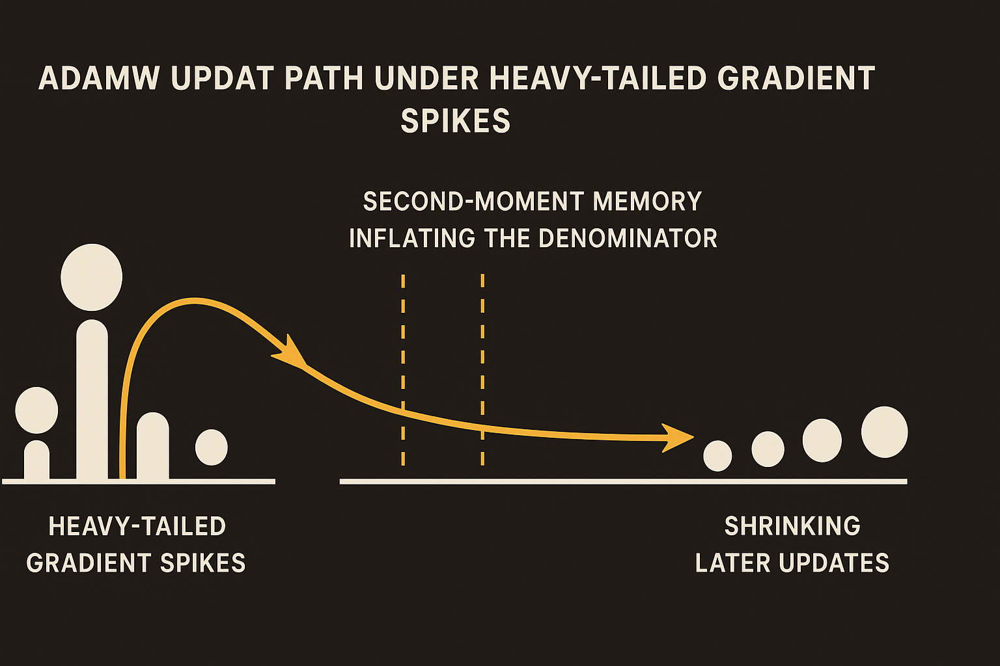

AdamW is one of those pieces of infrastructure that became boring because it worked. It is the default optimizer for training large language models. People tune learning rates, betas, weight decay, warmup, schedules, batch sizes. AdamW sits in the middle of the stack, treated less like a hypothesis and more like plumbing.

A new arXiv open problem in cs.AI and cs.LG says the plumbing has a theory problem. Not a small one. The authors argue that most AdamW convergence theory still lives in finite-variance settings, while empirical evidence suggests stochastic gradient noise in LLM pretraining is often heavy-tailed.

That means rare, very large gradient events are not just outliers to be averaged away. They may be part of the training regime.

## The uncomfortable part is the denominator

AdamW adapts step sizes using a second-moment accumulator. Roughly: it keeps memory of squared gradients, then divides updates by a term derived from that memory. This is useful when gradients vary by coordinate. It is also the thing the new open problem puts under the microscope.

The authors ask whether AdamW can converge under the same heavy-tailed assumptions where other optimizers now have cleaner theory. They point to recent work showing sign-based methods such as Lion and Muon can achieve sharp heavy-tailed rates, and that AdaGrad can also converge under heavy-tailed noise.

AdamW does not yet have that kind of guarantee.

The paper’s key concern is not just “big gradients are hard.” It is more specific: denominator memory can hide large gradients. If a second-moment accumulator gets inflated by rare spikes, later meaningful gradients may be divided down too aggressively. The authors describe a “corridor lower-bound mechanism” for this kind of obstruction.

That is a useful framing. It does not say AdamW fails in today’s training runs. It says the usual explanation for why AdamW should work may not cover the noise regime that modern LLMs actually inhabit.

## Practice is ahead of proof, again

This is a familiar pattern in deep learning. Builders find a recipe that works, then theory catches up unevenly. Sometimes the theory explains the recipe. Sometimes it reveals that the recipe only works because of surrounding hacks: clipping, schedules, normalization, data ordering, batch scaling, or just massive empirical search.

AdamW in LLM training is not used in isolation. It is wrapped in gradient clipping in many systems. It runs with warmup. It interacts with loss scaling, normalization layers, architecture choices, and distributed batch construction. Any one of those can soften heavy-tailed behavior in practice.

That is why I would not read this open problem as “switch away from AdamW.” The authors do not claim that. The better read is: optimizer comparisons that ignore tail behavior are missing a core part of the problem.

It also makes the recent interest in sign-based optimizers less cosmetic. Lion and Muon are not just “faster Adam alternatives” for benchmark tables. Their update structure may be better matched to heavy-tailed noise because signs are less sensitive to the magnitude of rare spikes. That does not make them universally better. It does make them theoretically interesting in a way that maps to the training reality people increasingly suspect.

## The benchmark should change

The practical gap here is measurement. Many teams compare optimizers by final loss, tokens per second, and stability under a few learning rates. Fine, but incomplete.

If heavy-tailed gradient noise is the real setting, then optimizer evals should report tail-sensitive diagnostics. How often do gradient spikes occur? Which layers see them? How long does the second-moment accumulator stay inflated afterward? Does clipping erase the difference between AdamW and sign-based methods, or just hide it until scale changes?

Those are not glamorous metrics. They are exactly the kind of metrics that explain why a training run looks stable for 50 billion tokens, then becomes fragile when you change the data mix or batch regime.

For practitioners, I would not rip out AdamW based on this. I would add instrumentation. Track gradient norm tails by layer, accumulator behavior after spikes, and update-to-weight ratios over time. Then run a small controlled comparison against Lion, Muon, or AdaGrad-style baselines on the same data slice. The catch most readers miss: the optimizer may not be the whole story, but if your clipping and schedule are quietly compensating for AdamW’s denominator memory, you want to know that before the expensive run.
