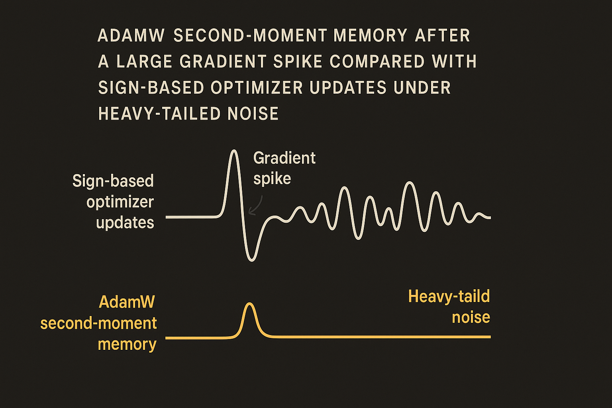

## AdamW works, but the proof gap is real

AdamW is one of those boring defaults that quietly runs the field. If you are training a large language model, fine-tuning one, or copying a known recipe, AdamW is probably in the stack.

That is exactly why the new arXiv open problem is interesting. The authors are not claiming AdamW fails. They are pointing at a mismatch: AdamW is the de facto optimizer for LLM training, while much of its convergence theory still sits in finite-variance settings.

That assumption matters. The authors state that empirical evidence suggests stochastic gradient noise in LLM pretraining is typically heavy-tailed. Translation: the noise is not nicely behaved. You can get rare, large gradient events that matter more than a Gaussian mental model would suggest.

This is not just math housekeeping. Optimizer behavior under heavy-tailed noise can change the training story. It affects stability, rate claims, and what you should trust when a recipe works at one scale and acts weird at another.

The awkward part is that AdamW’s competitors are starting to look cleaner on paper. The arXiv authors cite recent work showing sign-based optimizers such as Lion and Muon can achieve sharp rates under heavy-tailed noise. They also note that AdaGrad can converge in this regime. AdamW, the workhorse, does not yet have the same rigorous convergence story.

## The suspicious piece is the second moment

AdamW adapts updates using a moving estimate of squared gradients. That second-moment accumulator is part of why it behaves so well in practice. It rescales coordinates. It damps volatile directions. It gives builders a tool that often feels forgiving.

Under heavy-tailed noise, that same memory may be the problem.

The authors frame the question directly: can AdamW converge under the same heavy-tailed assumptions, or does its second-moment accumulator create a genuine obstruction? They give a “corridor lower-bound mechanism” showing how denominator memory can hide large gradients. That phrase is dense, but the intuition is simple enough: if the denominator stays inflated after big events, AdamW can shrink later updates in a way that masks useful signal.

This is why sign-based optimizers are such a useful contrast. Lion and Muon do not respond to gradient magnitude in the same way. They care more about direction than scale. In a heavy-tailed world, ignoring magnitude can be a feature, not a bug.

But I would be careful not to overread this. The arXiv authors present an open problem, not a takedown. AdamW has enormous empirical momentum. If the question were simply “does AdamW ever train LLMs well,” the answer is obviously yes. The narrower question is whether we understand why it works under the noise conditions that may actually describe modern pretraining.

That distinction matters. Practice can be ahead of theory. It often is. But when the default tool lacks theory in the regime you care about, you should treat its behavior as an empirical artifact to measure, not a law of nature.

## This is a training-systems question, not just an optimizer paper

The practical implication is not “drop AdamW tomorrow.” It is “stop treating AdamW as invisible plumbing.”

If you are running serious training experiments, optimizer choice should be part of the ablation plan. AdamW against Lion, Muon, and AdaGrad-style variants is not a novelty benchmark. It is a way to probe whether your run is sensitive to heavy-tailed gradient events.

The catch is that small experiments may not show the effect. Heavy-tailed behavior is about rare events, scale, and tails. A clean 1B-token test might not expose the same dynamics as a long pretraining run. Also, optimizer swaps are not one-line comparisons. Learning rate, weight decay, warmup, beta settings, gradient clipping, batch construction, and loss spikes all interact.

So I would not chase the optimizer with the best abstract theorem. I would instrument the training run first. Track gradient norm distributions. Look at tail behavior over time. Log how often clipping activates. Compare loss recovery after spikes. Then run optimizer ablations on the regimes where the tails actually show up.

For builders, the move is simple: keep AdamW as the baseline, but make it prove itself. Add Lion or Muon to the next optimizer sweep, especially if your training logs show spiky gradients or weird recovery after loss jumps. The catch most teams miss is denominator memory. AdamW may look stable because it is damping the mess, not because it is learning through it.
