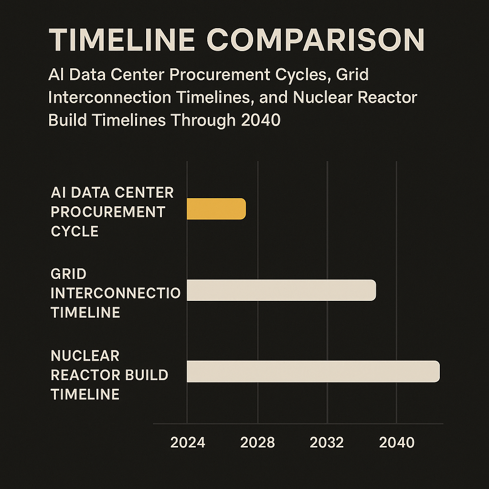

A Hacker News item today points to Canada planning a “nuclear renaissance,” with up to 10 reactors built by 2040. That is the whole hard claim in the material provided here, so I’m not going to dress it up with invented megawatts, vendor names, or budget numbers.

But the angle is clear. AI infrastructure has made electricity strategy a board-level issue again. Not in the abstract. In site selection, interconnection queues, power purchase agreements, backup generation, water permits, and local politics.

If Canada really tries to build as many as 10 reactors by 2040, this is not just climate policy. It is industrial policy. And for AI, it is a reminder that the compute stack now extends all the way down to steel, concrete, uranium, transmission lines, and regulators.

## 2040 is soon for grids, late for AI

The funny mismatch: 2040 sounds far away to anyone shipping AI products, but close to anyone building nuclear plants.

A frontier model team can change its training plan in weeks. A cloud buyer can shift inference workloads in months. A data center campus might take a few years if the power is available. Nuclear does not work on that clock.

That does not make it irrelevant. It makes it strategic rather than tactical.

Canada already has a real nuclear base, especially in Ontario. It also has cold weather, political interest in clean firm power, and a geography that could matter as data centers keep hunting for large, stable energy supplies. But no AI operator should read “up to 10 reactors by 2040” as “cheap clean compute next year.”

The useful read is different: countries are starting to connect AI capacity with sovereign energy capacity. The winners will not only be the places with GPUs. They will be the places that can power them without turning every new cluster into a grid fight.

## Firm power beats vibes

AI data centers do not just need electricity. They need dependable electricity, in very large blocks, with a cost profile that can survive hardware refresh cycles and model demand spikes.

That is why nuclear keeps coming back into the conversation. Solar and wind can be cheap, but variable. Batteries help, but they are not a full answer for every hour of every season. Gas can move faster, but comes with emissions and fuel-price exposure. Hydro is great where it exists, but not infinitely expandable.

Nuclear’s pitch is simple: high-capacity, low-carbon, always-on generation. Its problem is equally simple: time, cost, execution risk, and public trust.

For AI builders, the temptation is to treat energy as somebody else’s backend. That worked when compute demand could be abstracted behind a cloud invoice. It works less well when the next tranche of capacity depends on whether a region can approve substations, transmission, and generation faster than demand arrives.

Canada’s reported plan should be read through that lens. Not “nuclear will power AI,” full stop. More like: governments are realizing that AI capacity, manufacturing capacity, and electrification all compete for the same grid headroom.

## The real bottleneck may be coordination

The hard part is not saying “build reactors.” It is lining up utilities, provinces, federal agencies, Indigenous consultation, public financing, private offtake, transmission planning, skilled labor, and credible project management.

That coordination problem is where AI companies may become more than customers. Large compute buyers can sign long-term power contracts. They can help underwrite new generation. They can choose regions that plan power seriously instead of chasing only tax incentives and cheap land.

But there is a catch. If AI firms lock up clean firm power without adding net new supply, they will create backlash. Local ratepayers will notice. Politicians will notice. The grid is shared infrastructure, not a private API.

For builders, the practical move is boring and important: add power strategy to infrastructure planning now. If you are choosing regions for training, inference, or enterprise deployments, ask about interconnection timelines, firm capacity, power pricing, and local generation plans. Do not just ask which cloud region has the GPUs. The catch most readers miss: by the time reactor announcements turn into available electrons, the companies that win may already have secured the sites, contracts, and political trust.
