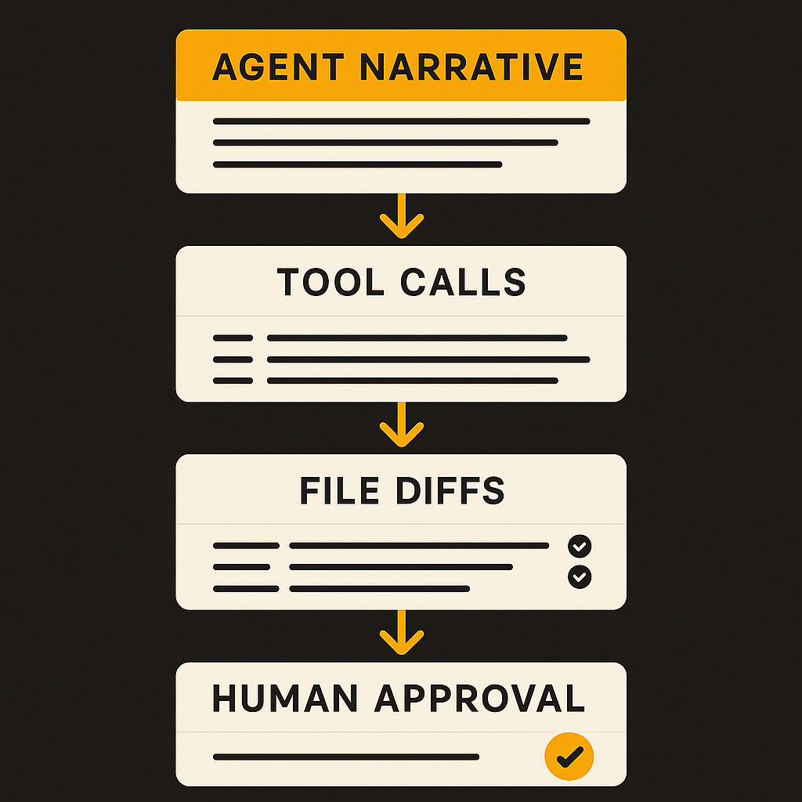

A small Hacker News item with a narrow title, “The text in Claude Code’s ‘Extended Thinking’ output,” hits a nerve because it sits right on top of a larger design question: when an AI coding agent shows its “thinking,” what exactly are we looking at?

Not necessarily the mind of the model. Not necessarily a faithful audit log. Maybe a useful progress indicator. Maybe a generated explanation. Maybe a filtered or transformed reasoning trace. Without more detail from Anthropic or the specific reproduction, that claim stays thin.

But the practical issue is real. Developers want to know why an agent is editing a file, running a command, or proposing a change. The interface gives them words. Humans are very good at turning words into intent. That is where things get slippery.

## The trap: readable reasoning feels more authoritative than it is

For coding agents, visible thinking has obvious value. If Claude Code says it is searching for a failing test, checking a dependency, or planning a refactor, that helps the user stay oriented. It lowers the feeling that the agent is randomly touching files.

The problem is that readable “thinking” can become theater. A clean explanation can make a weak action look deliberate. A messy explanation can make a good action look suspect. And a plausible chain of reasoning can still be post-hoc, incomplete, or simply wrong.

This is not a Claude-only issue. Any agent UI that streams thoughts, plans, scratchpads, tool intentions, or summaries is making a product tradeoff. More visibility builds trust. Too much narrative can create false trust.

For builders, the distinction matters. A model’s visible reasoning should not be treated like a debugger stack trace. A debugger trace has a defined relationship to execution. It tells you what code ran, where, and with what state. A model’s text may describe a plan, but the plan is not the execution.

That gap gets dangerous when the agent is operating in a repo. If the model says, “I found the issue,” the actual evidence is still the diff, the test output, the command history, and the files it read. The sentence is context. The artifact is proof.

## Agent UIs need provenance, not just personality

The better pattern is to separate explanation from provenance.

Explanation answers, “What is the agent trying to do?” Provenance answers, “What did it actually inspect, change, and verify?” Those are different product surfaces.

A coding tool should make tool calls first-class. Show the search query. Show the files opened. Show the exact command. Show whether tests passed, failed, or were skipped. Show which edits came from the model and which came from a formatter or shell command. Then let the model summarize that record.

That summary can still be useful. I want the agent to narrate, especially during long tasks. But I want it grounded in events I can inspect. If the summary says it updated the auth middleware, I should be able to click through to the diff and the relevant test run. If the summary says it could not reproduce a bug, I want the command and output.

The Hacker News framing is useful because it reminds us that “Extended Thinking” is a loaded label. Users hear it as privileged access to cognition. Product teams may mean something narrower: a work log, plan, or model-generated trace. The label sets expectations.

If Anthropic wants developers to rely on this surface, the right move is clarity. Say what the text is. Say what it is not. If it is filtered, summarized, or not guaranteed to match internal reasoning, say that plainly. Trust improves when the boundary is explicit.

Practitioner’s take: if you are building with Claude Code or any coding agent, treat visible thinking as a weak signal. Useful for orientation, not verification. Review diffs, run tests, inspect command history, and ask the agent to cite files and outputs when it explains a change. The catch most teams miss: the prettiest reasoning trace is still less valuable than a boring, clickable trail of what actually happened.
