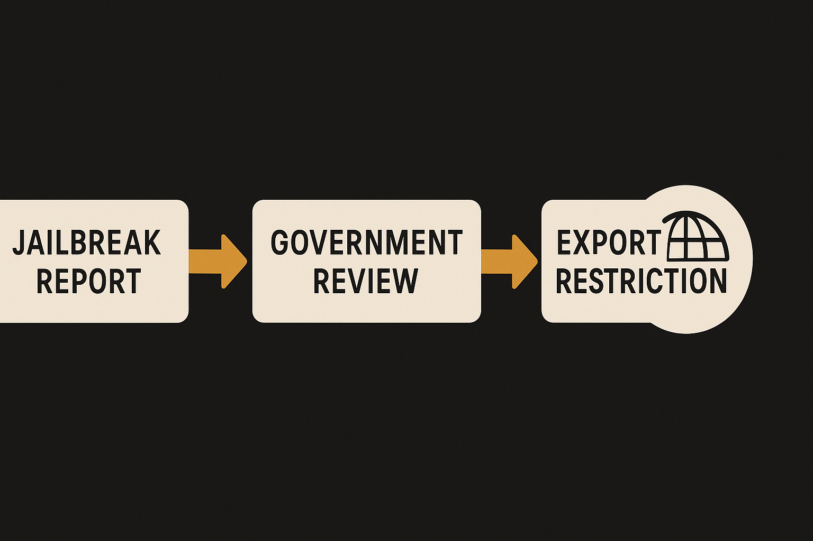

The strange part is not that a government tried to restrict access to a frontier model.

The strange part is how crude the mechanism was.

Matt Wolfe reported that Anthropic disabled Mythos 5 and Fable 5 globally after the U.S. government ordered the company to suspend access for foreign nationals, including foreign nationals inside the U.S. and foreign national Anthropic employees. Anthropic’s practical answer was to turn the models off for everyone.

That is the story in one sentence: a targeted restriction became a global product shutdown because the access-control problem was not solvable fast enough.

## Export control is a blunt API switch

AI Explained said, citing The Information, that the fastest way for the administration to act was an export restriction. That matters. Export control is built for stopping transfer across borders. Cloud AI does not look like a crate of GPUs on a ship. It looks like accounts, employees, contractors, enterprise tenants, API keys, inference endpoints, eval partners, and users who may change legal status or location.

So the order was not just “block adversaries.” It was “prove nationality-aware access control across your whole model delivery stack, right now.”

That is a very different bar.

The reported trigger was a jailbreak. David Sacks, the U.S. AI czar, claimed a trusted partner of both Anthropic and the government found a guardrail bypass while testing Fable. According to Sacks, the administration asked Dario Amodei to fix the jailbreak or deploy a different model, and Amodei refused.

Anthropic’s counter, as AI Explained summarized it, was that the vulnerability surfaced capabilities already available in other models, including OpenAI’s GPT-5.5. If true, that weakens the narrow safety rationale. If a common jailbreak on a common capability is enough to pull one model, the standard should apply across the market. If it only applies to Anthropic, then this starts to look selective.

## Anthropic asked for this kind of regime

There is also an uncomfortable Anthropic-specific layer.

Wolfe pointed to Amodei’s own recent argument that frontier AI should be regulated more like aviation, with technical testing, audits, and the ability to block or reverse releases when public safety standards are not met. That position is not crazy. I think there is a real case for pre-release audits on the most capable systems.

But once you ask for an FAA-style release regime, you cannot be shocked when the state uses a hammer you do not like.

The political system rarely gives labs the precise regulator they imagine. It gives them deadlines, interagency pressure, national security framing, rival CEOs, press leaks, and tools already sitting on the shelf. In this case, that tool appears to have been export control.

The irony is thick, but the lesson is practical: safety advocacy without a clear operational model becomes policy fog. “The government should be able to reverse unsafe releases” sounds clean until the reversal path is “ban access for all foreign nationals” and the only compliant product move is global shutdown.

## The Amazon detail cuts both ways

The reported Andy Jassy detail is the weirdest one. Wolfe and AI Explained both noted that Amazon is a major Anthropic investor and vendor. If Jassy raised concerns to senior officials, that is not an obvious rival attack. Amazon has plenty to lose if Anthropic’s flagship model gets pulled.

That makes the concern more credible, but not automatically decisive. Big customers and infrastructure partners may see failure modes labs discount. They also have their own liability, cloud security, and procurement incentives. A partner warning the White House is a serious signal. It is not a final technical finding.

For builders, the lesson is boring and important: treat model access as a compliance surface, not just a billing surface. If you depend on one frontier model, test fallbacks now. Keep evals portable. Know which workflows break if a model disappears overnight. And if you are shipping a high-capability model, do not market it as near-apocalyptic unless you are ready for regulators to take you literally.
