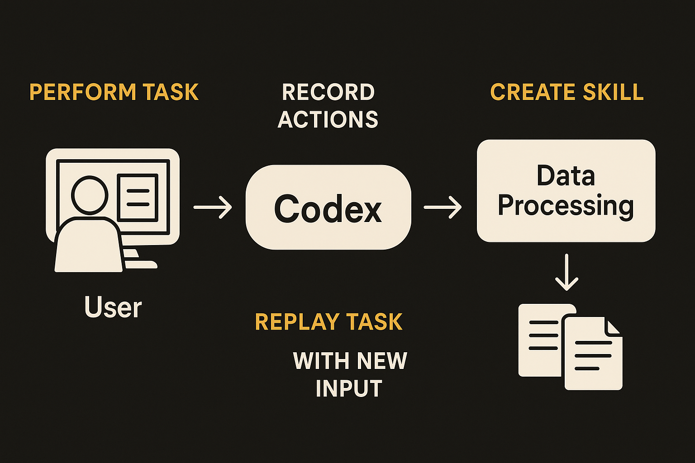

Matt Wolfe reported that OpenAI has rolled out record-and-replay for Codex. The pitch is simple: perform a task on your computer once, let Codex watch it, then call that saved behavior later as a reusable skill.

His example is mundane in the best possible way. Upload a YouTube video. Pick the video file. Add a thumbnail. Add subtitles. Set visibility to private. Save. Later, the user drops a PNG, a video file, and a subtitle file into Codex chat and asks it to use the saved YouTube upload skill. Codex repeats the steps.

That is not sci-fi. It is not AGI. It is office automation with a better capture mechanism.

## The important shift is from prompts to demonstrations

Most agent workflows still ask users to describe a process in language. That is a bad interface for many tasks, because the real work lives in tiny UI decisions. Which tab. Which dropdown. Which checkbox. Which file picker. Which default should not be touched.

Record-and-replay flips the setup. The human does the thing once. The system turns that trace into something callable.

That matters because demonstrations are often more precise than written instructions. If I say “upload the video to YouTube and make it private,” I am leaving out a dozen steps. If I show the task, the model gets the sequence, the files involved, and the UI state changes. The resulting skill is closer to a macro, but with language around it.

The word “skill” is doing a lot of work here. A saved upload routine is only useful if it can accept new inputs without getting confused. The thumbnail changes. The video changes. The subtitle file changes. Maybe the title changes too. The interesting question is how much of the original demonstration becomes fixed behavior, and how much becomes a parameter.

## This is agentic RPA, not magic

The clean comparison is robotic process automation, but less miserable to set up. Traditional RPA tools work when processes are stable and painful when software changes. Buttons move. Labels change. Auth expires. A modal appears. The bot fails.

Codex-style record-and-replay may handle some of that better if it uses visual context and model reasoning, rather than only brittle coordinates or selectors. But the source material does not show the failure cases. It does not show what happens when YouTube changes the upload flow, when a file is missing, when the account has multiple channels, or when the wrong subtitle language is selected.

Those are the boring details that decide whether this becomes a daily tool or a demo loop.

I also want to know what gets stored. Is Codex saving a video trace, a set of interpreted steps, browser actions, code, or some mix? Can the user edit the skill after creation? Can it ask for confirmation before publishing? Can it expose a diff of what it plans to do? For anything beyond low-risk chores, replay without inspection is a liability.

## The first good use cases are narrow and repetitive

The YouTube upload example is a good target because the task is repeatable, file-driven, and easy to verify. That is the shape builders should look for.

Think weekly report assembly. CMS publishing. Invoice portal uploads. QA setup steps. Data export from stubborn web apps. Internal admin chores that happen the same way 80 percent of the time and waste attention rather than require judgment.

The mistake will be trying to make one giant “do my job” agent. The better pattern is a library of small named skills: upload video, pull invoice CSV, create draft post, update CRM field, run release checklist. Each one should have clear inputs, a visible dry run when possible, and a human approval point before irreversible actions.

Practitioner's take: try this on one annoying workflow that already has a checklist and low downside. Record the clean path, then test the ugly paths: missing file, wrong file type, changed UI, logged-out session, duplicate upload. The catch most readers miss is maintenance. A recorded skill is not a one-time asset. Treat it like a tiny internal tool, with owners, test cases, and a kill switch.
