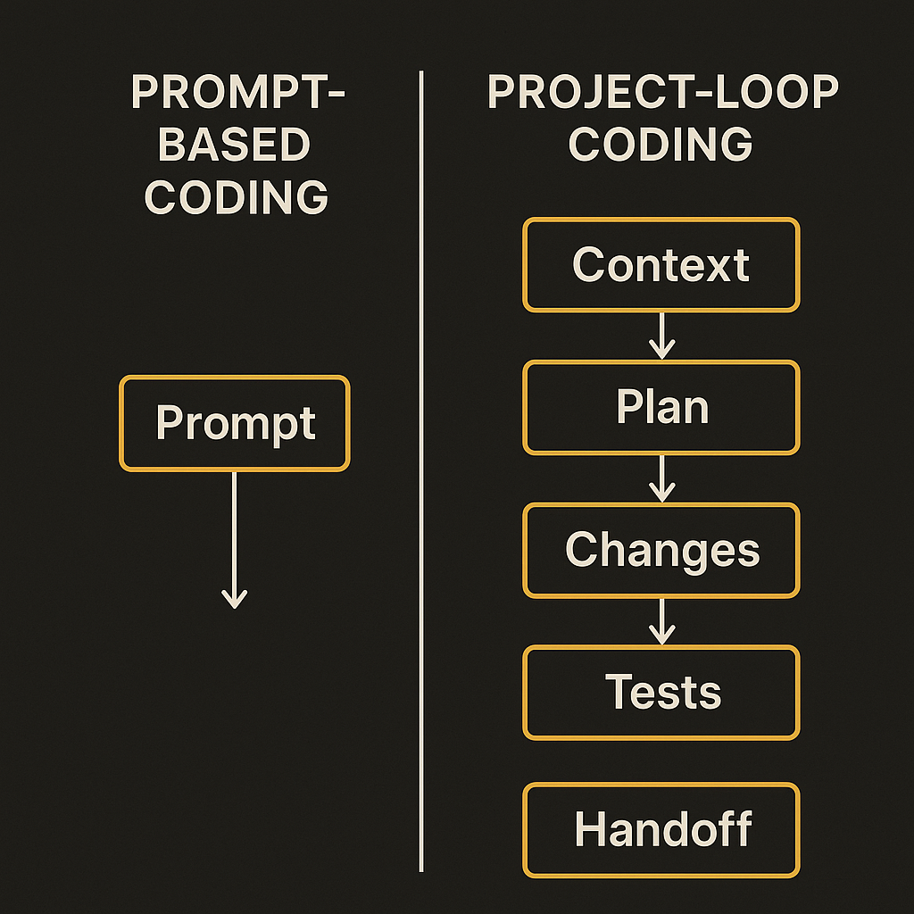

OpenAI’s post on “Codex-maxxing” is not really about squeezing one better answer out of a model. It is about keeping work alive after the first prompt gets stale.

That is the right frame.

Most coding-agent demos still look like magic tricks: paste an issue, watch files change, run tests, celebrate. Real projects are messier. The hard part is not getting a model to write code once. The hard part is getting it to remember what the work is, what decisions have already been made, which constraints still matter, and where the bodies are buried.

OpenAI describes Jason Liu using Codex to preserve context, manage complex projects, and keep work moving beyond a single prompt. That is a small claim, but an important one. It shifts Codex from “autocomplete with ambition” toward something closer to an operating rhythm.

## The prompt is not the unit of work

A single prompt is a bad container for a serious software task. It mixes goals, constraints, file state, reasoning, half-finished decisions, and implementation guesses into one blob. Then the next prompt tries to reconstruct all of that from memory, or from whatever context window survived.

That is where long-running agent work breaks.

The better unit is the project loop: goal, current state, plan, change, verification, handoff. If Codex can help maintain that loop, the value is less about raw model intelligence and more about continuity. The agent becomes useful because it can re-enter the work without forcing the human to explain the whole project again.

That sounds boring. Good. Boring is where tools become usable.

## Context preservation is a design problem, not a vibe

The phrase “preserve context” can hide a lot. There is a difference between dumping more tokens into a window and maintaining a clean project memory.

Useful context has shape. It says what the project is trying to do. It names the files that matter. It records decisions and rejected paths. It keeps track of open questions. It separates facts from guesses. It gives the next run something testable, not just a transcript.

That distinction matters because agents can get worse with more context if the context is noisy. Old assumptions linger. Dead plans stay alive. A confident summary can quietly replace reality. Long-running work needs pruning as much as memory.

OpenAI’s post, at least from the public description, is a case study rather than a benchmark. So I would not read it as proof that Codex can autonomously run large projects end to end. I would read it as a signal about where the product category is going: less “ask and answer,” more “maintain state across work.”

## The human job moves upstream

If the agent can continue work across sessions, the human role changes. You spend less time restating instructions and more time designing the workflow the agent lives inside.

That means writing better project briefs. Keeping acceptance criteria clear. Making tests easy to run. Leaving explicit handoffs. Saying “do not touch this module” when needed. Asking for a status note before asking for code.

This is also where hype creeps in. “Long-running” does not mean “unattended.” It means the work can survive interruption. The distinction is not academic. A coding agent that keeps useful state for two days is valuable even if a human reviews every change. Maybe especially then.

Practitioner’s take: try this on one annoying project, not your whole repo. Create a short project brief, a running decision log, a current-task file, and a verification checklist. Ask Codex to update those artifacts after each meaningful change. The catch most teams miss: context is only helpful if it is maintained like code. If nobody deletes stale assumptions, your agent will faithfully carry yesterday’s mistake into tomorrow’s build.
