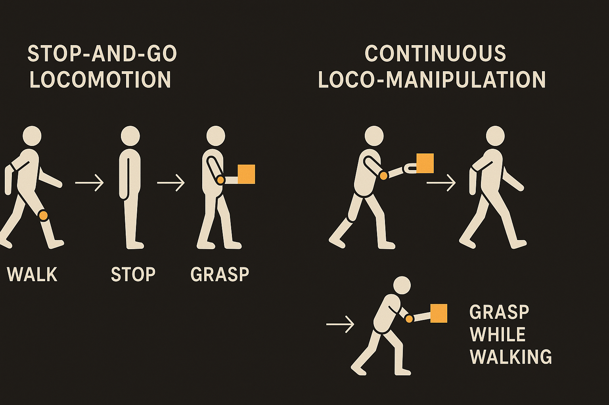
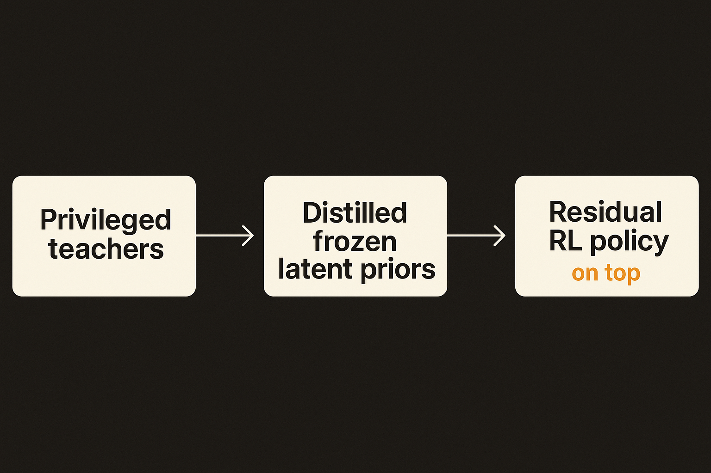
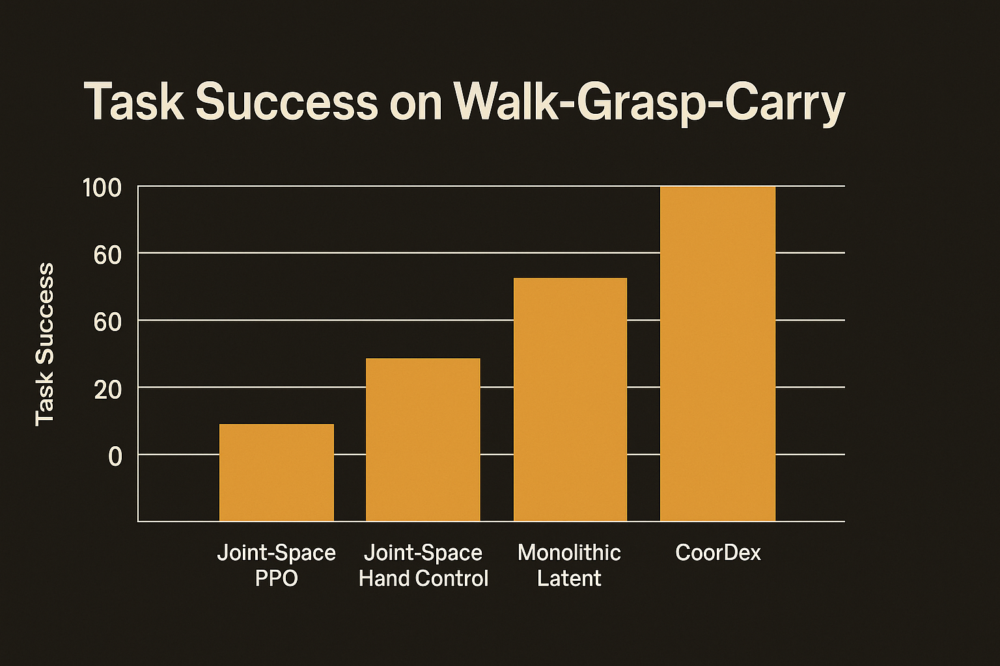

Watch most humanoid robot demos closely and you notice a pattern. The robot walks to the object. It stops. It plants its feet. Then it reaches and grabs. Then it starts walking again. Stop, manipulate, go. It looks fine in a highlight reel, but it is not how anything alive moves. You do not freeze in place to pick a bottle off a table while crossing the room.

A new paper called CoorDex goes after exactly this gap. The pitch: high-degrees-of-freedom dexterous manipulation while the robot is still in motion. Non-stop bottle grasping and carrying. Opening a fridge door on the move. Cube pick-and-turn. All on a Unitree G1 fitted with a 20-DoF WUJI hand, which is a real dexterous hand, not the open-close claw most loco-manipulation work leans on.

That combination is the interesting part. Walking is hard. Dexterous hands are hard. Doing both at once, while making contact with objects, is where the whole thing usually falls apart.

## Why stop-and-go exists in the first place

Stop-and-go is not laziness. It is a coping mechanism for a control problem that gets ugly fast.

A humanoid body already has a lot of joints to coordinate just to stay upright while moving. Bolt on a 20-DoF hand and you are now controlling a very high-dimensional system where the body and the hand are mechanically coupled. Shift your weight to reach and your balance changes. Close your fingers around a bottle and the contact forces feed back into the whole chain. Everything affects everything.

The usual escape hatch is to decouple the problem in time. Walk first. Then, once you are stable and stationary, manipulate. That makes each phase tractable on its own. It also makes the robot slow and brittle, because the real world does not wait for you to plant your feet.

CoorDex's claim is that you can keep the body and hand running together if you change what you are controlling. Instead of commanding raw joints, you command something higher level.

## The trick: control priors, not joints

Here is the pipeline, in plain terms.

Start in simulation with whole-body and hand demonstrations. Train two "teacher" policies that are privileged, meaning they get information a real robot would not have, and their only job is to track motion accurately. One teacher for the body. One for the hand.

Then distill those teachers into latent priors that run on proprioception alone, which is the information a real robot actually has about its own joint positions and velocities. A prior is basically a learned, compressed action space. Instead of the policy needing to figure out all 20-plus joint commands from scratch, it picks a point in a much smaller latent space, and the frozen prior expands that into natural-looking motion.

Then freeze those priors and do downstream reinforcement learning on top of them. The new policy does not output joint torques. It outputs residuals in the latent space of the priors. Small corrections on top of motion that already looks right.

The structure matters too. CoorDex uses a shared task context but separate residual heads for the body and the hand. So the two systems coordinate through the same task signal while still getting their own correction channels. Body stays balanced and natural. Hand gets the fine, contact-level adjustments it needs to actually hold the bottle without dropping it.

It is a sensible division of labor. The priors carry the "how to move like a humanoid" knowledge. The residual RL carries the "adapt to this specific contact-rich task" knowledge. Neither has to solve the whole thing alone.

## The ablations are the receipt

I am skeptical of robotics papers that show three nice clips and call it a day. What makes CoorDex worth attention is the ablation section, where they break their own method to show why each piece is load-bearing.

On the walk-grasp-carry task, under the same reward budget, the authors report that three obvious alternatives all fail. Joint-space PPO fails. Joint-space hand control fails. Monolithic latent prediction, meaning predicting one combined latent instead of coordinated body and hand residuals, also fails.

That last one is the most telling. It is not just "use latents instead of joints." Squishing the body and hand into one latent does not work either. You need the coordinated structure: shared context, separate heads. The specific architecture is doing the work, not just the general idea of priors.

This is the honest version of a result. They are saying: here is exactly which design choices are necessary, and we showed the alternatives collapse. Failing under "the same reward budget" is the right framing, because you can brute-force almost anything with infinite training. The question is whether the structure makes a hard problem trainable at a reasonable cost. They argue it does.

## What this is and what it is not

Two caveats before anyone declares dexterous humanoids solved.

First, this is built from simulated demonstrations and the project is presented around sim plus hardware on a G1. The sim-to-real gap for contact-rich dexterous tasks is notoriously brutal. Finger-level contact reliability is exactly where simulation tends to lie to you, because friction, compliance, and slip are hard to model. The demos listed are real tasks, but how robust they are across object variation, lighting, and clutter is the part a paper page cannot fully answer.

Second, the tasks are still a curated set: bottle grasp and carry, fridge door, cube pick-and-turn. Impressive, and harder than they look, but a long way from open-ended "manipulate whatever is in this kitchen." The contribution is a control method, not a general manipulation brain. CoorDex tells you how to coordinate body and hand once you know the task. It does not decide what to do.

Both of those are fine. The paper is honest about its scope. It is a piece of the stack, the motor-control layer, and a good one.

This is the dividing line I would watch in humanoid robotics. The frozen-prior-plus-residual-RL pattern is becoming the workhorse recipe for hard whole-body control, because it makes high-dimensional problems trainable without throwing away natural motion. CoorDex is a clean example of pushing it into dexterous, continuous, contact-rich territory. If you are building on humanoid hardware, the takeaway is architectural: stop trying to learn raw joint policies for coupled body-hand tasks. Distill motion priors first, freeze them, then learn small residuals on top with separate heads for parts of the body that need independent fine control. The catch most readers will miss is in that ablation: the win is not "use latents," it is the coordinated structure. Collapse the body and hand into one shared latent to save effort and, per their own results, the whole thing stops training. The decomposition is the feature, not an implementation detail.
