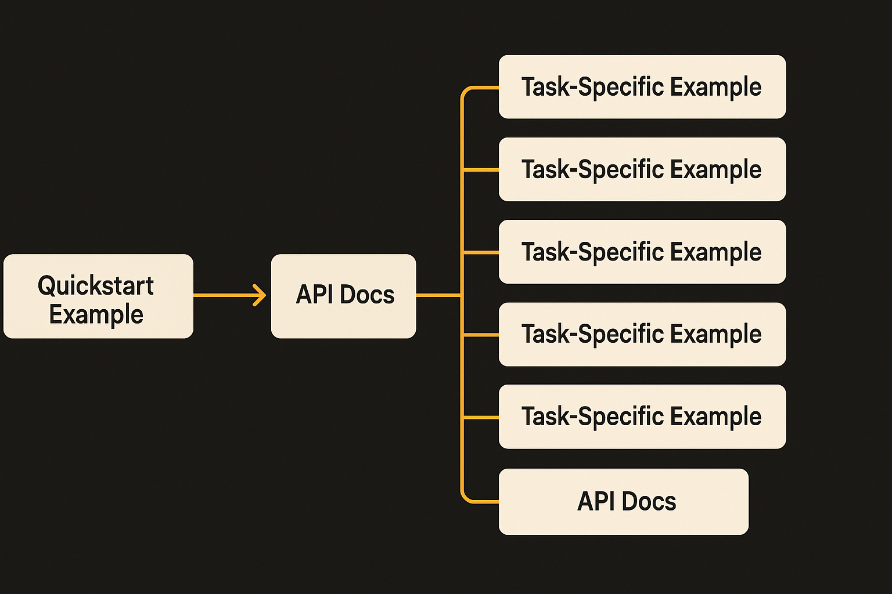
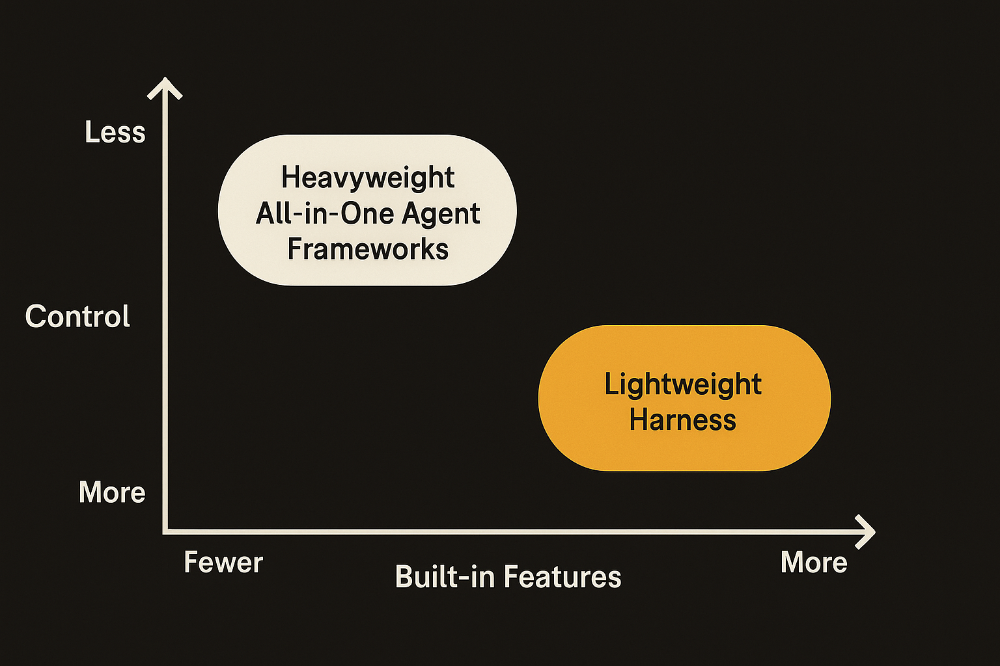
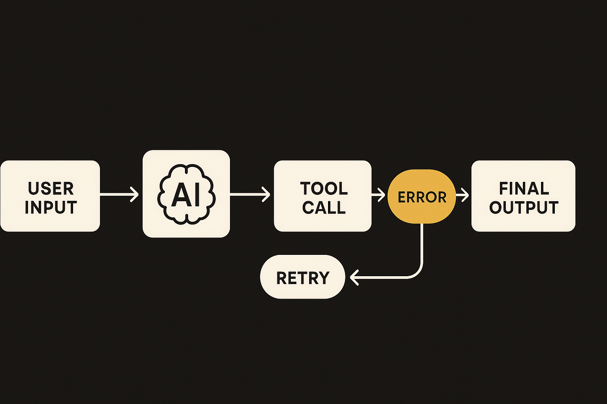

Hugging Face put out a post on CUGA, a lightweight harness for building agentic apps, and the headline number is the part worth pausing on: about two dozen working examples shipped alongside it. Not a manifesto. Not a benchmark chart. Working examples.

That ratio tells you something about where agent tooling actually is in mid-2026. The frameworks are commodity now. What separates a usable harness from an abandoned one is whether someone can clone it, run example number 7, and see a real task complete. CUGA is betting on the examples. I think that bet is correct, and I also think it hides the part that trips people up.

## The examples are the spec

Most agent frameworks ship with a quickstart that does one trivial thing (echo a string, call one tool) and then point you at API docs for the rest. You end up reverse-engineering intent from method signatures. That gap is where weekends go to die.

A library of two dozen runnable examples is a different contract. Each one is a small, opinionated answer to "how do I wire this specific pattern." When the examples cover enough surface area, they become the real documentation, more honest than prose because they have to actually execute. If example 12 is broken, you know immediately. A paragraph in a README can stay wrong for a year.

This is the same reason people learn a new language by reading its test suite. The tests are the spec that can't lie. Hugging Face leaning on examples for CUGA is them choosing the format that fails loudly instead of the format that fails silently.

The catch: a pile of examples is only as good as its coverage. Two dozen sounds like a lot until you map them against the patterns you actually need. Single-tool calls, multi-step plans, retries, human-in-the-loop approval, parallel sub-agents, state that survives a crash. If the examples cluster around the easy half of that list, you are back to reverse-engineering for the hard half. I'd want to see the example list mapped against the failure modes before calling it complete.

## Lightweight is a feature until it isn't

CUGA being described as a lightweight harness is doing real work in that sentence. The agent space spent 2024 and 2025 accumulating heavyweight frameworks that wanted to own your whole stack: the orchestration, the memory, the tracing, the eval, the deployment. Many builders bounced off them because the abstraction tax was higher than the problem.

A lightweight harness inverts that. It gives you the loop and the wiring and gets out of the way. You bring your own model, your own tools, your own opinions about state. For a builder who already knows the shape of their agent, that is exactly right. You don't want a framework's worldview, you want plumbing you can read in an afternoon.

Where lightweight bites you: the moment you hit production concerns. Observability, cost tracking, rate-limit backoff, retry semantics, structured logging of every tool call. Heavyweight frameworks bundle that, badly but bundled. A lightweight harness leaves it to you, which means the two dozen examples need to show those patterns too, or you'll build them yourself anyway and lose the time you thought you saved. The honest version of "lightweight" is "you'll add the boring 30% yourself." That is often the right trade. Just know you're making it.

## What I'd actually run first

If I cloned CUGA today, I wouldn't read the README top to bottom. I'd do three things in order.

First, find the example closest to my real task and run it unmodified. Does it complete? How many model calls did it take? What did it cost? That tells me more in five minutes than any feature list.

Second, break it on purpose. Feed it a tool that returns an error. Give it an ambiguous instruction. Kill it mid-run. How the harness behaves when things go wrong is the entire story for agents, because in production things go wrong constantly. A demo that only shows the happy path is a screenshot, not a system.

Third, count the lines of code between me and the model. Lightweight should mean I can trace a request from my prompt to the API call and back without getting lost in three layers of abstraction. If I can read the loop, I can fix the loop. That readability is the actual product here, more than any single example.

One honest caveat: the Hugging Face post is the only source I have on CUGA right now, so I'm reading the framing as much as the framework. The claims about example count and lightweight design are theirs, not yet stress-tested by a community of users posting their own results. Until people are shipping things with it and complaining publicly about the rough edges, treat the example library as a promising start, not a proven foundation. The difference between a good harness and a great one shows up in month two, when the easy demos are behind you and you're debugging the weird production case at 11pm.

## The pattern under the pattern

CUGA is one harness, but the move it represents is the interesting thing. Agent tooling is converging on "small core, rich examples" because the alternative (big framework, thin examples) kept producing tools people starred on GitHub and never used. The market is correcting toward honesty. Examples that run are honest. Feature lists are marketing.

If you build agent tools, copy this. Ship the loop small and the examples deep. Cover the failure modes, not just the demos. The library that wins is the one whose example number 17 happens to be the exact gnarly thing someone needed at 2am.

Practitioner's take: clone CUGA, ignore the prose, and run the example nearest your actual use case in the first ten minutes. Then deliberately break it: bad tool output, ambiguous prompt, mid-run kill. If the harness handles failure cleanly and you can read the agent loop end to end, it's worth building on. If the examples only cover the happy path, budget for the boring 30% (retries, logging, cost tracking) you'll write yourself, and decide whether that's still cheaper than a heavyweight framework. The catch most people miss: a lightweight harness saves you time on day one and charges it back in production. Pick it because you want to own that 30%, not because you forgot it exists.
