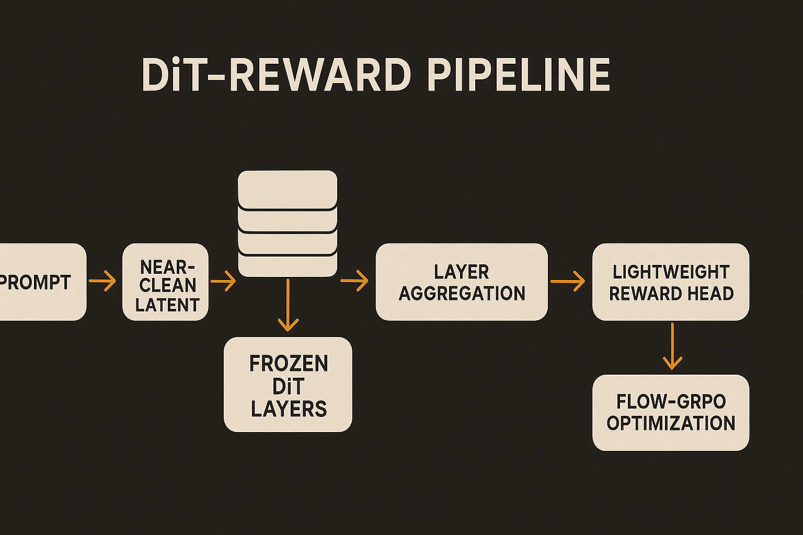

Image reward models have usually felt like add-ons. Generate an image, decode it, send it through a separate preference or aesthetic model, then hope that model’s taste lines up with the thing you actually want.

DiT-Reward points at a cleaner possibility: the text-to-image model may already know a lot about whether its own output is good.

The arXiv paper, posted under both cs.AI and cs.LG, converts a pretrained text-to-image Diffusion Transformer into a reward model. Instead of judging final pixels through a separate model, DiT-Reward processes near-clean image latents and aggregates text-conditioned image representations from inside the transformer. Same generator family, repurposed as critic.

That is the interesting bit. Not just “train a better reward model.” More like: stop throwing away the internal representations the image model built while learning how to generate.

## The generator has usable taste signals

The DiT-Reward paper reports that, using the same training data mixture as HPSv3, its model beats HPSv3 across all four evaluated preference benchmarks. The headline numbers are 85.6% on HPDv2 and 77.6% on HPDv3.

Those are benchmark results, not a universal measure of visual taste. Still, the comparison is fairer than many papers because the authors say they matched the HPSv3 training mixture. That matters. A reward model can look impressive if it simply saw better or more aligned preference data.

The frozen-backbone result is the stronger signal to me. The researchers report that even when the generative backbone is frozen, a lightweight learned head can extract meaningful preference predictions. In other words, the diffusion transformer’s internal states already carry information about prompt-image fit, aesthetics, or realism that a smaller head can read out.

That lines up with a broader pattern in AI systems: models trained on hard generative tasks learn reusable evaluative features as a side effect. A model that can make plausible images from text has to represent composition, object identity, style, lighting, and some version of “does this look right?” DiT-Reward turns that latent knowledge into a scoring function.

## Middle layers do more than expected

The layer probing result is useful for builders. DiT-Reward’s reward performance is strongest in the middle-to-late layers, and combining representations across stages helps.

That is a nice reminder that “final layer only” is often a lazy default. In generation models, earlier layers may carry more local or structural information, while later layers may be closer to semantic alignment and final denoising decisions. The best reward signal can be distributed.

This also makes DiT-Reward more than a wrapper around a diffusion model. The method is really a representation mining strategy. It asks which hidden states have the most evaluative signal, then learns how to combine them.

The paper also reports positive scaling with generative backbone capacity. Bigger DiT backbones produce better reward models. That is not shocking, but it does matter. If the reward model quality tracks generator capacity, labs with strong image backbones may get a second product almost for free: a domain-specific critic built from the same model family.

## Faster scoring changes the optimization loop

The practical win is speed. DiT-Reward scores latents directly and reports a 1.65x inference speedup over HPSv3 with comparable peak memory. That is not a tiny implementation detail if you are doing RL-style optimization, rejection sampling, or large-scale prompt evaluation.

The authors test DiT-Reward while optimizing Stable Diffusion 3.5 Large with Flow-GRPO, and report that it beats HPSv3 along the matched training trajectory, with especially clear gains in realism. That last phrase is important. The strongest visible improvement may be realism, not every dimension users care about. Text rendering, rare concepts, brand constraints, safety policy, and subjective style taste may still need separate evaluation.

There is also a philosophical catch. If the generator becomes the critic, you can tighten the loop, but you can also reinforce the model family’s blind spots. A DiT-derived reward model may prefer images that look good to a DiT. That can be exactly what you want for model improvement. It can also flatten taste if you use it as the only judge.

For builders, I would try this first as an internal reranker or training reward, not as the final arbiter of quality. Score latents before decode, compare against your existing aesthetic or preference model, and track disagreement cases by category: realism, prompt adherence, typography, hands, layout, policy, brand style. The catch most teams miss is that faster reward scoring is only useful if you preserve diversity and inspect where the reward model is confidently wrong.
