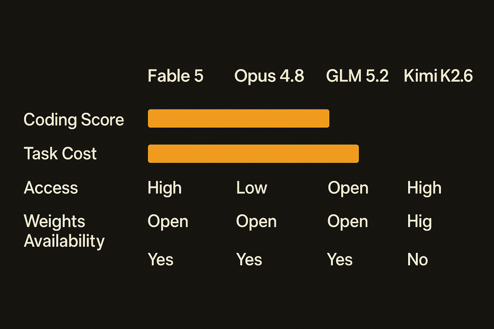

Fable 5 is probably the stronger model. GLM 5.2 may be the more important one.

That sounds like a hedge, but it is the real story this week. Anthropic’s new Fable tier, at least from the early benchmark readouts, is the expensive ceiling for agentic coding. Z.ai’s GLM 5.2 is the open-weights challenger that gives teams a serious alternative when cost, deployment control, and access matter as much as raw score.

## The ceiling got more expensive

1littlecoder reported Fable 5 pricing at $10 per million input tokens and $50 per million output tokens, roughly double Opus pricing, while still cheaper than GPT-5.5 Pro by his comparison. That puts Fable in a narrow lane: high-value coding and agentic work where one better answer is worth the burn.

The early benchmark numbers fit that story. On SWE Bench Pro, 1littlecoder cited Fable 5 at 80.3%, versus Opus 4.8 at 70%. On Cursor Bench, he cited Fable 5 Max at 72.9%, using 63,000 tokens across 76 steps, for an $18 task cost. Kimi K2.6 reportedly cost $1.22 on the same task and scored under 50%.

That is the whole trade in one paragraph. Fable may buy you a 20-point jump on a hard coding agent benchmark. It may also cost 15x to 17x more for a single run.

Access is also murky. 1littlecoder framed Fable as available through Claude.ai and IDEs like Cursor, but also discussed limits around who can access it. Sam Witteveen described Fable as no longer available to most people, and flagged early reports that benchmark results may depend heavily on fallback behavior to Opus 4.8. That is a thin area, but it matters. If a headline score depends on routing, fallback, or policy gating, builders need to test the product they can actually call, not the label on the leaderboard.

## GLM 5.2 is not just “good for open”

Z.ai’s GLM 5.2 is interesting because it is open MIT, with no regional limits claimed by Z.ai, and the weights are out. Sam Witteveen noted that Z.ai released both full and FP8 versions, though not the base model. That last part is becoming normal. Companies still want a commercial path for custom fine-tuning and hosted deals.

The headline spec is a 1 million token context window. For coding agents, that is not a vanity number. Agent harnesses stuff prompts, repo context, tool traces, plans, diffs, failed attempts, and logs into context. Long-horizon work gets bloated fast.

Z.ai is also saying more than “trust us.” 1littlecoder pointed to IndexShare, also described through an Index Cache paper from March 2026, which reuses sparse attention indices across layers and claims 2.9x fewer FLOPs per token. Sam also noted multi-token prediction and faster-feeling behavior than prior GLM releases.

The scores are credible enough to care about, but not magical. 1littlecoder cited GLM 5.2 at 74.4% on Frontier SWE, close to Opus 4.8 at 75%. Sam said Artificial Analysis placed GLM 5.2 behind GPT-5.5, Opus 4.8, and Fable 5 with fallback, while showing a large jump over GLM 5.1. On some agentic terminal work and non-tool knowledge tests, the closed frontier models still lead.

That is fine. “Not first” is not the same as “not useful.”

## The new stack is tiered, not winner-take-all

The practical pattern is obvious now. Use Fable 5 when the task is expensive to fail: deep refactors, gnarly production bugs, architecture migrations, agentic coding runs with real business value. Use GLM 5.2 when you need long context, open deployment, controllable costs, and good enough frontier-adjacent coding.

This is also where open weights change behavior. A team can run evaluations on private repos, tune inference settings, test FP8 economics, and decide whether a 1 million token window helps their actual workflow. They do not have to wait for access policy, rate limits, or product routing to settle.

I would not replace every coding model with GLM 5.2 tomorrow. I would add it to the eval set immediately. Run your top 20 coding-agent tasks through GLM 5.2, Opus 4.8, your current cheap model, and Fable if you can access it. Measure pass rate, wall time, tokens, retry count, and human cleanup. The catch most readers miss: long-horizon agents do not fail only because the model is dumb. They fail because context management, tool loops, and evaluation are sloppy. GLM 5.2 gives builders more room to test that system, not an excuse to skip the system.
