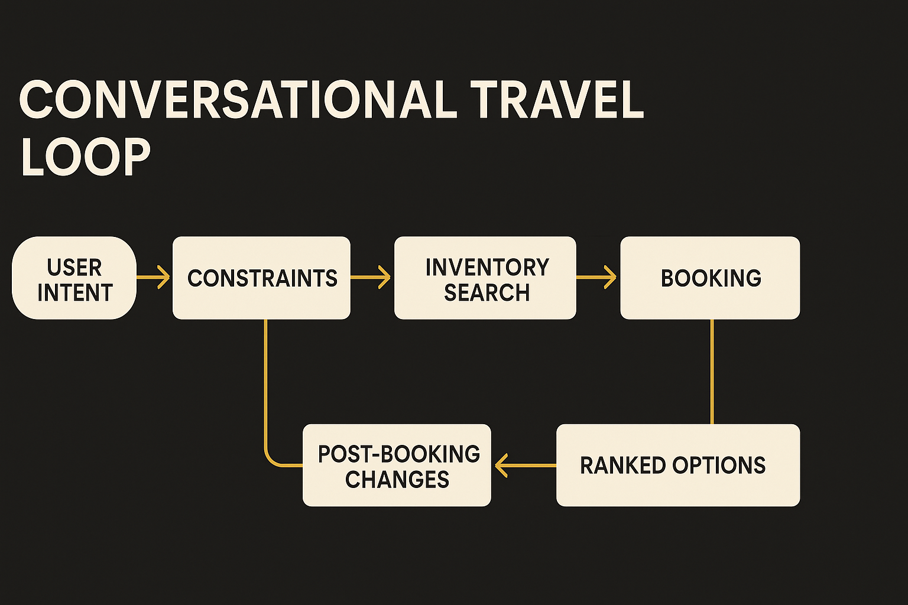

OpenAI says Omio is using its models to power conversational travel experiences, speed up product development, and move toward becoming an “AI-native” company. That phrase can mean anything from “we added a chat box” to “we rebuilt the operating model around models.” The useful question is narrower: what parts of travel are actually better when the interface is a conversation?

Travel is a good test case because the user rarely wants one thing. They want a trip. That means tradeoffs across price, timing, transfers, baggage, hotels, local transport, cancellation rules, and personal constraints. Traditional search handles this by asking users to decompose the trip into fields. Origin. Destination. Date. Passengers. Sort by price. Filter by duration. Repeat.

A good conversational system should do the reverse. It should let the traveler state intent in human terms, then turn that intent into structured search, booking, and support actions.

## The hard part is not the chat

The obvious demo is easy: “Find me a train from Berlin to Prague next Friday morning.” The harder product is what happens after the first answer.

A real traveler says: “Actually, I can leave after lunch if it saves more than €50.” Or: “My hotel check-in is at 3.” Or: “Avoid tight transfers, I’ll have a stroller.” A useful assistant needs to preserve those constraints, ask clarifying questions only when needed, and explain why one option beats another.

That is where Omio’s angle gets interesting. Omio already sits across travel inventory, not just one airline or rail operator. If OpenAI’s models help it translate messy intent into searchable constraints, conversational travel becomes more than a support widget. It becomes a new input layer for travel commerce.

But the product bar is high. Travel users have low tolerance for confident nonsense. A wrong restaurant suggestion is annoying. A wrong connection time can ruin a trip. So the model cannot be the source of truth. It has to sit around verified inventory, policy rules, payment systems, and customer support workflows.

## “AI-native” should mean changed workflows

OpenAI also says Omio is using AI to accelerate product development. That may matter as much as the traveler-facing assistant.

In practice, AI-native companies are not defined by press releases. They are defined by where models show up in the work. Product specs. Customer research synthesis. QA. Localization. Support macros. Data exploration. Experiment analysis. Internal tooling. If Omio is serious, the bigger shift is probably not one conversational feature. It is hundreds of smaller workflow changes that let teams test and ship faster.

There is a catch. Faster development only helps if the company also gets better at measuring outcomes. A conversational travel assistant can look magical in a demo and still fail on conversion, trust, margin, or support load. The right metrics are not “messages sent” or “AI interactions.” They are closer to completed bookings, fewer abandoned searches, fewer avoidable support tickets, better change handling, and higher user confidence.

## The agent shape is emerging

Travel is one of the cleaner agent markets because the job has a beginning, middle, and end. Plan the trip. Book the trip. Manage the trip when reality changes. Weather, strikes, delays, price shifts, schedule changes, and human indecision all create moments where an assistant can be useful.

The danger is trying to make the assistant too broad too early. A travel agent that can “do everything” will fail in boring operational corners: refund rules, seat constraints, transfer risk, duplicate bookings, payment edge cases. The better path is narrower. Pick trip planning, itinerary changes, or support triage. Make that flow excellent. Then expand.

For builders, the practical move is to map the user journey and find the highest-friction decision point where language beats forms. Start there. Put the model behind tools that check live data, not behind static answers. Log every clarification, failed search, and handoff to support. The catch most teams miss: the conversation is not the product. The product is the system that turns conversation into correct action.
