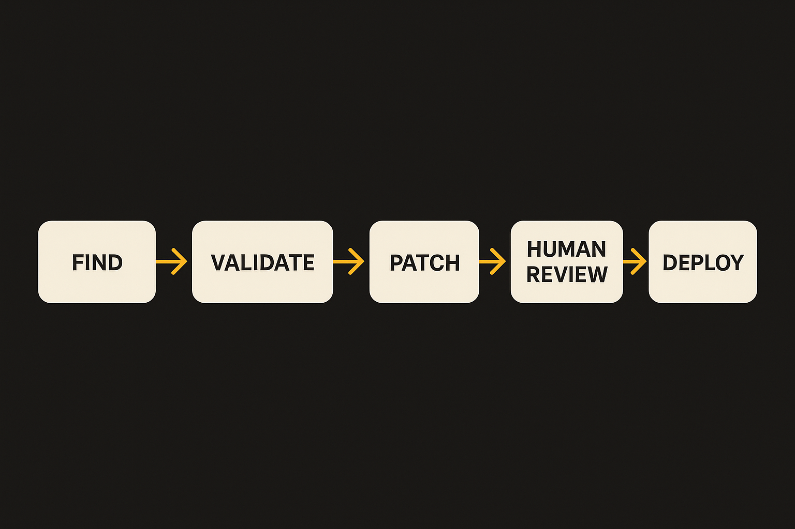

OpenAI introduced Daybreak as a set of tools “for securing every organization in the world,” with Codex Security and GPT-5.5-Cyber as the named pieces. The promise is simple: find vulnerabilities, validate them, and patch them at scale.

That framing matters. Most AI security demos stop at finding a scary-looking bug. Daybreak’s pitch reaches further into the workflow, where the actual cost lives. A vulnerability report is only useful if someone can prove it matters, prioritize it against everything else, write the fix, test it, and get it merged without breaking production.

That is the right problem. It is also where the hype can hide.

## The loop matters more than the scanner

Security teams do not need another noisy inbox. They need fewer unresolved risks.

The interesting part of OpenAI’s announcement is the sequence: discovery, validation, patching. If Daybreak can connect those steps, it changes the shape of the work. A model that flags a possible injection issue is helpful. A model that reproduces it, explains the exploit path, proposes a minimal patch, updates the test suite, and hands an engineer a reviewable diff is more useful.

Codex Security sounds like the productized surface for that workflow. GPT-5.5-Cyber sounds like the specialized model layer underneath it. OpenAI has not, from the supplied material, given enough detail here to judge benchmarks, false positive rates, supported languages, deployment modes, or how much autonomy these tools get. Those details are not small. They decide whether this is a daily security assistant or another dashboard that gets ignored after week three.

The key test is not whether the model can spot known bug classes. Many systems can do that. The test is whether it can reduce time-to-fix without lowering engineering standards.

## “At scale” is where security tools break

“At scale” is doing a lot of work in OpenAI’s claim.

Every large organization has the same mess: old services, unclear ownership, abandoned repos, bespoke CI, third-party dependencies, compliance pressure, and developers who are already overloaded. A tool that works beautifully in a clean demo repo can fail badly when it touches a payments service maintained by three teams across two time zones.

Patching is especially tricky. A correct-looking change can introduce behavior drift. A secure fix can create a performance regression. A generated patch can pass unit tests and still miss the real business invariant. In security, “probably right” is not good enough, but waiting for perfect proof means vulnerabilities stay open.

So the practical Daybreak question is governance. Who approves patches? What evidence does the tool attach? Does it show a reproducible exploit? Does it map the issue to reachable code, or just vulnerable code? Can it open pull requests with narrow diffs instead of sprawling refactors? Can teams set policies by repo risk, service criticality, and data exposure?

That is where OpenAI’s opportunity is. Not just a smarter model. A tighter operating loop.

If I were evaluating Daybreak, I would not start with the hardest zero-day scenario. I would start with known classes in owned code: dependency bumps with exploit validation, unsafe deserialization, authentication bypass patterns, secrets handling, SSRF surfaces, SQL injection paths, and missing authorization checks. Run it against recent incidents and closed vulnerabilities. Ask a blunt question: would this have shortened the path from discovery to merged fix?

The catch most readers miss: the winning AI security tool may not be the one that finds the most bugs. It may be the one developers trust enough to merge. Start with a small repo set, require human review, track false positives and patch acceptance rate, and measure cycle time from report to fix. If Codex Security can improve that number without creating review debt, it is worth attention. If it only creates more tickets, it is just louder security.
