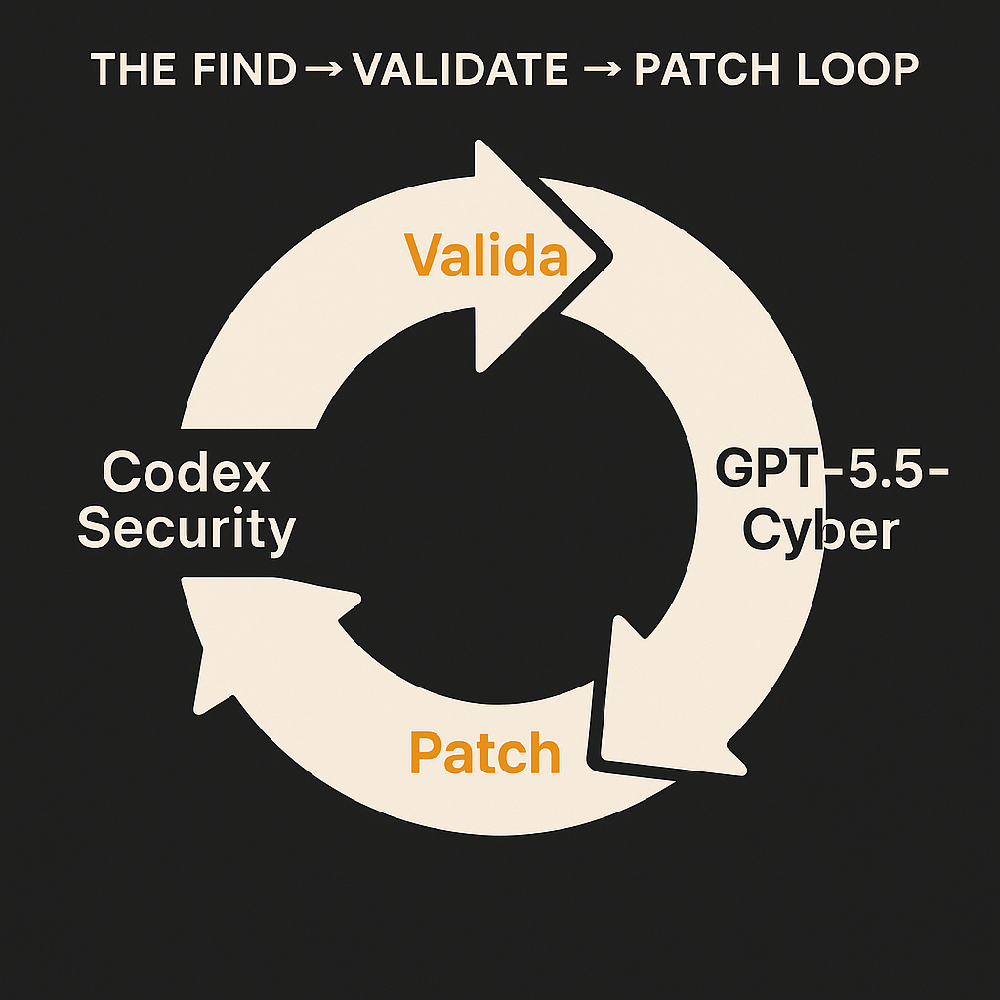
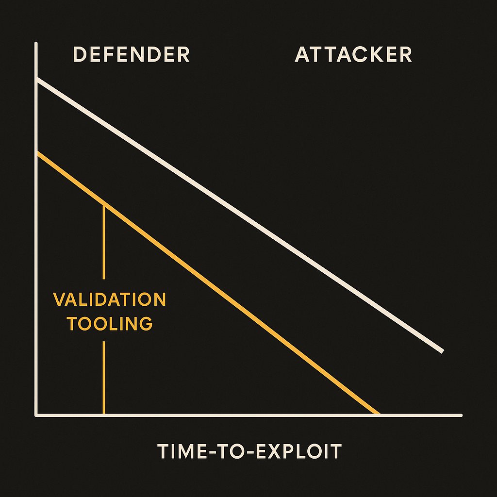
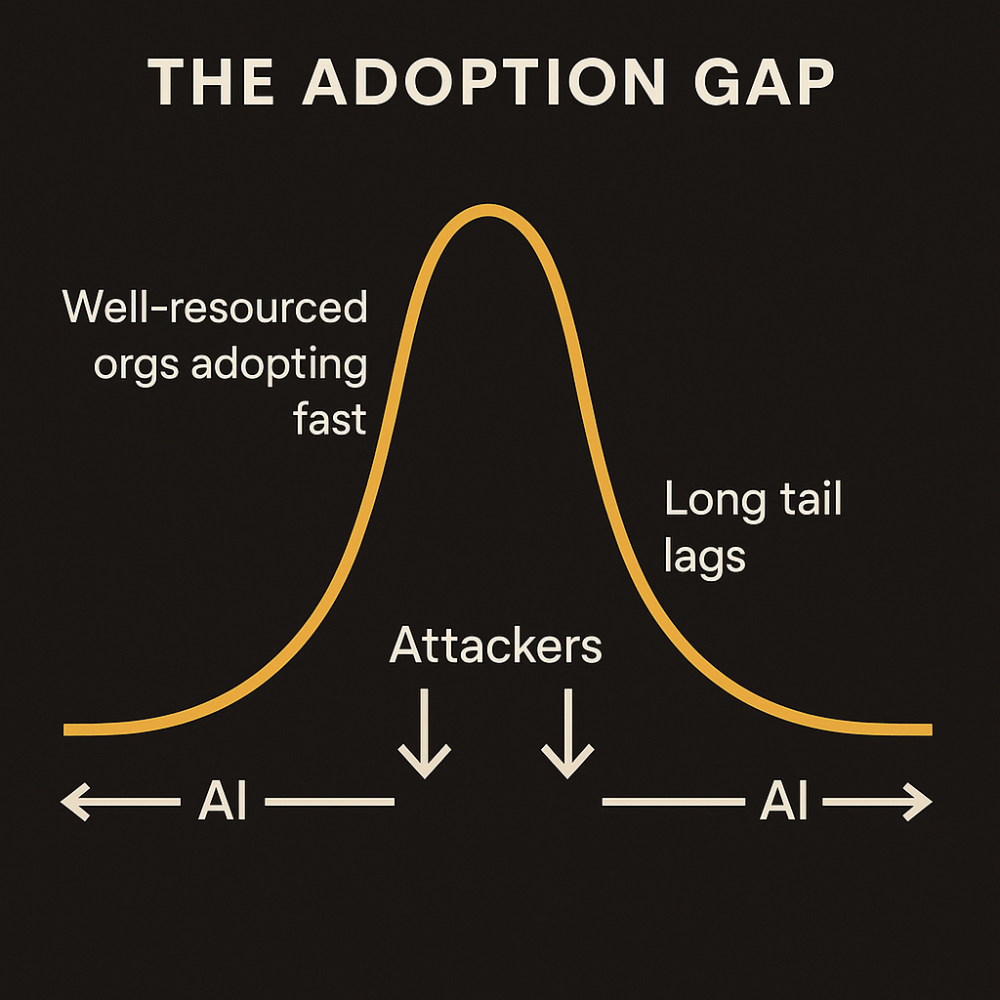

OpenAI just put out Daybreak, a package of security tools built around two things: Codex Security and a model they're calling GPT-5.5-Cyber. The pitch is straightforward. Find vulnerabilities, validate them, patch them, and do it at a scale humans can't match. The headline framing is "securing every organization in the world," which is the kind of line that should make you both interested and slightly suspicious.

I'm interested. I'm also going to sit with the suspicion for a minute, because the most important thing about a cyber model is rarely what it does for defenders. It's what it does for everyone.

## What Daybreak actually claims to do

Based on what OpenAI published, Daybreak isn't a single product. It's a workflow split across stages. Codex Security handles the code-level work: scanning a codebase, spotting the bug, and proposing a fix. GPT-5.5-Cyber is the specialized model underneath, tuned for security reasoning rather than general chat.

The interesting word in the announcement is "validate." Plenty of tools find vulnerabilities. Static analyzers have flagged potential bugs for decades. The problem has never been finding candidates. It's the noise. A scanner that throws 4,000 alerts at a team buries the twelve that matter under a pile that doesn't. So when OpenAI says find, validate, and patch as three distinct steps, the validate step is where the real claim lives.

If GPT-5.5-Cyber can actually confirm that a flagged vulnerability is exploitable, not just theoretically present, that's a meaningful jump. It moves the tool from "here are 4,000 things to look at" to "here are 12 things that are real, and here's a patch for each." That's the difference between a tool that adds work and one that removes it.

The catch: OpenAI's announcement asserts this capability. It doesn't, as far as I've seen in the published material, give the benchmark detail to prove the validation step holds up against the false-positive problem that has killed every security tool before it. Until there's a measured precision number on real codebases, treat "validate at scale" as the promise, not the proven result.

## The dual-use problem nobody wants on the slide

Here's the thing about a model that's good at finding exploitable vulnerabilities in code. It does not care which side of the keyboard you're on.

A defender points GPT-5.5-Cyber at their own codebase and gets a prioritized list of real bugs to fix. An attacker points the same class of capability at someone else's codebase and gets a prioritized list of real bugs to exploit. The validation step that makes the tool useful for defense, confirming a vulnerability is actually reachable, is exactly the step an attacker wants most. Knowing a bug is real before you spend effort on it is the entire economics of offense.

OpenAI clearly knows this, which is why the distribution will be gated rather than open. But gating is a speed bump, not a wall. The capability exists now. Once a frontier lab demonstrates that a model can validate exploitability at scale, that result propagates. Other labs build toward it. Open-weight models close the gap. The window where only well-behaved organizations have this is shorter than the marketing implies.

So the honest framing isn't "Daybreak makes everyone safer." It's "Daybreak compresses the time from vulnerability-exists to vulnerability-handled, for both attackers and defenders, and the question is who moves faster." Defenders have a structural advantage here: they get to run the tool on their own code before they ship it. Attackers have to work from the outside. That advantage is real, but it only pays off if defenders actually adopt the tooling at the same speed the capability spreads. Most won't. That's the gap that matters.

## Why "every organization" is the wrong frame

The "securing every organization in the world" line is aspirational, and I get why it's there. But it describes a future that depends almost entirely on adoption, not capability.

The organizations most exposed to AI-assisted attacks are not the ones who'll be first in line for Daybreak. They're small shops, municipal systems, hospitals running software two versions behind, the long tail of the internet that never patches because nobody has the budget or the staff. A powerful security model sitting behind an enterprise contract does nothing for them. Meanwhile the attacker only needs the capability once, pointed anywhere.

This is the same shape as every security tool before it. The defenders who adopt early are the ones already doing security well. The capability raises the floor for people who were already standing tall and does very little for the people on the ground. If OpenAI is serious about the "every organization" framing, the interesting work isn't the model. It's the distribution: making validated, patched fixes cheap and automatic enough that the hospital two versions behind gets them without hiring a security team.

I haven't seen that part of the plan yet. The tooling is the easy half. The distribution to the people who need it most is the hard half, and it's the half that decides whether "secure every organization" is a mission or a tagline.

## Practitioner's Take

If you ship code and you can get access, the move is to wire Codex Security into your CI before merge, not as a periodic audit. The value is in the validate step, so build your workflow around it: treat the validated, exploitable findings as blocking, and route the unvalidated noise to a separate queue you review on your own schedule. Don't let it become another dashboard nobody opens.

The catch most people will miss: this tool changes your threat model the day it ships, whether or not you adopt it. The same capability is now available to whoever wants to find bugs in your software, so the relevant question isn't "should we use this," it's "are we patching faster than someone else can scan us." Assume your dependencies are being checked by something Daybreak-shaped right now. Audit the libraries you pull in, not just the code you write, because that's the surface you don't control and the surface an attacker reaches first. Adoption speed is the whole game, and the labs already moved.
