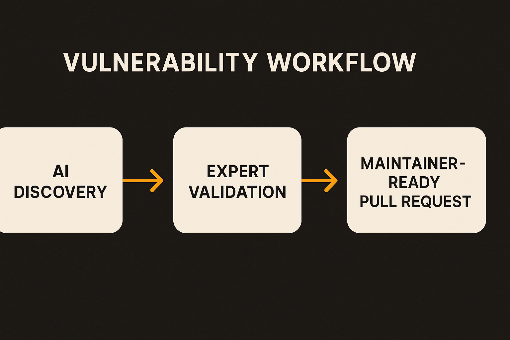

OpenAI is aiming AI at one of software’s least glamorous problems: open-source security maintenance.

The company introduced Patch the Planet, a Daybreak initiative meant to help open-source maintainers find, validate, and fix vulnerabilities with AI and expert review. That framing matters. The hard part is not only discovering bugs. It is sorting real risk from scanner noise, producing a fix that fits the project, and getting it merged without dumping unpaid labor on maintainers.

That is the right target. It is also a hard one.

## The bottleneck is validation, not detection

Most serious engineering teams already have too many alerts. Static analyzers, dependency scanners, bug bounty reports, CVE feeds, GitHub advisories, package audits. Some are valuable. Many are vague. Maintainers get a pile of “possible” issues, often with no reproduction, no patch, and no clear severity.

OpenAI’s wording is careful: Patch the Planet is about finding, validating, and fixing vulnerabilities, with AI and expert review. The expert review piece is doing a lot of work here. AI can inspect code, propose exploit paths, draft tests, and suggest patches. But if it cannot prove the issue matters, it risks becoming another inbox.

That is the thing I would watch. A useful security agent does not say, “this looks suspicious.” It says, “this function accepts untrusted input, here is a minimal reproduction, here is the failing test, here is the patch, here is why the patch does not break the public API.” Then a human can decide.

## Maintainers need finished work, not more tickets

Open source has a weird labor market. The internet depends on libraries maintained by people who may be volunteers, part-time caretakers, or one person with a day job. Security programs often assume maintainers have spare cycles to triage reports, understand edge cases, negotiate disclosure, review fixes, and cut releases.

They often do not.

So the success metric for Patch the Planet should not be “number of vulnerabilities found.” That number is easy to inflate. The better metric is maintainer time saved. How many reports came with working reproductions? How many patches were merged? How many fixes avoided breaking downstream users? How many maintainers said, “yes, this made my project safer without stealing my week”?

OpenAI has not shared enough detail in the provided announcement to judge the operating model. We do not know which projects are covered, how maintainers opt in, how disclosure is handled, who the experts are, or what happens when the AI and reviewers disagree. Those details are not paperwork. They are the product.

## AI security work needs a trust contract

Security is one of the better near-term uses for coding agents because the task has natural checks. A vulnerability can often be reproduced. A patch can be tested. A regression suite can run. A reviewer can inspect the diff.

But trust still has to be earned. Maintainers will want clear provenance, minimal patches, readable explanations, and respect for project norms. They will not want giant generated rewrites. They will not want private vulnerability handling that surprises them. They will not want “AI found this” as a substitute for evidence.

If Patch the Planet gets that contract right, it could be a useful pattern: AI does the boring sweep, humans validate the judgment, maintainers receive work that is close to mergeable. Not magic. Just a better assembly line for security debt.

For builders, the lesson is practical. If you are adding AI to security workflows, do not ship an alert generator and call it progress. Build the loop around proof: reproduction, test, patch, explanation, reviewer signoff. Start with one dependency or one code path, measure how many findings become accepted fixes, and track maintainer time. The catch most teams miss is that the user is not the person excited by AI. The user is the tired maintainer deciding whether your report is worth opening.
