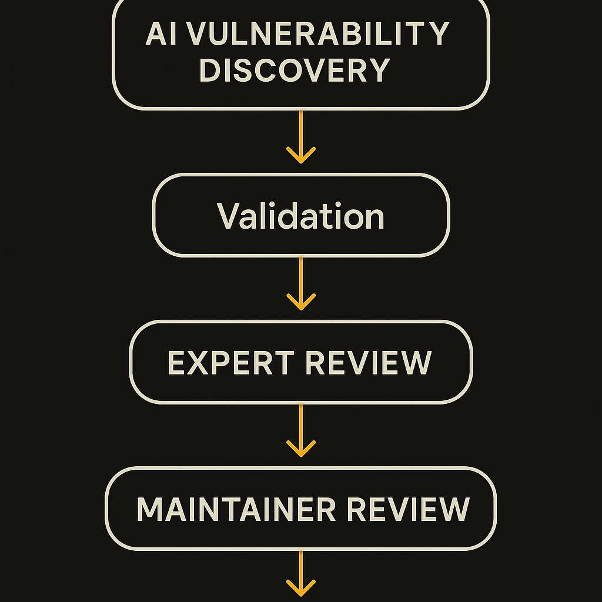

OpenAI introduced Patch the Planet, a Daybreak initiative meant to help open-source maintainers find, validate, and fix vulnerabilities with AI and expert review.

That framing matters. The promise is not just “AI finds bugs.” We have had scanners, fuzzers, static analysis, dependency alerts, and bounty programs for years. The hard part is everything after the alert: is this real, is it exploitable, does the fix break users, who has time to review it, and will the maintainer accept the patch?

If Patch the Planet is useful, it will be useful in that messy middle.

## The maintainer bottleneck is not discovery alone

Open-source security has a capacity problem. Popular packages are infrastructure, but many are still maintained by small teams, volunteers, or companies that do not treat maintenance as their main job. A tool that produces more findings can help, but it can also make the queue worse.

That is why OpenAI’s mention of validation and expert review is the interesting part. AI-generated vulnerability reports are cheap to create. Good reports are not. A maintainer needs a reproducible case, a clear impact statement, a minimal patch, tests, and a sense that the submitter understands the project’s style and constraints.

A weak version of this initiative becomes another alert firehose. A stronger version becomes a translation layer between automated analysis and human maintainers. It would turn suspected issues into reviewable pull requests, with enough context that a tired maintainer can say yes, no, or “close, change this.”

## AI can help most when the patch is small

There is a practical reason this kind of program could work: many security fixes are not giant architectural rewrites. They are input validation, safer defaults, bounds checks, dependency updates, permission tightening, escaping mistakes, test additions, and documentation warnings.

Those are exactly the zones where current coding models can be useful if they are constrained. Give the model the repository, the failing case, the security context, and the project’s test suite. Ask it for a minimal diff. Then have a human security reviewer and maintainer evaluate the result.

The catch is that “fixing a vulnerability” is not the same as making tests pass. A patch can close one hole while opening another. It can handle the reported exploit but miss related variants. It can also impose a breaking change that maintainers cannot ship casually.

So the expert-review piece is not decoration. It is the quality control layer. OpenAI has not, from the announcement details available here, shared scope, eligibility, target ecosystems, review process, success metrics, or how maintainers will opt in. Those details will decide whether this is a credible maintenance program or a good-sounding campaign.

## The right metric is merged, trusted fixes

I would not judge Patch the Planet by the number of vulnerabilities “found.” That number is too easy to inflate and too hard to interpret. I would look for merged patches, maintainer satisfaction, time saved, false-positive rate, and whether fixes land in projects people actually depend on.

There is also a trust issue. Open-source maintainers are already wary of low-quality AI pull requests. Some projects have had to close drive-by contributions that waste review time. If Patch the Planet sends maintainers polished, verified, narrow patches, it can build trust. If it sends generic diffs and vague security language, it will burn trust quickly.

This is the pattern I expect across serious AI tooling in 2026: not “the model replaces the expert,” but “the model drafts the work product, then expert process determines whether it is safe to ship.” Security is a good test case because the downside of sloppy automation is obvious.

Practitioner’s take: if you maintain a package, do not wait for a big initiative to improve your workflow. Create a security issue template, add a reproducible test pattern for vulnerability reports, document patch expectations, and make CI easy for external contributors. If AI-assisted security help arrives, you want it entering a clean review path. The catch most teams miss is that accepting AI-generated fixes safely requires better human process, not less of it.
