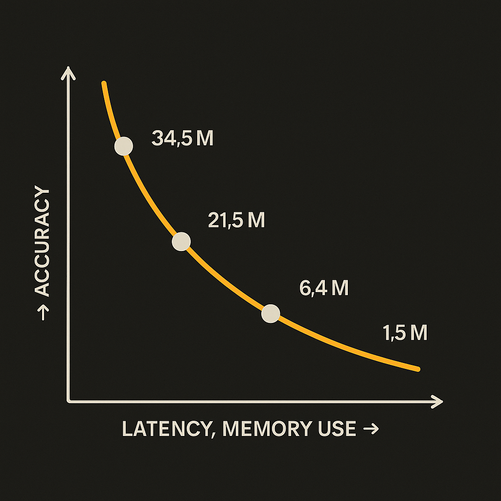

Hugging Face highlighted PP-OCRv6 this week as a 50-language OCR family with models ranging from 1.5M to 34.5M parameters. That size range is the story.

OCR has usually been treated as infrastructure plumbing. You send images or PDFs to a service, get back text, then feed that into search, RAG, accounting software, claims processing, or whatever workflow sits downstream. The model itself is often invisible.

PP-OCRv6 makes the model choice more explicit. A 1.5M parameter OCR model and a 34.5M parameter OCR model are not the same product, even if they live under the same family name. They imply different latency, memory, deployment, and accuracy tradeoffs. For builders, that matters more than the headline “50 languages.”

## OCR is becoming an edge-sized problem

The parameter counts Hugging Face called out are tiny compared with frontier language models, but OCR does not need to write essays. It needs to find text in pixels, recognize characters, and avoid corrupting downstream data.

That makes small models interesting. A compact OCR model can fit into places where calling a cloud API is awkward: mobile apps, factory floors, privacy-sensitive document review, disconnected field work, or high-volume back offices where per-page pricing adds up. A bigger 34.5M parameter model is still small enough to be considered lightweight in today’s AI stack, while a 1.5M model starts to feel like something you can embed almost anywhere.

The catch is that OCR quality has a long tail. Printed English invoices are one thing. Rotated receipts, low-resolution scans, mixed scripts, handwritten annotations, tables, stamps, checkboxes, and skewed photos are another. The practical question is not “does it support 50 languages?” It is “which 12 document types do we actually process, and where does it break?”

## Multilingual support is necessary, not sufficient

The 50-language claim is useful, especially for teams outside the English-first software bubble. But language coverage is only one layer of OCR performance.

A document pipeline also needs layout recovery, reading order, table handling, confidence scores, and a strategy for bad outputs. A model can recognize words correctly and still produce text in the wrong order. It can handle a language in clean print but fail on real scans from a regional office. It can pass a demo and still quietly poison a retrieval index.

That is why I would not evaluate PP-OCRv6 as a generic “OCR replacement.” I would evaluate it as a component. Pair it with document classifiers, page segmentation, validation rules, and human review for low-confidence cases. If you are extracting totals from invoices, compare the final extracted fields, not just character accuracy. If you are building search over contracts, test whether retrieved passages still point to the right clause after OCR.

This is also where Hugging Face availability matters. Once models are easy to pull, test, and swap, teams can run real bake-offs instead of committing to a vendor because procurement happened before evaluation. OCR is old tech, but open model distribution changes the iteration loop.

Practitioner’s take: take 200 ugly documents from your actual workflow, not a benchmark folder. Run the smallest PP-OCRv6 model first, then the larger one, then your current OCR provider. Measure end-to-end task success: fields extracted, pages searchable, human corrections needed, latency, and cost. The miss most teams make is judging OCR by clean text output instead of downstream damage. A one-character error in the wrong field can cost more than a slower model.
