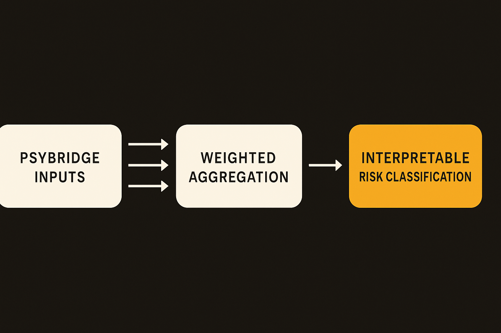

## The useful move is integration, not prediction theater

PsyBridge is not trying to be an AI therapist. Good.

The arXiv paper frames it as a hybrid decision-support system for mental health assessment. It combines PHQ-9 for depression, GAD-7 for anxiety, cognitive indicators, behavioral signals, and personality profiling into one weighted scoring architecture. The output is an interpretable risk classification plus recommendations.

That is a more useful direction than the usual “chat with this bot when you feel bad” product pitch. Mental health assessment is already full of structured instruments. The gap is that they often sit in separate forms, separate visits, or separate tabs. A system that pulls those signals together and shows why it assigned a risk level could be useful in telehealth, intake workflows, and stepped-care models.

PsyBridge reports 0.84 overall accuracy on 500 patient profiles, outperforming standalone PHQ-9 and GAD-7 baselines. The paper also says ablation and sensitivity tests showed that cognitive and personality components stabilized classification, especially around moderate-risk cases.

That last part matters. Low-risk and high-risk cases are usually easier. Moderate risk is where systems get messy, clinicians spend time, and bad routing can cause real harm. If extra dimensions reduce inconsistency there, that is the practical contribution.

## The catch is the data

The dataset is semi-synthetic. That does not make the work useless. It does cap what we can claim.

Semi-synthetic data can be a reasonable way to test architecture, run ablations, and check whether a scoring method behaves as expected across severity bands. It is not the same as prospective validation with real patients, real missing data, cultural variation, comorbidities, medication effects, clinician notes, crisis cases, and inconsistent self-reporting.

So I read the 0.84 accuracy as an engineering signal, not a clinical result. It says the framework can combine multiple mental health dimensions in a controlled test and beat individual screeners in that setup. It does not say PsyBridge is ready to route patients without clinician oversight.

This is where mental health AI needs more boring honesty. The hard part is not only model performance. It is calibration by setting, escalation policy, liability, audit trails, consent, explainability that clinicians actually understand, and graceful failure when someone is at risk but the inputs are incomplete.

The paper’s strongest choice is interpretability. A weighted aggregation mechanism is not glamorous, but in clinical workflows boring can be good. If a clinician can see that a risk classification came from elevated PHQ-9, moderate GAD-7, impaired cognitive indicators, and a relevant behavioral pattern, they can challenge it. A black-box score with a polished interface is much harder to trust.

## This is a workflow product, not a replacement clinician

The opportunity here is intake and monitoring. Imagine a telehealth platform where a patient completes standard screeners, a short cognitive task, and a personality or behavioral profile before the visit. PsyBridge-style logic could summarize risk, flag inconsistencies, suggest follow-up questions, and track changes over time.

That would save clinician attention for judgment, not paperwork. It could also make lower-acuity care more consistent. The system should not say, “diagnosis: depression.” It should say, “risk appears elevated for these reasons, here are the contributing dimensions, here is what changed since last assessment, here are recommended next steps.”

The danger is product teams turning this into an automated gatekeeper. Mental health systems are already overloaded. A tidy score can become a shortcut for denial, deferral, or under-triage if the business process rewards throughput over care. Any deployment needs human review for medium and high risk, crisis escalation paths, and bias testing across populations that were not represented in the synthetic setup.

For builders, the play is to copy the architecture pattern, not the claims. Start with validated instruments, add only signals that a clinician can explain, keep the scoring inspectable, and test first on retrospective real-world data before touching live routing. The catch most teams miss: the model is not the product. The product is the handoff between assessment, clinician action, and follow-up. If that loop is weak, 0.84 accuracy will not save you.
