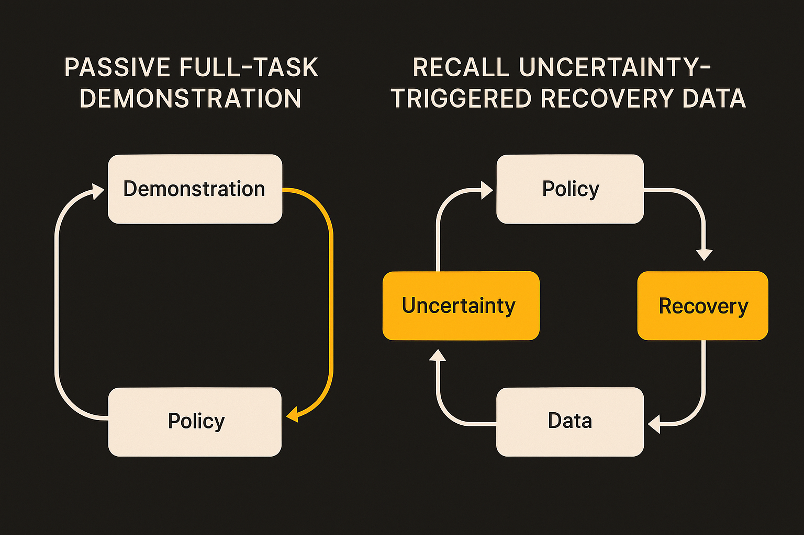

Robot fine-tuning still has a very human bottleneck: someone has to show the machine what to do.

The RECALL paper, listed on arXiv in cs.AI and cs.LG, takes aim at a common pattern in vision-language-action models. A robot policy performs badly on a task, so researchers collect more demonstrations and fine-tune the model. That sounds reasonable until you look at the workflow. The robot has to fail first. The data collector gets little signal about which states actually need help. And a lot of human time is spent re-demonstrating parts of the task the policy already handles.

RECALL proposes a cleaner loop: collect recovery experiences where the model is uncertain, then fine-tune from those targeted interventions. It is a small framing shift with big operational consequences. The point is not just “more robot data.” The point is better routing of expensive human supervision.

## Passive demos are a blunt instrument

Most imitation learning pipelines treat a demonstration as the unit of value. Full trajectory in, policy update out. That works, but it is noisy from an operations perspective.

If a robot can already approach the drawer, grip the handle, and pull halfway, but gets confused when the drawer sticks, a full new demo repeats a lot of known behavior. RECALL’s active collection setup asks a narrower question: where is the policy uncertain enough that a human recovery would teach it something?

That is the part I like. It turns data collection into debugging. Not “give me more examples,” but “show me the states where the current policy is least sure of itself.”

The RECALL authors report that uncertainty-guided data collection leads to more efficient fine-tuning than passively collected demonstrations. They do not claim this solves general robot learning. They show a more disciplined way to spend demonstration effort.

## Targeted learning creates a new failure mode

The catch is the useful part.

RECALL finds that fine-tuning only on actively collected recovery data can cause catastrophic forgetting. In plain terms: the robot improves on the uncertain recovery states, but loses some behaviors it had already learned.

That is the central tradeoff in continual learning, showing up in a physical policy rather than a benchmark leaderboard. Plasticity helps the system adapt to the newly collected data. Stability keeps the old task competence intact. Push too hard toward new recovery examples, and the model overfits to the latest lesson.

The paper evaluates replay-based data mixing and elastic weight consolidation. Replay mixing brings older data back into training so the model does not rewrite itself around the newest recovery cases. Elastic weight consolidation tries to protect parameters that matter for prior behaviors. Neither is magic. The RECALL authors frame this as a tradeoff, not a solved recipe.

That is the right level of humility. Active learning sounds efficient because it removes waste from data collection. But targeted data is not automatically balanced data. The more surgical the supervision, the more careful the update has to be.

## The real product is the learning loop

This is where robot learning starts to look less like model training and more like fleet operations.

A deployed robot should not wait for a full task failure, dump logs, and ask for another batch of demos. It should expose uncertainty during execution, request human help at the smallest useful boundary, store that recovery, and update without trashing yesterday’s skills.

That sounds obvious, but most AI product loops still do not work this way. They collect thumbs up, thumbs down, transcripts, crash reports, or full sessions. RECALL points toward a tighter pattern: instrument uncertainty, collect intervention data, mix it with memory, then measure both adaptation and retention.

The same idea applies beyond robotics. Coding agents, browser agents, support agents, and data-entry copilots all waste human feedback when they ask for broad corrections instead of pinpoint recovery. “Fix this whole workflow” is expensive. “Show me what to do at this uncertain branch” is cheaper, if the system can identify the branch.

For builders, the move is to separate three things in your loop: uncertainty detection, recovery capture, and retention testing. Try collecting corrections only at high-uncertainty states, but do not fine-tune on those corrections alone. Mix in representative older cases and test old capabilities every time. The catch most teams miss: better feedback selection can make model updates more brittle unless you protect what the model already knows.
