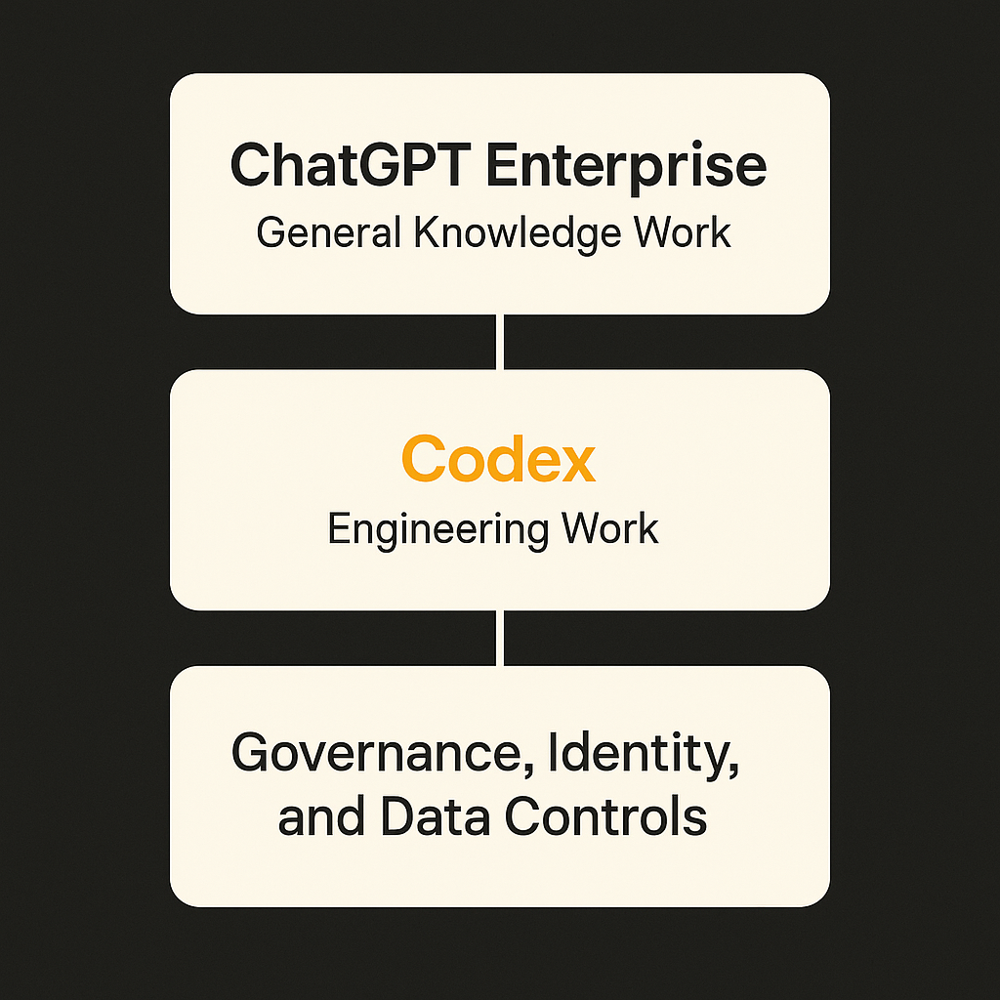

Samsung Electronics is rolling out ChatGPT Enterprise and Codex to employees worldwide. OpenAI called it one of its largest enterprise AI deployments.

That is the whole public fact pattern so far, and it is thin. No user count. No division breakdown. No detail on which workflows Samsung has approved. No performance numbers. Still, the move is useful signal because Samsung is not a small software startup playing with a chatbot. It is a global electronics manufacturer with chips, phones, appliances, displays, supply chains, factories, labs, and a huge engineering base.

When a company like that buys both ChatGPT Enterprise and Codex, it is not just buying a writing assistant. It is buying a new layer in the employee tool stack.

## The bundle matters more than the brand

ChatGPT Enterprise is the general-purpose interface. It handles the broad work: drafting, summarizing, translating, analyzing documents, turning messy notes into something usable, and helping employees reason through tasks.

Codex points at a narrower but important population: engineers. Code review, test generation, migration work, documentation, refactoring, internal tool building. That is where the ROI can be easier to see, because software teams already measure cycle time, defects, pull requests, tickets, and backlog burn-down.

The pairing is the point. Samsung is not treating AI as one app for one team. It is putting a general assistant and a coding assistant into the same enterprise motion. That suggests a shift from “let teams experiment” to “give employees sanctioned tools with enterprise controls.”

That is where the real enterprise AI market is going. Not better prompt tricks. Not viral demos. Procurement, identity, logging, data handling, admin controls, model access, and internal policy. Boring stuff. Necessary stuff.

## The rollout is also a governance story

Samsung has special reasons to care about AI controls. It handles sensitive product plans, semiconductor designs, manufacturing processes, supplier data, and customer-facing software. A global rollout only works if employees have a safer place to use AI than random public tools.

That does not mean risk disappears. It means the risk moves into a managed system.

The hard questions are operational. Which data can employees upload? Which teams can use Codex on proprietary repositories? Are outputs logged for audit? Are prompts retained? How are generated code changes reviewed? Who decides whether AI can touch production workflows? How are model mistakes reported?

OpenAI’s announcement does not answer those. That is normal for a customer rollout announcement, but builders should not skip past it. Large enterprise AI deployments are less about model access than permission design.

The most successful internal AI programs I have seen usually do not start with “everyone can do anything.” They start with patterns: approved use cases, prohibited data, human review gates, evaluation sets for key tasks, and a way for teams to share what actually works.

## The bigger signal: AI is becoming default software

This is one more sign that enterprise AI is moving out of the novelty budget.

A few years ago, the pitch was personal productivity. Now the buyer question is closer to: should AI sit beside email, docs, search, tickets, repos, and spreadsheets as a default work surface?

Samsung saying yes, at global scale, is meaningful. But it is not proof that every employee becomes dramatically more productive. The productivity claims still need receipts. Different jobs will see different gains. A developer writing tests may get immediate value. A hardware engineer working with confidential design docs may need much tighter constraints. A manager may mostly use it for synthesis and communication. A factory workflow may not be touched at all.

The catch is adoption quality. Buying seats is easy. Changing work is not.

For builders, the practical move is to design around actual workflows, not “AI access.” Pick three repeatable jobs inside the company: code review support, support doc summarization, sales or procurement analysis, test generation, internal search over policy. Define what good output means. Put review gates in place. Measure before and after. The catch most teams miss: the model is only one part of the system. The real product is the combination of model, permissions, data access, workflow fit, and trust.
