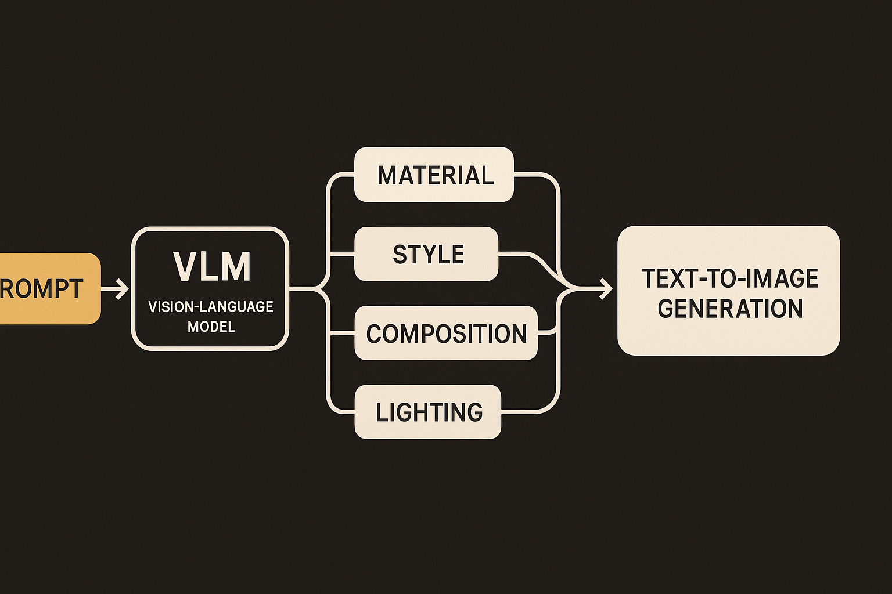

Text-to-image models got very good at doing what you ask. That sounds like the whole game, until you try to use them for design exploration.

Ask for “a modern chair in a sunlit studio” and you may get four polished images that differ mostly in upholstery color, camera angle, or background clutter. They are not useless. But they are often four samples of one idea, not four directions a designer can reason about.

The Semantic Browsing paper, posted to arXiv in both cs.AI and cs.LG, names this failure clearly: strict prompt adherence can collapse generations into a single visual interpretation. The authors argue that diversity should not mean incidental noise. It should mean structured, meaningful choices.

That is the useful bit. Not “more randomness.” Better menus.

## Random seeds are a weak interface

Most image generators already expose some form of variation. Change the seed. Nudge the prompt. Use a style preset. Generate again. The problem is that these controls are indirect.

A random seed may change a chair’s legs, the floor texture, and the lighting all at once. A prompt tweak may produce a new aesthetic but also break the scene. The user has to inspect each output and infer what changed. That makes exploration feel like slot-machine browsing.

Semantic Browsing flips the control surface. The authors induce diversity at the text level before pixels are generated. A vision language model operates over the full scene context, proposes axes of variation, and creates structured alternatives that remain tied to the original prompt.

For the chair example, the system might organize a gallery around material, silhouette, historical style, room context, or lighting mood. Each branch has a reason. The user is not just seeing options. They are seeing the map of the option space.

That matters because creative work is often comparative. You do not just want “another image.” You want to know whether the concept is stronger as bent plywood or brushed aluminum, as Bauhaus or Memphis, as product render or editorial photograph.

## The real shift is caption-first generation

The paper’s key observation is that recent text-to-image systems are trained on rich, elaborated captions. That gives builders a place to intervene. Instead of treating the model as a black box where diversity happens inside the sampler, Semantic Browsing pushes semantic decision-making into an upstream language workflow.

That is a practical architectural point. The VLM is not being asked to paint. It is being asked to understand the scene and write controlled variants. The image model then does what it already does well: follow detailed text and render pixels.

The authors also point out a common failure mode with standard VLM outputs: they can be generic. So their workflow is agentic, with explicit constraints to enforce structured variation tuned to the original prompt. That detail is important. If the VLM just says “make it futuristic, rustic, minimalist,” you have a mood-board cliché machine. The value comes from axes that are specific to the scene.

I would not overread the claim yet. The provided abstract says the method produces diverse and navigable design spaces, where every variation corresponds to a user-understandable semantic decision. Good direction. But without the full experiments in front of us here, I would treat that as a design hypothesis with promising evidence, not a solved interface problem.

## This is more about creative tooling than model quality

The interesting competition here is not between image models. It is between interaction models.

A better generator can make prettier samples. A better browsing system can make the user smarter about the design space. Those are different wins. Semantic Browsing points toward tools where the system exposes its creative branches instead of hiding them behind a regenerate button.

For builders, the pattern is simple enough to try now: put a planning layer in front of image generation. Given a prompt, ask a VLM or language model to propose 4 to 6 semantic axes, generate 3 to 5 controlled variants per axis, then label the gallery by the decision being tested. The catch most teams will miss is evaluation. Do not ask, “Are these images diverse?” Ask users whether the options helped them make a decision faster, reject a direction, or discover a direction they would not have prompted manually.
