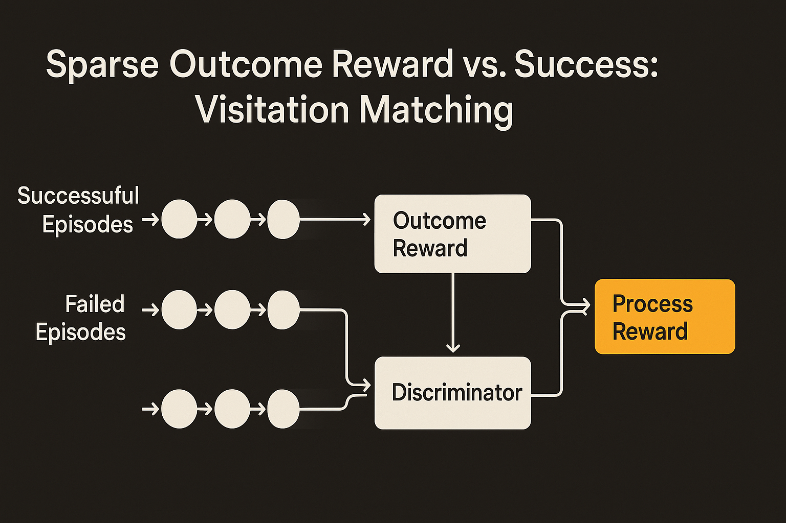

Sparse rewards are honest, but painful.

If the robot only gets +1 when the task is completed and 0 everywhere else, the reward function is clean. It also gives the learner almost no help. The policy has to figure out which of thousands of earlier state-action choices mattered. That is the classic credit assignment problem, and it is why sparse-outcome RL can spend a lot of time thrashing before improvement shows up.

A new arXiv paper, listed under both cs.AI and cs.LG, proposes a simple fix: learn a dense process reward from the difference between successful and unsuccessful episodes. The method is called Success Visitation Matching. The core move is to train a discriminator that can tell whether state-action visitations look like they came from prior successful rollouts or failed ones. Then use that signal as an added training reward.

Not just “did you finish?” More like “does this move look like the kind of move that tends to appear on paths that finish?”

## The useful bit is the visitation, not the label

The paper’s strongest idea is that it does not only reward states near completion. It rewards matching the whole distribution of state-action visitations from successful episodes, while discouraging visitations associated with failures.

That matters. In a robotic manipulation task, success is often the end of a long chain: approach, align, grasp, lift, place, release. The sparse reward only recognizes the last frame. A visitation-based reward can, in principle, give the policy useful pressure much earlier in the trajectory.

This is also why the approach feels less brittle than hand-written shaping rewards. Reward shaping usually smuggles in human guesses about intermediate progress. Sometimes those guesses help. Sometimes they teach the agent weird shortcuts. Here, the intermediate signal is learned from the empirical difference between successful and unsuccessful behavior.

The authors also claim the method “provably achieves this without changing the optimal policy.” That is the important theoretical guardrail. Dense reward is useful only if it speeds learning toward the same goal, not a nearby proxy that looks good in logs and fails in the real task.

## Robotics is the right test bed

The paper focuses on finetuning robotic control policies, both in simulation and on real-world manipulation tasks. That is the right place to test this kind of method because robot data is expensive, failures are common, and sparse rewards are normal.

The authors report significantly faster RL finetuning than simply maximizing the sparse outcome reward. The abstract does not give exact speedup numbers, so I would not overread the claim. But the direction is practical. If a lab already has a base policy that sometimes succeeds, it also has the raw material for this method: successful episodes, unsuccessful episodes, and a discriminator trained to separate their visitation patterns.

That setup is very builder-friendly. It does not require a human to label every step. It does not require a perfect simulator. It does not require rewriting the task reward by hand. It uses the traces you already collect during finetuning.

There is a broader lesson here for process rewards outside robotics too. The current AI conversation often treats process supervision as a human-labeling problem: grade the steps, not just the answer. This paper points at another pattern: infer useful step-level feedback from outcome-labeled trajectories. When you have many attempts and clear final success, you may be able to learn a process signal without annotating the process directly.

The catch is coverage. Success visitation matching needs successful episodes to imitate and failed episodes to avoid. If early exploration produces almost no successes, the discriminator has little useful contrast. If the successful traces are narrow or accidental, the learned process reward may overfit to one style of success. And if the failures include states that are actually necessary detours, the signal can become misleading.

For a practitioner, I would try this where the task has a clean final success condition and at least a modest trickle of successful rollouts. Start by logging full trajectories, not just outcomes. Train the discriminator offline first, inspect which states it scores as “success-like,” then use it as an auxiliary reward during finetuning rather than replacing the real task reward. The missed detail is that dense feedback is not automatically better. It is better only when it points at the same objective and gives the learner more chances to correct course before the final frame.
