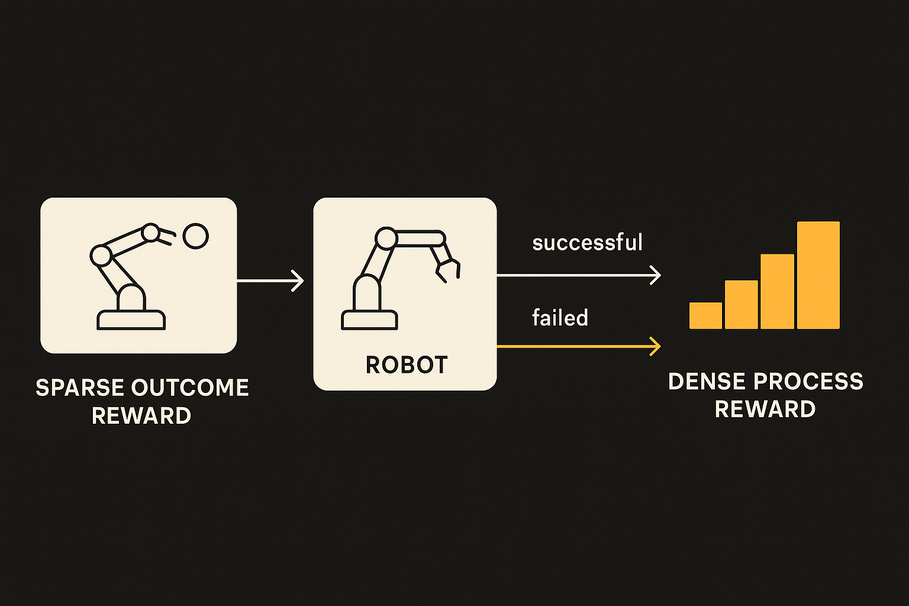

Sparse rewards are clean on paper and brutal in training.

A robot gets 0 for almost everything. Then, after a long chain of motions, grasps, adjustments, and maybe luck, it gets +1 for completing the task. That objective is easy to define. It is not easy to learn from.

The arXiv submission, “Learning Process Rewards via Success Visitation Matching for Efficient RL,” attacks that exact gap. The method turns a sparse outcome reward into a dense process reward by training a discriminator to tell successful episodes from unsuccessful ones. The policy is then rewarded for matching the state-action visitations seen in prior successful runs, while avoiding patterns common in failed runs.

That sounds modest. I think that is the point.

## The reward is not just at the finish line

The useful idea here is that “success” has a shape before the final success signal appears.

In a manipulation task, a successful trajectory probably visits certain states along the way. The gripper approaches from a useful angle. The object moves into a better pose. Contact happens in a productive region. None of those intermediate moments are the final reward, but they are not meaningless either.

Success visitation matching uses those moments as training signal. Instead of waiting for the task completion bit, it asks whether the current policy is spending time in parts of state-action space that look like earlier successes.

The important claim is not only that this speeds things up. “Learning Process Rewards via Success Visitation Matching for Efficient RL” also claims the added dense reward does not change the optimal policy. That matters because reward shaping can quietly teach the wrong task. A robot can learn to satisfy the proxy instead of the goal. The paper’s pitch is that the proxy gives better credit assignment without moving the target.

That is the line to watch.

## This is reward shaping with receipts, not magic

There is not much disagreement to triangulate here, since the cs.AI and cs.LG arXiv entries carry the same abstract and claim set. The work reports faster RL finetuning on simulated and real-world robotic manipulation tasks compared with simply maximizing the sparse outcome reward.

That is useful, but I would not read it as “sparse rewards are solved.” The method depends on having successful and unsuccessful episodes good enough to train the discriminator. If your task has almost no successes, or your successful examples cover a narrow strategy, the dense reward may push the policy toward imitation of yesterday’s accidents.

Still, the framing is strong. It treats past rollouts as evidence, not as demonstrations to clone blindly. The discriminator does not need a human to label every intermediate step. It learns the difference between trajectories that tend to end well and those that do not, then supplies feedback at each state-action visitation.

This is close to what many applied AI systems need outside robotics too. Long-horizon agents often get graded only at the end: did the code pass, did the report satisfy the user, did the workflow complete? Builders then invent brittle intermediate checks. Success visitation matching is a reminder that the intermediate signal may already be hiding in the logs.

## The broader lesson is about process rewards

The phrase “process reward” has picked up a lot of baggage in language model work. Sometimes it means carefully labeling reasoning steps. Sometimes it means training a judge to score partial work. Here, the robotics version is refreshingly concrete: compare the path of successful behavior against failed behavior, then reward paths that look more like the former.

That does not make the learned reward true. It makes it useful if the data has enough coverage and the discriminator does not learn superficial shortcuts.

The catch is distribution. If prior successes all came from one initial condition, one object pose, or one controller quirk, the process reward may encode that bias. The paper says the approach improves finetuning performance in simulated and real-world manipulation tasks, but the abstract does not give enough detail to judge how far it generalizes. I would want to see performance under shifted starts, new objects, and failure modes that look visually similar to success until late in the episode.

For builders, the practical move is simple: if your system only gets a final pass/fail signal, mine completed runs for intermediate patterns before adding hand-written shaping rules. Train a lightweight classifier to separate successful from failed traces, use its score as dense feedback, then audit hard for shortcuts. The catch most teams miss: a process reward is not a goal. It is a map drawn from yesterday’s wins. Use it to speed learning, but keep the real outcome check in charge.
