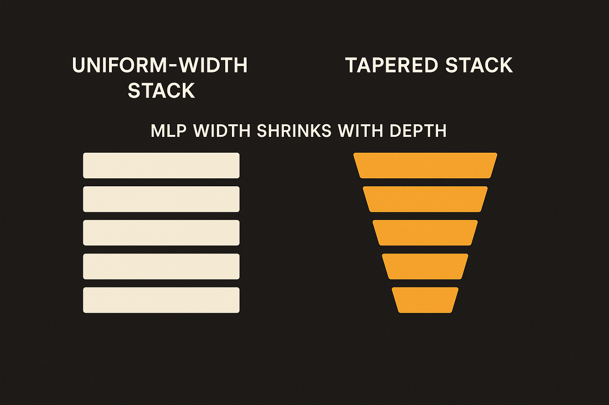
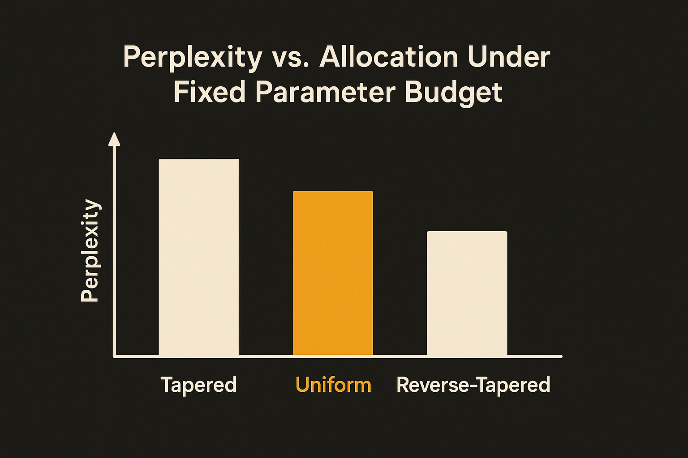

Every modern language model is built on a quiet assumption almost nobody questions: each layer gets the same width. Stack N identical blocks, give them identical parameter budgets, train. That default came straight out of the 2017 transformer and has barely moved since.

A paper titled "Tapered Language Models," posted across arXiv's cs.AI, cs.CL, and cs.LG listings, pokes at that assumption directly. The claim is small to state and big in implication: under a fixed parameter budget, put more capacity in early layers and less in late ones, and you get better perplexity and better downstream scores. Flip the allocation and you get worse. Same parameters, same compute, just redistributed.

If it holds up, it is the kind of finding that should annoy a lot of people. Free wins this clean usually have a catch.

## The argument: layers do not all do the same job

The starting observation is not new, but the authors lean on it hard. There is growing evidence that layers contribute non-uniformly to the final output. Early layers do heavy lifting, transforming the input into useful representations. Later layers mostly refine the residual stream rather than transform it. They nudge, they polish, they do not reshape.

If that picture is right, spending equal parameter capacity at every depth is wasteful. You are paying the same rent for layers doing very different amounts of work.

So the question the authors pose is straightforward. Should parameter capacity track how much work a layer actually does? They run the controlled version of that experiment first, before proposing anything fancy. More capacity early, less late, beats uniform. The reverse hurts. That ordering matters. It is not just "non-uniform is better," it is specifically front-loaded that wins. That asymmetry is the whole thesis, and it is good that they isolated it.

## Where the taper lives: the MLP

The clever move is the choice of knob. Modern LMs spend most of their parameters in the MLP blocks, not attention. Across transformer, recurrent, and memory-based families, the MLP dominates the parameter count. And MLP width is a single clean axis you can turn up or down without breaking everything else.

So instead of tapering "the model" in some vague way, Tapered Language Models taper MLP width across depth, monotonically, under a fixed total budget. Wide MLPs near the input, progressively narrower toward the output, following a smooth cosine schedule. The cosine part matters for the same reason it matters in learning rate schedules: smooth beats abrupt, no hard cliffs in capacity.

This is the part I like as a practitioner. It is not a new attention mechanism, not a new optimizer, not a new normalization trick. It is a reallocation of parameters you already have. The total stays fixed. The shape changes.

## What the results actually claim

The authors test across three model scales and four architectures: standard Transformer, Gated Attention, Hope-attention, and Titans. That last pair signals they wanted to show this is not a transformer-only quirk. Titans and Hope are memory and attention variants, so spanning them is a real attempt at generality rather than cherry-picking one family.

Across all of those, tapering improves perplexity and downstream benchmark performance over uniform baselines. At no additional parameter or compute cost. Their framing is that depth-aware capacity allocation is "a free lever hidden in plain sight."

Here is where I want to be careful, because the source material is the abstract, and the abstract is doing a lot of confident gesturing. "Consistently improves" is the claim. What we do not get in the abstract is the size of the improvement. A consistent 0.2% perplexity gain and a consistent 5% gain are very different stories. The reproduction across three identical postings (cs.AI, cs.CL, cs.LG) is just the same paper cross-listed, not three independent confirmations, so do not read the triple listing as extra evidence. It is one result.

The honest read: the direction is well-motivated and the controlled experiment isolating front-loaded versus back-loaded allocation is the strongest piece. The magnitude and the scale ceiling are open. "Three model scales" likely means small-to-medium, not frontier. Architectural tricks that shine at 100M to 1B parameters have a long history of shrinking or reversing at 70B. Until someone tapers at scale, treat this as promising, not proven.

## Why this is plausible anyway

The reason I am inclined to take it seriously despite the thin abstract: it rhymes with things we already know. Layer pruning research has shown for years that you can drop or compress late layers with surprisingly little damage. The "later layers just refine" story is consistent with that. If late layers can survive aggressive pruning, then giving them less width from the start is the proactive version of the same insight. Prune after the fact, or budget correctly up front.

It also costs nothing to try, which is the real reason architecture papers like this matter. A new attention variant means rewriting kernels and fighting numerical stability. Tapering MLP width means changing a config: set the hidden dimension per layer according to a cosine schedule. That is a few lines. The barrier to testing it on your own training run is close to zero.

The catch most readers will miss: tapering changes the shape of your weight tensors per layer, which can hurt the regularity that GPU kernels and tensor-parallel sharding rely on. Uniform widths are easy to shard cleanly. Variable widths can fragment your parallelism and your memory layout, so the "no additional compute cost" claim is true for FLOPs but may not be true for wall-clock throughput on real hardware. Before you celebrate the free lever, profile the actual training step, not just the parameter count.

Practitioner's take: if you train your own models at small or mid scale, this is worth a real ablation this week. Take a working config, apply a monotonic cosine taper to MLP width keeping total parameters fixed, and run it head to head against your uniform baseline on the same budget. Watch perplexity and at least two downstream tasks, and crucially watch step time, because variable layer widths can break your sharding efficiency even when FLOPs are flat. If the quality gain survives and throughput holds, you got a free win. If throughput drops, you have a tradeoff to price, not a free lunch. Either way you learn something the paper's abstract will not tell you, which is whether the lever is actually free on your hardware.
