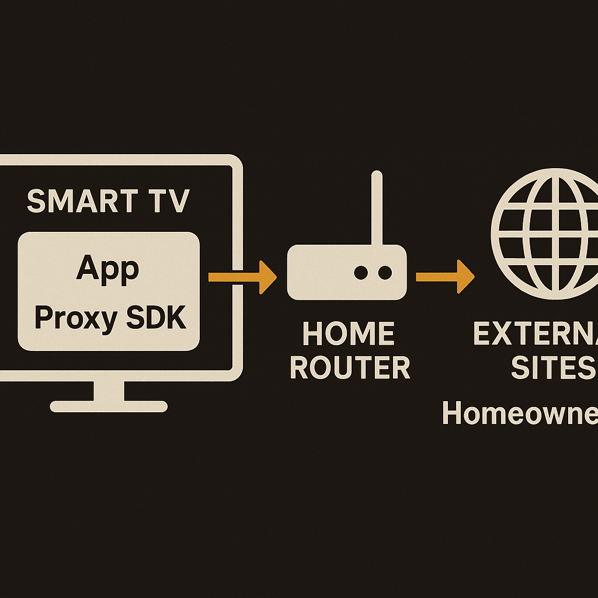

Hacker News surfaced a sharp claim this week: nearly half of LG smart TV apps contain residential proxy SDKs. That is the whole signal we have here, so treat the exact number as a claim, not a settled audit.

Still, the category matters.

A residential proxy SDK is not just another analytics library. It can turn a consumer device into part of a proxy network, routing third-party traffic through the user’s home IP address. On a phone or laptop, that is already ugly. On a TV, it is weirder, because the device sits on home Wi-Fi, runs for long stretches, and rarely gets the same scrutiny as a browser extension or mobile app.

The consumer thinks they installed a weather app, screensaver, free channel, or game. The app developer may think they found a way to monetize a low-margin app. The proxy network sees something more valuable: residential IP supply.

## The bargain users never agreed to

The core issue is consent. Not a checkbox buried in a privacy policy. Real consent.

Residential proxy SDKs can be framed as a trade: users get a free app, developers get paid, networks get exit nodes. But that only works if the user understands the trade. Most people do not expect a TV app to sell spare bandwidth or reputation from their home connection.

And reputation matters. If traffic exits through your IP, other systems may treat it as you. That can create account flags, blocked services, CAPTCHA spikes, or worse if abusive traffic gets routed through the device. The risk is not that every SDK is criminal. The risk is that the user has almost no practical visibility into what the TV is doing.

LG is not the only relevant actor in this pattern. Platform owners approve apps. Developers choose monetization libraries. SDK vendors set defaults and disclosures. Users get the mess.

## App stores still grade privacy by paperwork

This is where connected TV feels years behind mobile security.

Apple and Google have spent a decade tightening app permissions, labels, review rules, and runtime controls. That system is flawed, but at least it gives researchers and users something to inspect. Smart TV ecosystems are more opaque. Apps are fewer, interfaces are clunkier, and consumers rarely review network behavior after install.

A TV app also does not need many user-facing permissions to be risky. Network access is the product. If the app can talk out, and the SDK can run in the background or during idle sessions, the damage can happen without a microphone prompt, camera prompt, or location permission.

This is why “nearly half” is less important than the app store failure mode. Even if the true share is lower, the question for LG and other TV platforms is simple: should residential proxy code be allowed at all in consumer TV apps? If yes, what disclosure is required? If no, how is it detected during review and after publication?

Static scanning can catch known SDK signatures. Dynamic analysis can watch where traffic goes. Store policy can ban bandwidth resale or require a plain-language prompt. None of this is exotic. It is basic hygiene.

## Free apps keep finding new rent to extract

The bigger story is the economics of “free.”

When ads are weak, subscriptions do not work, and users will not pay $2.99 for a novelty TV app, developers look for hidden revenue. Data collection was the old path. Bandwidth resale is a nastier version because it turns the device from an attention surface into infrastructure.

That is why builders should not treat this as only a privacy story. It is a supply-chain story. If you ship apps on any consumer device, you own the SDKs inside them. “The vendor said it was compliant” is not enough. Read the monetization terms. Inspect runtime traffic. Keep a bill of materials. Ban libraries that monetize user bandwidth unless the user knowingly opted in.

Practitioner's take: if you run a platform, add residential proxy SDKs to your review blocklist and test apps on a real network with traffic capture, not just static checks. If you build apps, audit every third-party library this week and remove anything that sells bandwidth or IP access. The catch most teams miss is that consent text does not fix a bad default. On a living room device, quiet background monetization is not clever. It is a trust leak.
