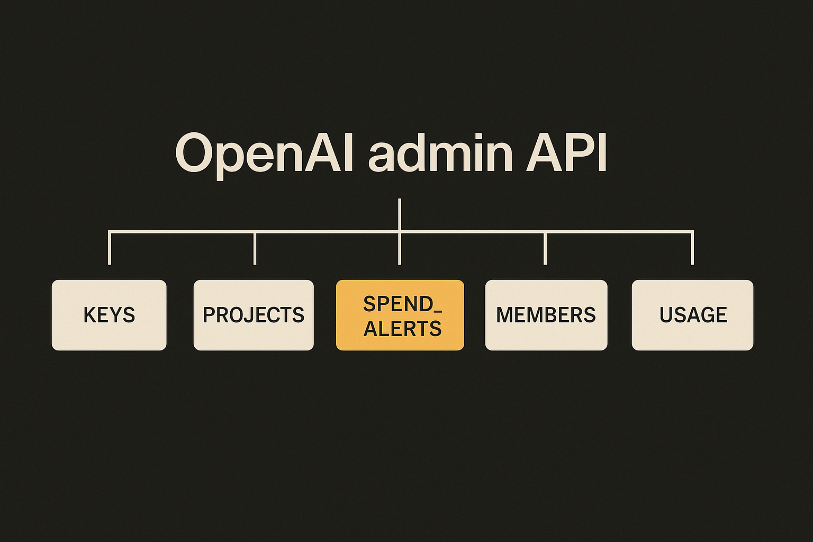
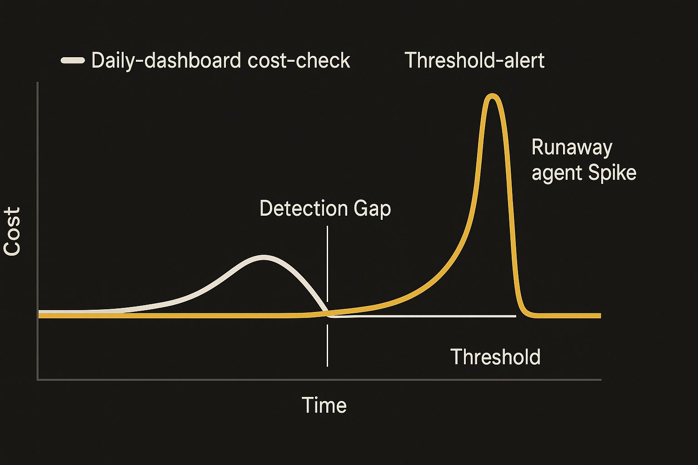

Most SDK releases are noise. Version bumps, regenerated specs, dependency nudges. You skim the changelog, see "update OpenAPI spec or Stainless config," and move on. That is exactly what v2.43.0 of the openai-python library looks like: one line, an autogenerated spec refresh, nothing for a human to act on.

But v2.42.0, shipped the day before on June 16, slipped in something worth stopping for. Buried in the features list, between two routine entries, sits this: `admin: spend_alerts`. No fanfare. No blog post. Just a commit ([6134198](https://github.com/openai/openai-python/commit/6134198a488996c4ff6fca4551afd55fb3294fdc)) and a feature line.

That is the kind of change I pay attention to. Not because it is flashy, but because of what it signals about who OpenAI thinks its customers are now.

## What actually landed

Let me be precise about what we know and what we are inferring, because the source here is thin. The changelog gives us the feature name and a commit hash. It does not give us API docs, parameter shapes, or examples. So treat the mechanics below as informed reading, not gospel.

The feature lives under the `admin` namespace. That tells you it is an org-level control, not something you call inside your inference loop. Admin endpoints in the OpenAI SDK deal with the boring-but-critical stuff: API keys, projects, members, invites, usage. Spend alerts joining that family means this is about governance, not generation.

A spend alert, by the plain meaning of the name, is a threshold you set so you get notified (or something gets triggered) when your organization's spending crosses a line. Think of it as the AWS Budgets alarm equivalent for token spend.

The other entries in 2.42.0 confirm the unglamorous nature of the release. "Manual updates," another spec regen, and two build-system fixes: one for release workflow permissions ([#3389](https://github.com/openai/openai-python/issues/3389)) and one to use a CI environment for the examples API key ([#3394](https://github.com/openai/openai-python/issues/3394)). That second one is a small tell of its own. Putting the examples key behind a CI environment is the kind of housekeeping you do when real money is flowing through example runs and you want guardrails. Even the plumbing is getting more cost-conscious.

## Why a one-line feature matters

Here is the thing about cost in AI applications: for the first two years, almost nobody modeled it properly. You shipped a feature, traffic grew, and the bill grew with it in ways that were hard to predict because token consumption is non-linear with user behavior. One power user pasting a giant document into your RAG pipeline can cost more than a thousand casual users.

The early answer was crude. Set a hard monthly cap on the account, hope you do not hit it, and check the dashboard when finance asks. That breaks the moment you have more than one team, more than one project, or any kind of agent that calls the API in a loop. Agents are the real accelerant here. A misconfigured agent that retries, branches, or runs sub-tasks can burn through budget in minutes, not days. By the time you notice on a daily dashboard, the damage is done.

Spend alerts move the control from "check it later" to "tell me when." That is the difference between a smoke detector and walking through the house every hour sniffing for fire.

I want to be careful not to oversell a feature I have not seen documented. We do not know if these alerts can trigger automated actions (like pausing a key) or if they only notify. We do not know the granularity: org-wide only, or per-project, per-key. Per-project would be a much bigger deal, because that is what lets a platform company attribute cost to internal teams or to their own customers. If it is org-wide only, it is useful but limited. I would bet on per-project given it lives in the admin namespace alongside project controls, but that is a bet, not a fact.

## The pattern this fits into

Zoom out and this is part of a steady move by the big labs to make their APIs feel like real cloud infrastructure rather than a research demo with a billing page bolted on.

Cloud providers spent a decade building cost tooling: budgets, alerts, anomaly detection, tagging, chargeback. AI APIs are walking the same path, just compressed. Admin keys, projects, usage endpoints, and now spend alerts are the early scaffolding of that same discipline. The customers asking for this are not hobbyists. They are companies with a finance team that wants to know why the OpenAI line item jumped 40 percent last month, and an engineering lead who needs to answer before the next meeting.

The two-release sequence tells the story neatly. On June 16, a real governance feature. On June 17, a pure spec regeneration with nothing for a human. That cadence (frequent, mostly mechanical, occasionally meaningful) is what mature SDK maintenance looks like. Stainless-generated clients ship constantly because the spec changes constantly. The skill, as a consumer of these libraries, is knowing which releases to actually read.

## What I would still want to know

The honest gap here is documentation. A feature name in a changelog is a promise, not an interface. Before I built anything on spend_alerts I would want answers to three questions: Can alerts trigger actions or only notifications? What is the granularity, org versus project versus key? And what is the delivery mechanism, webhook, email, or polling? Until those are clear, this is a signal of direction more than a tool you can rely on in production.

If you are reading the same changelog and seeing only "update OpenAPI spec or Stainless config," fair enough. Most weeks that is the whole story. This week there was one more line worth the click.

Practitioner's take: upgrade to 2.42.0 or later and go read the `admin` namespace in your installed SDK directly (`python -c "import openai; help(openai.resources.admin)"` or just browse the source), because that is currently the most reliable spec for a feature with no public docs yet. If spend_alerts supports per-project thresholds, wire one alert per project at roughly 1.3x your expected daily spend, then a hard org-level cap well above that as a backstop. The catch most people will miss: an alert is not a brake. It tells you the agent is on fire, it does not put the fire out. Pair any alert with an actual kill switch on the key, because the whole reason you need this is that agents can spend faster than a human can react to an email.
