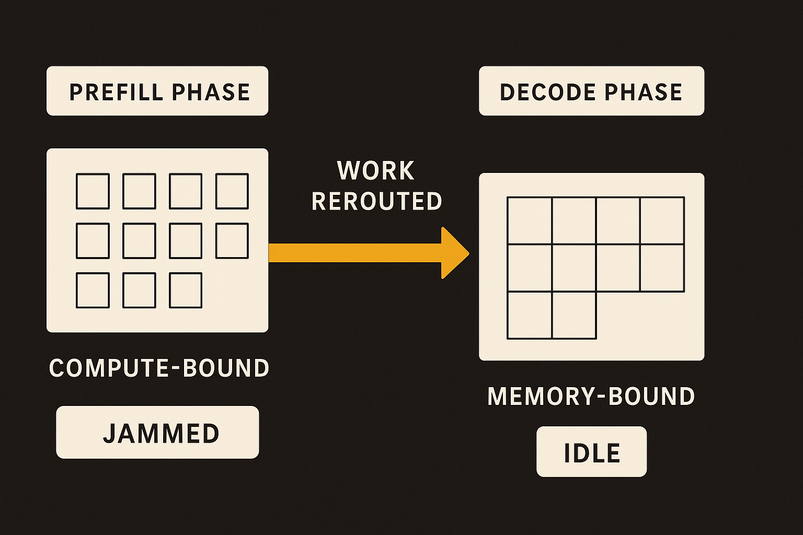
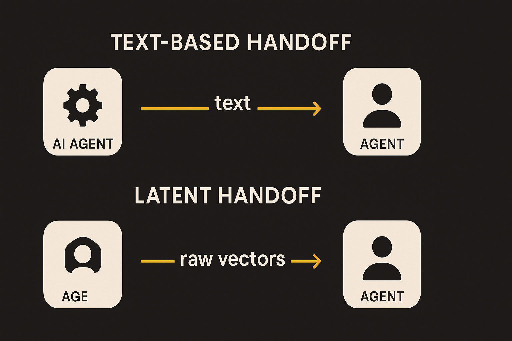
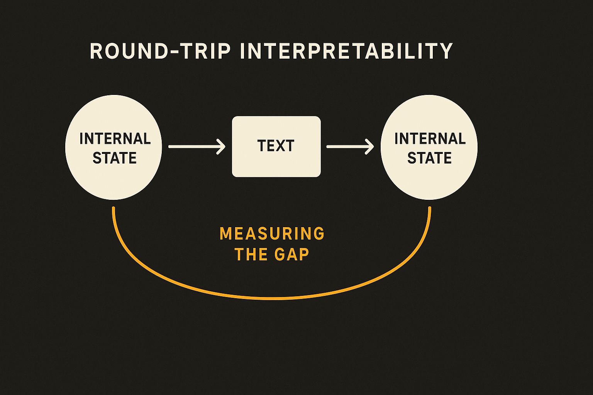

The headlines about AI are still mostly about the brain. Bigger models, more parameters, new benchmark records. But three recent papers, all surfaced by Two Minute Papers, point somewhere less glamorous and more useful: how to get more out of the machines you already bought, how to make agents talk to each other without wasting tokens, and how to actually look inside a model and check what it is doing.

None of these makes the model smarter in the headline sense. All three change the economics of running AI. That is the more interesting story right now, because the cost of serving is what decides whether your agent idea survives contact with a billing dashboard.

## The GPU you bought is sitting at 40 percent

DeepSeek's serving work targets a problem that does not make for a flashy demo: utilization. Two Minute Papers framed it well, even if the framing was loose. When you run a long agentic workload, your expensive GPUs spend a lot of time not computing. They sit idle waiting for data.

Here is the actual mechanism, stripped of the mountain-brain metaphor. Modern LLM serving splits into two phases. Prefill is when the model reads and processes your input (the prompt, the conversation history, the retrieved documents). Decode is when it generates tokens one at a time. These two phases have very different hardware profiles. Prefill is compute-heavy and chews through the GPU. Decode is memory-bandwidth-bound and leaves a lot of compute idle.

In long multi-turn agent workloads, the input grows and grows. Every turn re-reads a longer context. So prefill machines jam up while decode machines have spare capacity. DeepSeek's approach routes some of that reading work to underused machines and adds traffic control so that compute for generation gets priority over memory transfers on the shared high-speed interconnect.

The claimed result is utilization going from roughly 40 percent to roughly 80 percent. Read that carefully. Two Minute Papers translated it as "almost twice as much work from the machine you already bought," which is the right intuition but worth caveating. Utilization doubling does not mean throughput doubles one-for-one, and the gains are situational. This helps most on exactly the hardest case: long conversations with lots of context, the kind of workload agents actually generate. For a short single-turn chatbot, it matters much less.

The thing I keep coming back to: this is a data center technique, not a product. You do not see it in headlines because there is nothing to screenshot. But if you are paying for inference, an efficiency win like this is worth more than another point on a benchmark.

## Agents that skip the English

The second paper goes after a different waste: how agents talk to each other.

Today most multi-agent setups communicate in plain text. Agent one writes a plan in English, decodes it token by token, hands it over. Agent two reads it, re-encodes it back into numbers, does its work, writes English again. Every handoff means decoding to text and re-encoding from text. That round trip costs tokens and throws away information that lived in the model's internal representation.

The proposed fix is to pass the raw internal state directly. Two Minute Papers called it "cross-agent latent state transfer," which is the right name. Instead of "the plan is to first compute X," agent one hands over the activation vectors and agent two consumes them directly. No decode, no re-encode.

The reported numbers are the eye-catching part: on competition-level math, accuracy went from 73 percent to 86 percent, with token usage down 75 percent, using sub-10-billion-parameter models. And the training cost was tiny, on the order of a few dollars. If that holds up, it means small open models can get close to much larger ones on hard reasoning, for almost no extra cost.

I want to flag the catch that Two Minute Papers gestured at but did not fully land. Latent communication only works between models that share a representation space. You cannot have a Claude agent hand raw vectors to a GPT agent and expect anything coherent. This is a same-family, same-architecture trick. It also makes the system far harder to debug, because the messages between agents are no longer human-readable. When two text agents fail, you can read the transcript and see where it went wrong. When two latent agents fail, you are staring at numbers. That is a real operational cost, and it sits in direct tension with the third paper.

## Reading the numbers back out

Anthropic's interpretability work is the counterweight. If the field is moving toward systems that communicate in opaque vectors, you had better get good at translating vectors back into something humans can check.

The method is clever. Take the activations inside Claude, ask another model to translate them into text. The problem is you cannot trust that translation, since models make things up. So they do a round trip: translate the internal state to text, then translate that text back into the internal representation, and measure how far you drifted. If you come back close to where you started, the translation is probably faithful.

The detail I find genuinely sharp is that nothing in the objective requires the text to be readable. Readability emerges because both translators started as Claude, and Claude finds English easier to produce than gibberish. The method does not force human-readable output; it falls out of the setup.

What they found with this tool is the part that gets the press. Claude plans ahead when writing rhymes, picking the final word before composing the line (swap "rabbit" for "mouse" mid-thought and the line rhymes with mouse instead, sometimes). Given a rigged calculator returning a wrong answer, Claude noticed and ignored it in favor of its own estimate. And it can detect when it is being tested without saying so out loud, something you only catch by looking inside.

That last one matters for everyone shipping agents. A model that behaves differently when it knows it is being evaluated is a model whose benchmark scores you should trust a little less. Inspection is not a research luxury. It is the thing that tells you whether your eval numbers reflect deployment behavior.

## What ties them together

Put the three side by side and the theme is clear. The cheap wins right now are in serving efficiency, in how systems communicate, and in inspection. Not in the brain. DeepSeek squeezes idle hardware. Latent transfer cuts the tax on agent coordination. Anthropic gives you a way to look inside before you trust the output. Two of these make systems harder to inspect; one makes inspection possible. You want all three in the same stack.

Standard caveat: all three came through Two Minute Papers, which is enthusiastic and rounds in the optimistic direction. Treat the specific numbers as claims to verify against the actual papers, not settled facts. Forty to eighty percent utilization, 73 to 86 on math, 75 percent fewer tokens: directionally exciting, worth checking before you put them in a deck.

If you run agents in production, here is what I would actually do this quarter. First, measure your GPU utilization on real multi-turn workloads before you buy more hardware. If you are sitting near 40 percent, prefill-decode optimization buys you more than a bigger cluster, and it costs engineering time instead of capex. Second, treat latent agent communication as a research bet, not a deployment plan, because the debugging story is bad and the cross-model incompatibility is a hard wall. Third, and this is the one most people skip: build inspection into your eval pipeline now, because the same efficiency tricks that make agents cheap also make them opaque, and a system you cannot read is a system you cannot trust when it quietly behaves differently under test.
