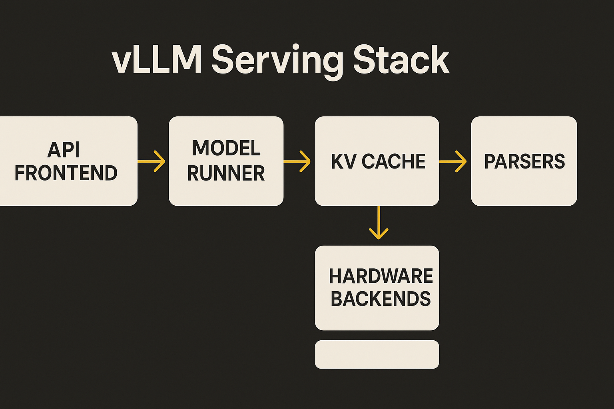

vLLM 0.23.0 is a big release in the unglamorous way that matters. vLLM reported 408 commits from 200 contributors, including 63 new contributors. The prior 0.22.1 patch had 8 commits from 6 contributors. That contrast tells the story: the inference layer is no longer just a fast path for token generation. It is where model compatibility, hardware support, cache economics, tool calling, multimodal handling, and production routing all collide.

The headline is not “faster Llama.” It is that serving open models now looks like operating a small distributed system.

## The model matrix keeps getting wider

vLLM 0.23.0 adds support for Step-3.7-Flash, Cosmos3 Reasoner, Gemma 4 Unified, JetBrains Mellum v2, Granite Speech Plus, and Cohere Mini Code. Mellum v2 also landed in the 0.22.1 patch as an open-weights MoE code-generation model from JetBrains. That is useful, but the more interesting part is the maintenance burden around those models.

DeepSeek-V4, introduced in 0.22.0, got another large hardening pass. vLLM reported changes across sparse MLA metadata, TRTLLM-gen attention, Mega-MoE support, sliding-window KV cache behavior, RoPE and attention refactors, and an XPU decode path. In 0.22.1, DeepSeek-V4 also needed an initialization fix for a CUTLASS `fmin` compatibility issue.

That pattern is normal now. New models arrive, then the serving layer absorbs weeks of sharp edges. Gemma 4 got encoder-free Unified support, MTP, native ViT linear layers, quantization exclusions, and fixes for concurrency, startup, CPU init, and tensor parallel cases. Qwen3-VL, GLM, MiniCPM, HyperCLOVAX, OlmoHybrid, and Kimi all show up in the fixes list too.

Also, a small but useful caveat: vLLM says Minimax M3 is not supported in 0.23.0, even though it points users to a recipe. That kind of note is worth reading before you schedule a migration.

## Serving is becoming a control plane

The biggest architectural signal is not one kernel. It is the spread of responsibilities.

Model Runner V2 is now the default for Llama and Mistral dense models, in addition to Qwen3. It picked up a FlashInfer sampler, breakable CUDA graphs, pipeline-parallel bubble elimination, hybrid model block-size support, and Gemma 4 MTP. That sounds like internals, but it affects real deployment behavior: batching, graph capture, parallelism, and failure modes.

The Rust frontend is also growing beyond an experiment. vLLM added a streaming `generate` endpoint, dynamic LoRA endpoints, `/version`, `/server_info`, request-ID headers, router extension hooks, and more tool parsers. That is not just polish. It is the shape of an inference server that wants to be embedded into larger app infrastructure.

Then there is KV cache offloading. vLLM added an object-store secondary tier, HMA support for capable connectors, tiering support for HMA models, and per-request offloading policy through an `on_new_request` lifecycle hook. This is where cost and latency start to become programmable. Not perfectly. Not magically. But enough that serving policy can vary by request type instead of being one global setting.

## The boring fixes are the receipts

The 0.22.1 patch is a reminder that production inference fails in boring ways. A multi-node Ray data-parallel serving setup could hang deterministically when `num_api_servers > 1`. Docker builds were broken by a quarantined PyPI package. A CUDA 13 image could import the wrong NIXL KV-connector wheel and hit `ImportError: libcudart.so.12`. HyperCLOVAX needed native registration after its upstream Hugging Face repo removed remote code.

These are not benchmark-chart problems. They are Tuesday problems.

I would read 0.23.0 as a sign that vLLM is moving from “fast open model server” toward “default substrate for messy model fleets.” The unified parser work points the same way: reasoning and tool-call parsing now sit behind one `Parser.parse()` interface, with the Responses parser migrated to it. Tool calling is not a side feature anymore. It is part of the serving contract.

If you run vLLM today, I would test 0.23.0 first on the exact models and hardware you care about, not on a generic benchmark. Try MRv2 with Llama or Mistral dense models. Exercise your tool-call parsing. Run a long-context workload with KV offloading policy enabled. Check Ray if you serve multi-node. The catch most readers miss: these releases are less about grabbing every new model and more about reducing variance in production. Your win is not a higher peak tokens-per-second number. It is fewer weird failures when the model, cache, frontend, and hardware all meet real traffic.
