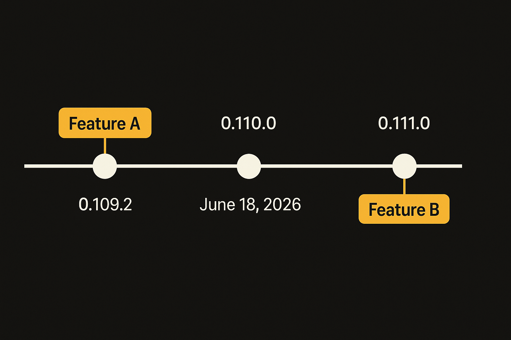
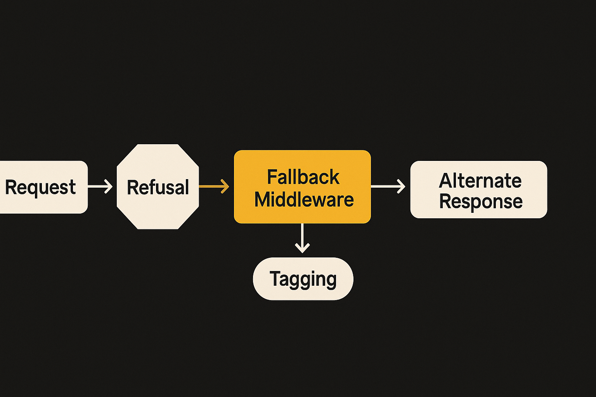
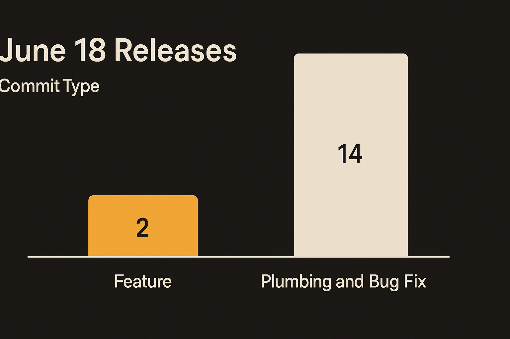

Two releases shipped on the same day. June 18, 2026. The Anthropic Python SDK went from 0.109.2 to 0.110.0 to 0.111.0 in one push, and almost nobody noticed because the changelog reads like janitorial work. Header merges. Stream event types. A "closed value vocabulary" for some internal key.

But buried in 0.110.0 is one line that matters: support for a new `code_execution_20260120` tool. And in 0.111.0 there is refusal-fallback middleware. Read those two together and you get a small but real signal about how Anthropic expects people to build agents this year.

Let me show the receipts and then say what I think it means.

## The actual changes, no spin

Here is what shipped, straight from the changelogs.

In 0.110.0, the feature commit adds support for a tool named `code_execution_20260120`. That date-stamped naming is Anthropic's convention for versioned tool definitions, the same pattern they use for things like the computer-use and text-editor tools. The rest of 0.110.0 is bug fixes: Bedrock now preserves the stream event type, header merges append `x-stainless-helper` instead of clobbering it, and there is a single source of truth for that helper key with a closed value vocabulary.

In 0.111.0, the one feature is refusal-fallback middleware. Requests that go through it get tagged with `fallback-refusal-middleware`. That is the whole release.

So two features across two releases: a code execution tool and a refusal-fallback mechanism. Everything else is plumbing. I want to be clear that I am reading SDK commits here, not a product announcement. Anthropic has not published a blog post tying these together, and I am inferring intent from naming and timing. Treat what follows as informed guessing, not gospel.

## Code execution as a first-class tool

The `code_execution_20260120` name tells you this is a server-side tool definition, not just a helper you wire up yourself. When Anthropic versions a tool with a date stamp and adds SDK support for it, it usually means the model has been trained to call it and the API knows how to route it.

Code execution as a built-in tool is not new in the industry. OpenAI has had a code interpreter for a long time, and Anthropic has shipped earlier code execution capabilities. What is worth tracking is the version bump. A new date-stamped revision means the tool's interface or behavior changed enough to need a new identifier. That is the kind of thing that breaks if you hardcoded the old name, which is exactly why it lands in the SDK as a discrete feature commit.

For builders, the practical read is simple. If you are running Claude agents that need to do math, parse files, transform data, or test snippets of code, you increasingly do not need to stand up your own sandbox and tool loop. You declare the tool and the model handles the round trip. That is less code you own and less code you debug. It is also less control, which matters if you have strict requirements about where code runs and what it can touch.

## The refusal-fallback piece is the interesting one

The 0.111.0 release tags requests with `fallback-refusal-middleware`. The word "fallback" is doing a lot of work here. It implies a flow where the primary path produces a refusal and the middleware catches it and does something else.

This is the part I find genuinely useful, because refusals are one of the quiet tax line items of building on any frontier model. You ship an agent, it works in testing, and then in production the model refuses some fraction of legitimate requests because they brush against a safety boundary. You either eat the failure or build your own retry-and-rephrase logic on top.

Middleware that tags fallback-refusal requests suggests Anthropic is building a sanctioned path for handling this. Not "trick the model into complying" but a structured way to detect a refusal and route to an alternate response or a retry. The tagging matters too: if requests carry a `fallback-refusal-middleware` marker, Anthropic can see how often this path fires and developers can filter their own logs by it.

I want to flag the obvious tension. A fallback-on-refusal mechanism is the kind of feature that gets read two ways. To a developer it is "stop failing on false-positive refusals." To a safety team it is "what exactly happens when the first answer was a refusal." The fact that requests get explicitly tagged tells me Anthropic wants the audit trail. That is a reasonable design choice and I would not assume bad intent. But I would watch how this is documented when it gets a real writeup, because middleware that quietly reshapes refusals is a feature you want to understand fully before you turn it on.

## What the plumbing commits actually tell you

Do not skip the boring fixes, because they back up the story. The `x-stainless-helper` header work, append instead of clobber, single source of truth, closed value vocabulary, all of that is about helpers being tagged consistently so they can be tracked across header merges. Both the refusal-fallback middleware and that header work touch the same machinery: identifying which helper or middleware handled a request.

That is what mature SDK work looks like. The headline feature lands, and right next to it is the unglamorous instrumentation that makes the feature observable in production. Stainless, which generates this SDK, is clearly building the bookkeeping so that when you run an agent at scale you can answer "which of my requests hit fallback logic" without guessing. The Bedrock stream-event fix points the same direction: people are running this in real deployments across providers, and the rough edges are getting filed down.

None of this is a moonshot. It is the slow, deliberate work of turning a model API into an agent platform you can actually operate.

Practitioner's take: if you build on Claude, do two things this week. First, pin your tool version explicitly and check whether you are on `code_execution_20260120` or an older revision, because a silent name change is the kind of thing that breaks an agent loop in production and gives you a confusing error. Second, wait for real docs before you adopt the refusal-fallback middleware, but go ahead and start logging refusals now so you have a baseline of how often they hit you. The catch most people will miss: these are version-stamped, opt-in primitives, not magic. The code tool still runs in someone else's sandbox, and the fallback middleware still leaves a tag on every request it touches. Build assuming both facts are true, because they are.
