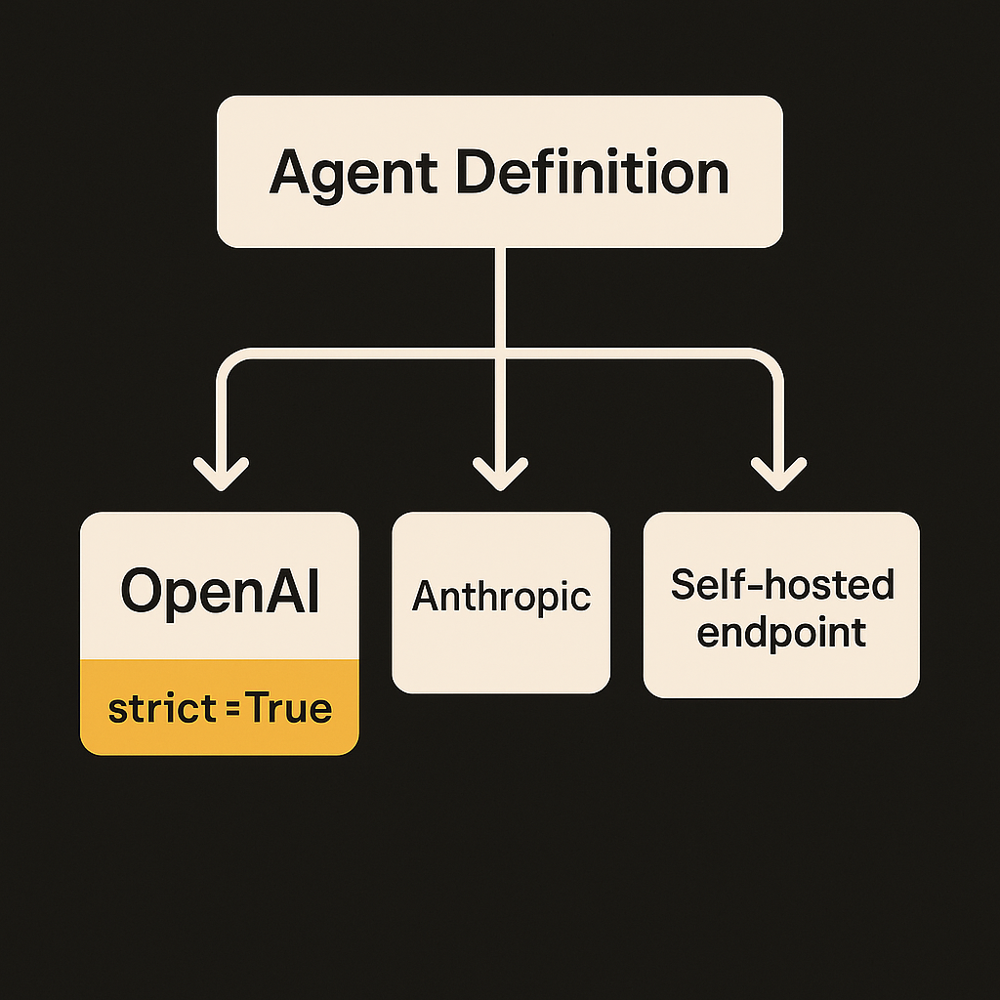
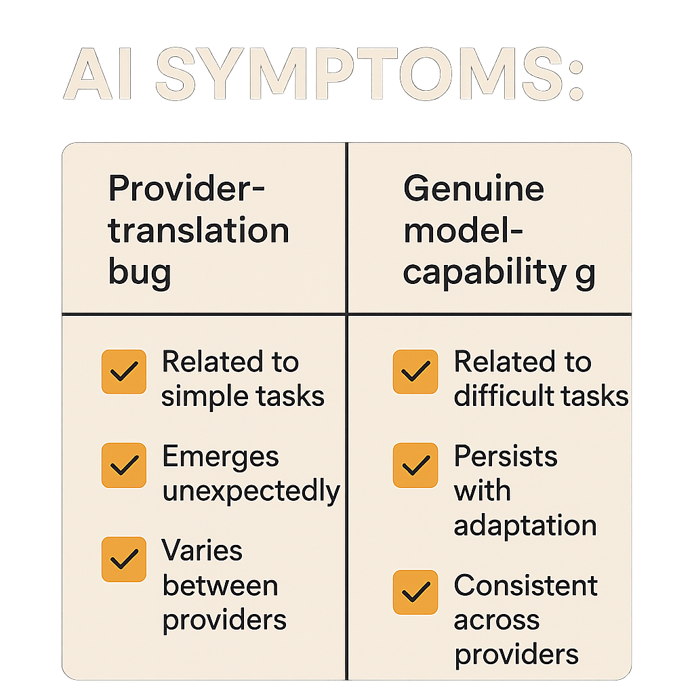
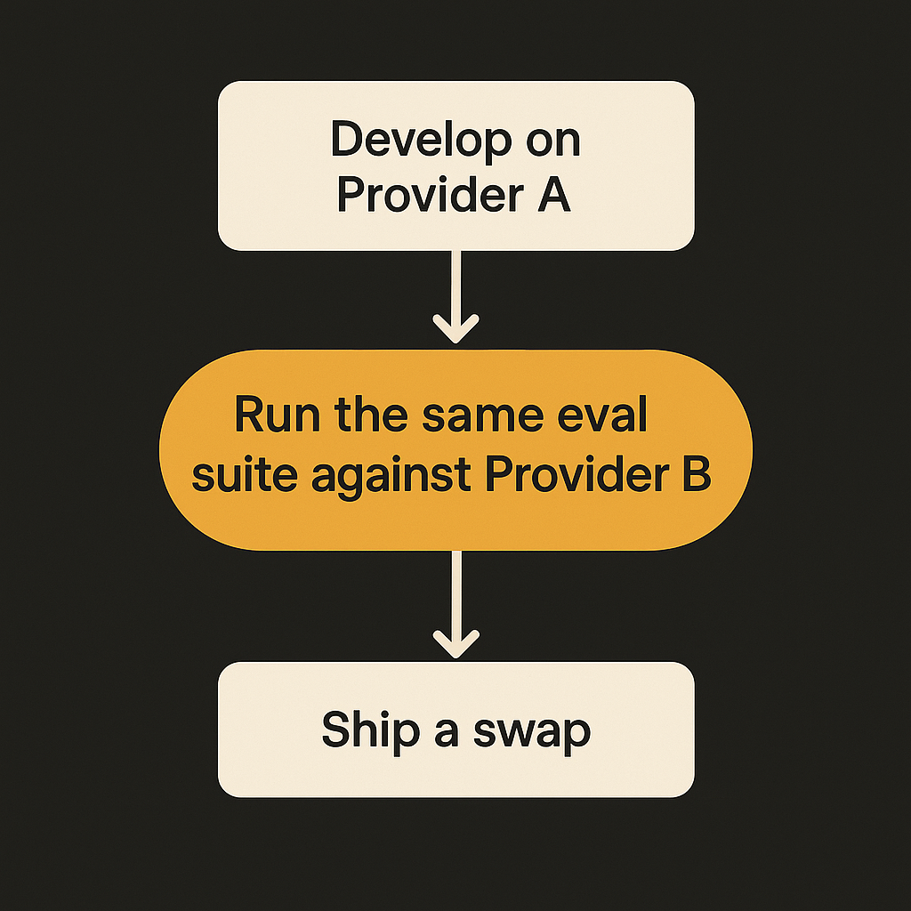

A couple of patch releases dropped this week that almost nobody will read the changelog for. LangChain 1.3.11 and langchain-openai 1.3.3. Point releases. Bug fixes. The kind of thing that scrolls past in your dependabot noise.

But one line in each is worth stopping on, because it names a problem most teams hit and misdiagnose: agents that work fine on one provider and quietly break on another. The fix here is small. The lesson under it is not.

## The actual change

In both releases, the headline fix is the same PR (#38370): "only set `strict=True` on tools for OpenAI-compatible models in `ProviderStrategy`."

Here is what that means in plain terms. When you give a model a tool, you hand it a JSON schema describing the arguments. OpenAI supports a `strict` mode that forces the model's output to conform exactly to that schema. It's great. It eliminates a whole class of "the model returned a string where you wanted an int" failures.

The problem: LangChain was setting `strict=True` for models that aren't OpenAI. Anthropic, Google, open weights served through OpenAI-compatible endpoints that don't actually implement strict the same way. So you'd write a tool, test it against GPT, ship it, then route the same agent to Claude or a self-hosted model and get a schema error that has nothing to do with your code. The patch scopes `strict` to the providers that actually honor it.

The langchain-openai release adds two more in the same spirit. PR #38372 drops response item IDs when `store` is false, and #38336 drops `stop` from the Responses API payload. Both are cases where LangChain was sending parameters a particular API path doesn't accept. Both produce errors that look like your bug and are actually a leaky abstraction.

## Why this is the agent-portability tax in miniature

The whole pitch of a framework like LangChain is that you write your agent once and swap the model underneath. Cheaper model for routine calls, frontier model for hard ones, local model for privacy-sensitive work. The `model` argument is supposed to be a knob you turn.

It mostly is. But the closer you get to the metal, the more provider-specific behavior leaks through. Tool calling is the leakiest part. Strict mode, schema dialects, how nested objects get flattened, whether `additionalProperties: false` is required or rejected, how parallel tool calls are signaled. None of this is standardized across OpenAI, Anthropic, and Google, and the "OpenAI-compatible" endpoints from everyone else are compatible right up until they aren't.

So the framework's job becomes maintaining a translation layer per provider. That's exactly what `ProviderStrategy` is. And this week's bug is a reminder that the translation layer is hand-maintained, which means it has gaps, which means the portability you were sold has an asterisk.

The relevant chore in the openai release makes the point: PR #38274 refreshes model profile data. LangChain ships a table of what each model supports, by hand, and updates it on a release cadence. Your agent's behavior depends on whether that table is current for the model you picked. When a provider ships a new model or changes an API path, there's a lag.

## How to tell if this bites you

The tell is simple. Your agent passes tests on the provider you developed against and throws schema or payload errors on a different one. Not wrong answers. Errors. A 400 from the API, or an exception inside LangChain before the request even goes out.

If you've seen that and chalked it up to "the other model is worse at tool calling," go back and check. A meaningful share of those failures are this category: the framework sent a parameter the target provider doesn't accept. The model never got a fair shot.

Concretely, the things that travel badly:

- `strict` on tool schemas (this week's fix)
- `stop` sequences on the Responses API (also this week's fix)
- `store` and response item IDs (also this week)
- `response_format` / structured output, which each provider implements differently
- parallel tool calling flags
- system prompt handling, especially on Anthropic where the role placement differs

None of these are model-quality issues. They're plumbing. And the fix is almost always a version bump plus reading whether your provider is actually in scope for the feature you turned on.

## The practical move: pin, test the swap, watch the profile table

The honest read on these releases is that LangChain is doing its job. Small, fast fixes scoped to real bugs, with tests attached (#38338 clarifies the expected strict schema error, #38199 adds VCR equivalence tests for embeddings). That's a healthy maintenance rhythm, not a fire.

But it changes how you should treat model swapping. Don't assume it's free.

Practitioner's take: if you run agents that can route to more than one provider, build a tiny cross-provider smoke test and run it in CI. Take three or four representative tool calls and one structured-output call, and fire them at every provider you might route to, not just your primary. You're not checking answer quality here, you're checking that the request even goes through. That's what would have caught this week's `strict=True` bug before it hit a user. Pin your `langchain` and `langchain-openai` versions together, because these two move in lockstep (the same PR #38370 ships in both, and a mismatched pair will reintroduce the bug you just patched). And when you bump, skim the model-profile refresh in the changelog, because that table is the source of truth for what LangChain thinks your model can do, and it's only as fresh as the last release. The catch most people miss: "OpenAI-compatible" is a marketing phrase, not a guarantee, and the framework is quietly papering over the gaps for you. When it gets one wrong, the error lands in your logs, not theirs.
