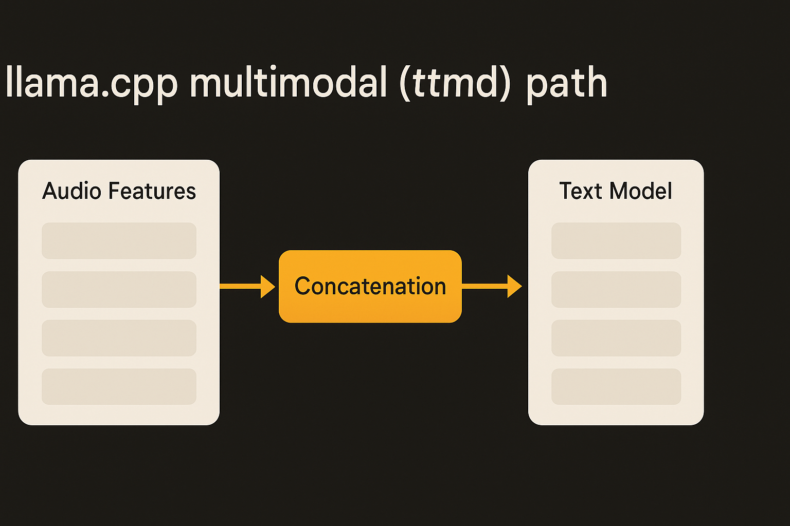
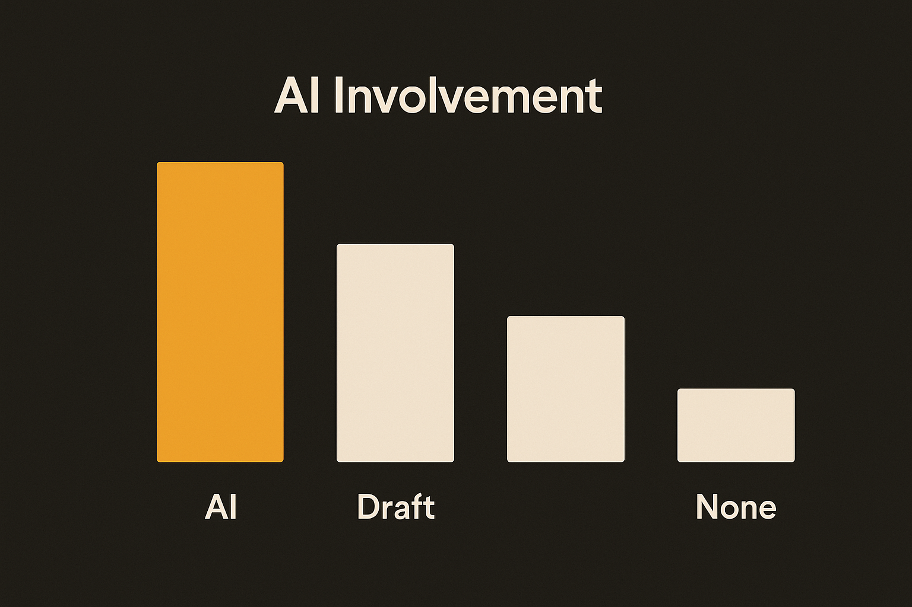

Most release notes are noise. You scroll past the wall of download links and move on. But buried in two consecutive llama.cpp builds, b9767 and b9768, there's something more interesting than the features themselves: a per-commit log of exactly how much an AI agent contributed to each change.

That's the part worth slowing down on. Not the speech model. Not the WebGPU tweak. The bookkeeping.

## The two releases, briefly

b9768 adds conversion support for Granite Speech Plus, IBM's audio-capable model. The work, credited to Gabe Goodhart with Xuan-Son Nguyen co-authoring, extends llama.cpp's multimodal path (mtmd) to handle multi-layer feature concatenation for audio. In plain terms: the tooling can now ingest a newer Granite speech variant and run it through the same local pipeline you already use for text.

b9767, one build earlier, is smaller and purely about speed. It improves WebGPU inference for MTP (multi-token prediction) by routing small batches through a mat-vec path instead of the general matrix-multiply kernel, plus a barrier fix in the multiply loop. For anyone running models in a browser or on a non-CUDA GPU, small-batch decoding is the common case, so this is a real latency win, not a benchmark trophy.

Neither is a headline on its own. Together they show the steady, unglamorous cadence that makes llama.cpp the backbone of local AI: a new model one day, a kernel optimization the next, across macOS, Linux, Android, Windows, ROCm, Vulkan, SYCL, OpenVINO, and more.

## The metadata nobody's reading

Here's what caught my eye. Each commit in the Granite Speech Plus change carries an explicit `AI-usage:` tag. Read them in order:

- "feat: Add conversion support" → AI-usage: **full** (Bob, OpenCode + Qwen3.6-35b)
- "feat: Extend granite_speech to support plus" → AI-usage: **draft** (Bob, OpenCode + Qwen3.6-35b)
- "fix(conversion): Fix plural naming" → AI-usage: **none**
- "fix(mtmd): Align feature_layer usage" → AI-usage: **none**
- "style: Use fstring for log" → (no tag)

That's not a marketing claim about AI productivity. It's a maintainer documenting, commit by commit, where an agent did the work and where a human took over. And the gradient is the whole story.

The boilerplate-heavy first pass, wiring up a new conversion path, was fully AI-generated through OpenCode driving a Qwen3.6-35b model (the contributor's local setup, nicknamed "Bob"). The second commit, extending the logic for the "plus" multi-layer behavior, was a draft: AI started it, a human shaped it. Then the two bug fixes, the naming correction and the cross-file alignment of `feature_layer` semantics, were marked AI-usage: none. Human, all the way.

## Why the gradient matters more than the percentage

Everyone wants a single number. "AI writes 30% of our code." "AI writes 90% of our code." Those numbers are mostly useless because they flatten the part that actually predicts whether the code is any good: which 30%.

The llama.cpp commits draw the real line. AI handled the parts that are pattern-matchable from existing code: scaffolding a new conversion routine that looks a lot like the dozen conversion routines already in the tree. The human handled the parts that require holding the system in your head: getting the plural naming right so it's consistent everywhere, aligning `feature_layer` usage across mtmd so a subtle off-by-one in semantics doesn't ship.

That's the division of labor I see hold up across serious codebases. Agents are strong at "produce something shaped like the thing next to it." They're weak at "make sure this is correct against constraints that live in five other files and one maintainer's memory." The fixes here are exactly the latter category, and a maintainer wrote them by hand. Not because the agent couldn't type the change, but because catching that the change was needed is the hard part.

I'll flag what we don't know, because honesty matters here. We don't know how many agent attempts preceded the "full" commit, or how much human review went into accepting it. The tag tells you who generated the diff, not how much supervision it took. A "full" tag with two hours of review is a very different thing from a "full" tag with two minutes. The metadata is a useful signal, not a complete accounting.

## A norm worth copying

The more I look at this, the more I think the tagging convention is the actual news. We're heading into a stretch where provenance of code matters: for licensing, for security review, for debugging, for just knowing what to trust. A commit history that records AI involvement per change gives future maintainers something concrete. When a bug surfaces in the Granite Speech path six months from now, whoever investigates can see that the conversion scaffolding was agent-generated and the semantics were hand-tuned. That's a real clue, not a vibe.

Compare that to the typical state of things: a giant AI-assisted commit with a one-line message and no indication of what was machine-drafted versus human-verified. When that breaks, you're archaeology with no map.

llama.cpp didn't announce a policy. A contributor just started leaving honest notes. That's usually how good norms spread.

## Practitioner's take

Steal the convention this week. Add an `AI-usage:` line to your commit trailer with three values: full, draft, none. Full means the agent produced it and you reviewed it. Draft means the agent started it and you rewrote substantial parts. None means you wrote it. Don't agonize over precision; the buckets are enough to be useful later.

The payoff isn't virtue signaling. It's that you build a dataset about your own workflow. After a month you'll see, plainly, which categories of work your agent nails (conversions, scaffolding, glue) and which ones it keeps getting subtly wrong (cross-file invariants, naming consistency, anything requiring the whole system in your head). That tells you where to point the agent and where to keep your hands on the keyboard.

The catch most people miss: the tag describes generation, not correctness. A "full" commit still needs the same review as anything else, arguably more. The llama.cpp log works because a maintainer who knows the codebase signed off on every line, agent-written or not. The metadata is a record of who typed it. You're still the one who has to know if it's right.
