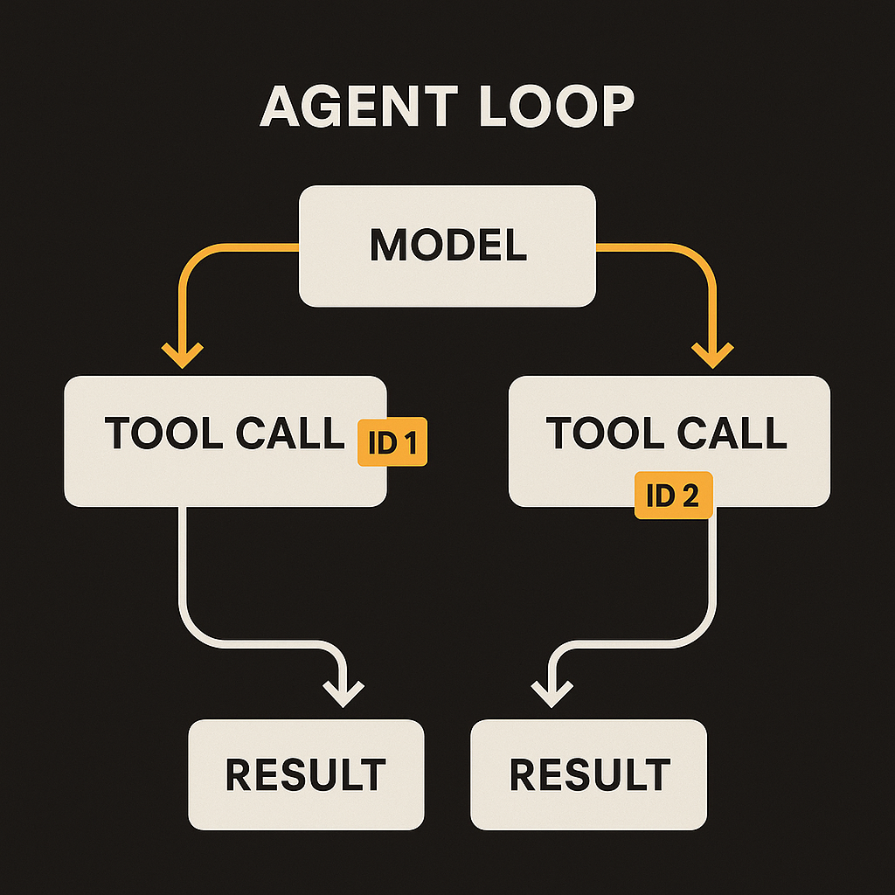
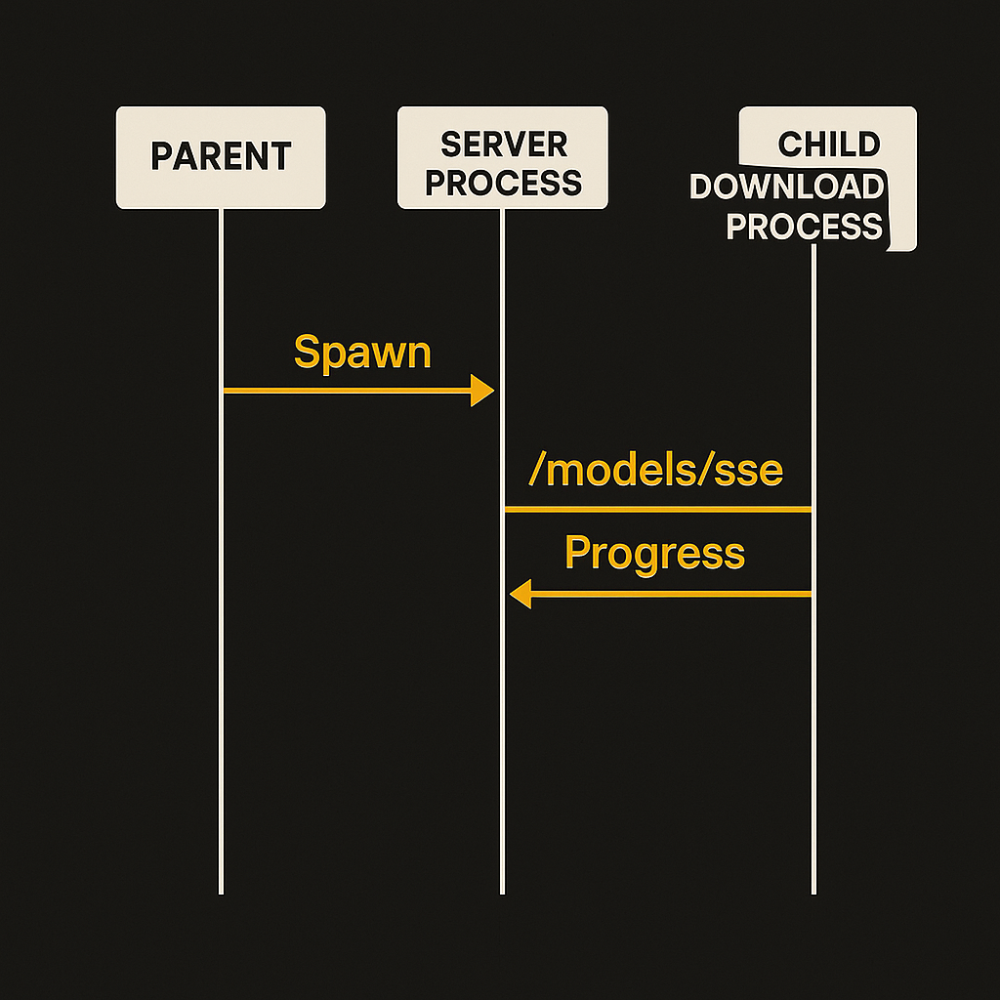
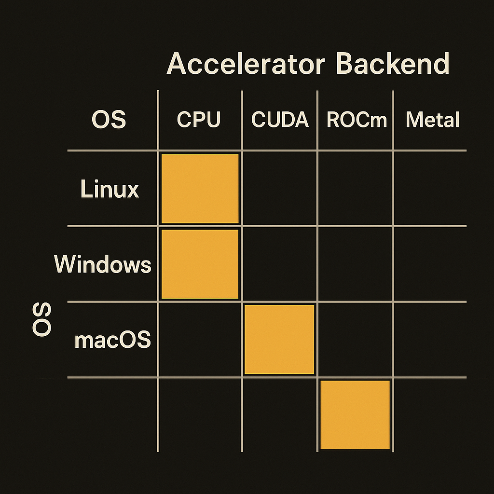

Two llama.cpp builds landed close together: b9761 and b9763. Neither is a headline. One adds an `id` field to tool call responses in the server API. The other moves model downloading into a dedicated child process with real-time progress over an SSE endpoint. If you skim the release notes you move on in five seconds.

I don't think you should. These two commits, boring as they look, tell you exactly where local inference is heading. The project stopped optimizing for "can I run a model on my laptop" a while ago. It is now optimizing for "can I run this as a server other software depends on." That is a different job, and the details show it.

## Tool call IDs are an agent feature, not a chat feature

Build b9763 (PR #24882) adds an `id` to tool call responses in the server's API. On its own that sounds like plumbing. It is plumbing. But it is plumbing that only matters if you are building agents.

Here is why. When a model emits a tool call, an agent loop has to send the result back. If the model fires multiple tool calls in one turn, which happens constantly in real agent workflows, you need a stable identifier to match each result to its call. The OpenAI Chat Completions format has carried `tool_call.id` for exactly this reason. llama.cpp adding it means the local server is closing the gap with the format that agent frameworks already speak.

So this is not a feature for someone chatting with a local model in a web UI. It is a feature for someone pointing LangChain, an MCP client, or their own agent harness at `http://localhost:8080` and expecting it to behave like the hosted API they tested against. The closer the local server matches the OpenAI shape, the less custom glue you write. Every one of these small compatibility fixes lowers the switching cost between a hosted endpoint and a local one.

That is the real story across a lot of llama.cpp's server work lately. It is not chasing tokens per second. It is chasing API parity.

## Moving downloads to a child process is an ops decision

Build b9761 (PR #24834) is the one I find more interesting, because it is pure operational maturity. The change moves model downloading out of the main server process and into a dedicated child process, with real-time load progress tracked via a `/models/sse` endpoint.

Think about what problem that solves. If your server process is also the thing pulling a 40GB quantized model over the network, a stalled or slow download can interfere with the process that is supposed to be serving requests. Isolating the download into a child process means the parent stays responsive, and a failed download doesn't take down your inference server. The SSE progress stream means a frontend or orchestration layer can show "model loading, 62%" instead of staring at a hung request and guessing.

The commit message itself is full of the unglamorous reality of this kind of work: "fix most problems," "do not detach() thread," "shorter MODEL_DOWNLOAD_TIMEOUT in test," "throttle." That is what hardening looks like. Nobody writes a press release about adding a timeout to a test. But that is the difference between software you demo and software you deploy.

This is a router feature too, worth noting. llama.cpp has been growing a router that can manage multiple models, and download lifecycle management is part of running a server that swaps models on demand. You can't have a multi-model server that freezes every time it fetches a new model.

## The build matrix is the quiet headline

Look at what these releases actually ship to. Every build covers macOS arm64 and x64, an iOS XCFramework, Ubuntu on x64, arm64 and s390x, Vulkan, ROCm 7.2, OpenVINO, two SYCL variants, Android arm64, Windows across CPU, CUDA 12.4, CUDA 13.3, Vulkan, OpenVINO, SYCL and HIP, plus OpenCL for Adreno on Windows arm64.

That is not a hobby project's release page. That is a matrix that says: whatever hardware you have, x86 server, Apple Silicon laptop, an AMD card, an Intel GPU, a phone, an IBM mainframe, there is a binary for you. A couple of targets are honestly marked disabled (KleidiAI on macOS, the openEuler Ascend builds), which I appreciate. They tell you what is broken instead of quietly shipping something that doesn't work.

The breadth matters because it is the other half of the API parity story. Parity makes your code portable across hosted and local. The build matrix makes your deployment portable across hardware. Together they mean the same agent harness can run against OpenAI in the cloud, llama.cpp on a beefy Linux box with CUDA, and llama.cpp on a developer's M-series laptop, with minimal changes. That portability is the actual product.

## What this pattern is really telling us

I read these two builds as a signal about 2026 local inference in general, not just one project. The interesting work has shifted from raw model running to the boring server concerns: request correctness, process isolation, load progress, timeouts, model lifecycle. The questions are operational now. How does it behave under load? What happens when a download fails? Can my agent framework talk to it without custom adapters?

That shift only happens when people are actually running this stuff in front of real workloads. You don't add tool call IDs and download child processes for fun. You add them because someone hit the missing version in production and filed an issue.

The catch worth naming: none of this means local inference matches hosted frontier models on capability. It does not. What it means is that the gap in operational polish is closing fast, so the decision between local and hosted increasingly comes down to model quality, cost, and privacy rather than "can I even run this reliably."

If you are a builder, the move is concrete. Stand up the latest llama.cpp server build for your hardware, point your existing agent code at it with the OpenAI-compatible endpoint, and check whether your tool-calling loop works unchanged now that responses carry IDs. Wire a small status check against `/models/sse` so your app knows when a model is actually ready instead of firing requests into a loading server. The thing most people miss is that these endpoints behave enough like the hosted API to swap in for a real fallback or a cost-controlled tier, not just a local dev toy. Test that assumption with your actual prompts before you trust it, because parity in the API shape is not the same as parity in model behavior, and that last gap is the one that bites you in production.
