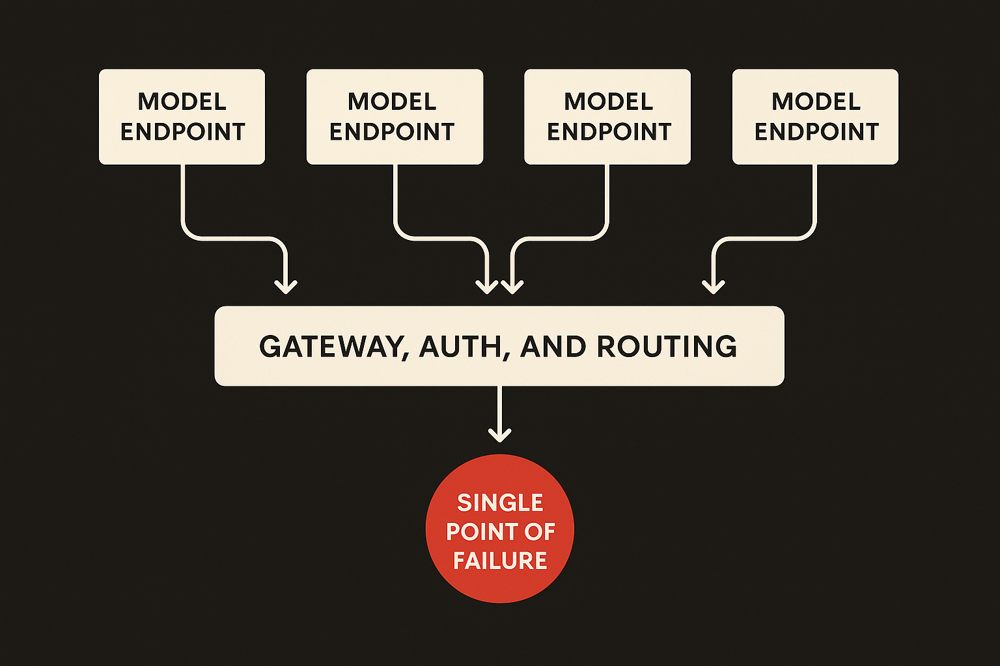
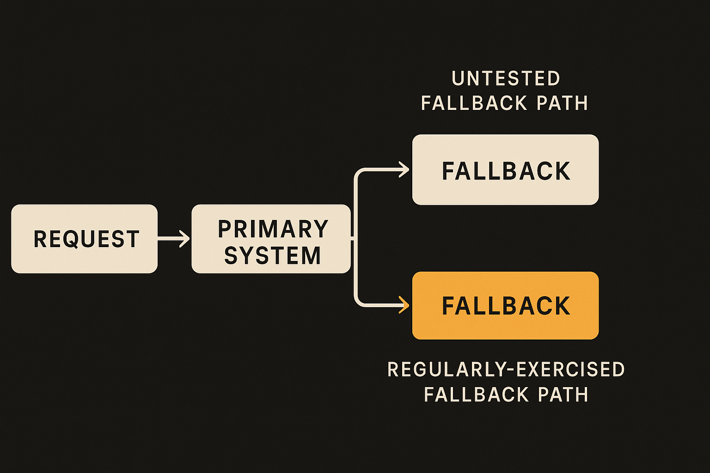

A status note showed up on Hacker News today: "Elevated error rate across multiple models." Short, vague, the kind of thing that scrolls past unless it breaks your app at the wrong moment. There's no rich postmortem yet, no root cause, no affected-customer count. So I'm not going to pretend I know what happened inside the provider. I don't.

But I do know what these moments expose. And the interesting part isn't the outage. It's how much we've quietly built on top of the assumption that outages won't happen.

## The thin signal, and what it actually tells us

Let me be honest about the source first. One status-style report of "elevated error rate across multiple models" is thin. We don't know the provider, the duration, the error types (timeouts? 500s? rate-limit storms?), or whether "multiple models" means a shared gateway hiccup or something deeper in the serving layer.

The phrase "across multiple models" is the one detail worth sitting with. When several distinct models degrade at once, that usually points at shared infrastructure: a routing layer, an auth service, a load balancer, a region. Models are different weights, but they ride the same plumbing. So a "multiple models" incident is often a single-point-of-failure story wearing a costume.

That's a guess, not a finding. I'll flag it as such. But it matches the pattern of most public AI incidents over the past two years: the model wasn't the problem, the system around the model was.

## Why this hits AI workflows harder than normal APIs

A normal API call fails and you retry. Annoying, recoverable. AI workflows fail differently, and worse, for three reasons.

First, latency and cost make retries expensive. Re-running a 30-second agent step or a 100k-token call isn't free, and naive retry loops during an outage can turn a blip into a bill. I've watched a "just add retries" change triple inference spend in an hour because every call was failing slowly, then retrying, then failing again.

Second, AI calls are often chained. An agent does step one, feeds it to step two, calls a tool, summarizes, decides. One degraded call in the middle doesn't just fail, it corrupts state. You get half-finished plans, orphaned tool calls, and outputs that look plausible but were built on a missing piece. Silent partial failure is the dangerous kind.

Third, nondeterminism hides the failure. A flaky deterministic API throws an error you can catch. A degraded model might still return *something*, just worse: a truncated answer, a hallucinated field, a confident wrong number. Your error handling never fires because there was no error. The model just got dumber for ten minutes and your pipeline shipped it.

That last one is the part most builders miss. We instrument for 500s. We don't instrument for "the answer got 20% worse."

## The single-vendor habit nobody admits to

Here's the uncomfortable thing. Most production AI apps I've seen, including ones I've built, are wired to one provider, often one model, with a hardcoded fallback that nobody has tested since launch.

We tell ourselves we have redundancy because there's a try/except and a "backup model" string in the config. Then the primary degrades, the fallback path runs for the first time in real traffic, and it turns out the prompt was tuned for the primary, the output schema is slightly different, and the fallback model can't follow the format. So the fallback "works" and produces garbage your downstream code chokes on.

A backup you've never exercised isn't a backup. It's a hope.

There's a real tension here, and I won't pretend it away. Multi-provider abstraction has costs. Prompts don't transfer cleanly between models. Tool-calling formats differ. Output quality differs. Maintaining two or three working paths is genuine engineering work, and for a lot of small products it's not worth it. Single-vendor is a reasonable default. The mistake is being single-vendor *by accident* and calling it resilient.

## What actually buys you resilience

Resilience for AI workflows is less about heroic multi-cloud architecture and more about a handful of unglamorous habits.

Treat the model call like any other unreliable network dependency, because it is one. Timeouts. Circuit breakers so a degraded provider doesn't drag your whole queue down. Bounded retries with backoff, not infinite loops. This is 2010-era distributed systems hygiene, and AI teams skip it constantly because the SDK makes the call look like a function.

Build for degraded mode, not just up/down. Decide ahead of time what your product does when the model is slow or low-quality. Serve a cached answer? Queue the request and tell the user it's processing? Fall back to a simpler deterministic path? Doing nothing means your users get the failure raw.

Checkpoint long agent runs. If an agent has done eight steps and step nine hits a degraded model, you want to resume from step eight, not restart and re-spend. State that survives a provider hiccup is worth more than any prompt trick.

And monitor quality, not just availability. A canary prompt with a known-good answer, run on a schedule, will catch "the model got dumber" before your users do. It's cheap insurance and almost nobody runs it.

The honest caveat: all of this is work, and on a thin signal like today's report it's tempting to wave it off as a one-off. It probably was. The next one will be too, right up until it isn't, and it lands during your launch.

A practitioner's take: don't overreact to a single status note, but use it as a free fire drill. This week, do three small things. One, find every model call in your codebase and confirm it has a timeout and a bounded retry, because I'd bet money some don't. Two, actually run your fallback path against real traffic for an hour and watch what breaks, schema mismatches, format drift, quality drop, then fix the prompt for the fallback model specifically. Three, write one canary prompt with a known answer and put it on a five-minute cron, so next time "elevated error rate" shows up you know within minutes whether it's hitting you. The catch most people miss: the failure that hurts isn't the loud one your except block catches, it's the quiet degradation that ships a worse answer while every dashboard stays green.
