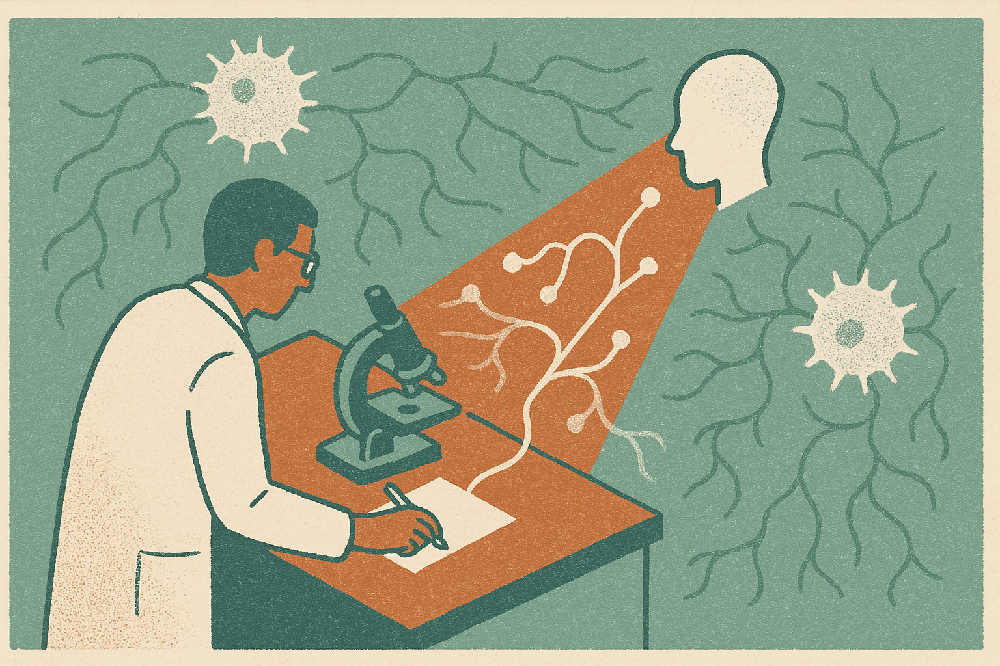

OpenAI reported that GPT-5 Pro helped immunologist Derya Unutmaz solve a three-year-old mystery about T cell behavior, with possible relevance for cancer and autoimmune research.

That is a big claim. It is also a narrow one.

The interesting part is not “AI cures cancer,” because nobody serious should read it that way. The interesting part is that a frontier model appears to have been useful inside an expert research loop on a real, stubborn scientific problem. Not trivia. Not benchmark bait. A domain scientist with years of context used the model to get unstuck.

That is the pattern worth watching.

## The model did not replace the immunologist

The phrasing matters. OpenAI said GPT-5 Pro helped Unutmaz solve the mystery. Helped is doing real work here.

In biology, the hard part is rarely one missing fact. It is the tangled mix of papers, mechanisms, contradictory evidence, experimental artifacts, edge cases, and the tacit sense that an experienced researcher builds over years. A model can be useful if it helps reframe the problem, connect distant findings, propose mechanisms, or point to a neglected explanation. But the scientist still has to judge whether the idea survives contact with cells, assays, and prior evidence.

That is why I would not file this under “AI scientist.” I would file it under “AI as senior research aide with infinite patience.”

The better mental model is a collaborator that can search across conceptual space faster than a human, while the human owns taste, skepticism, and experimental reality. If GPT-5 Pro surfaced an insight that Unutmaz could validate against immunology, that is meaningful. If it merely produced a plausible story, that is much less meaningful.

OpenAI’s public summary does not give enough detail to separate those cleanly. We do not have the full prompt trail, the alternative explanations, the validation path, or the extent to which GPT-5 Pro generated the key idea versus helped organize existing thinking. So I’d treat this as a promising case report, not a settled proof point.

## The value is in compressing the messy middle

Most research time does not look like a clean eureka moment. It looks like reading, comparing, doubting, rewriting hypotheses, checking whether a mechanism makes biological sense, then doing it again.

That is exactly where language models may matter.

They are not especially magical when asked for final answers. They are often more valuable when asked to generate candidate explanations, stress-test assumptions, translate between subfields, and surface papers or mechanisms a researcher would not have considered first. The win is not that the model knows immunology better than an immunologist. The win is that it can keep a much larger scratchpad active.

For T cell behavior, that can matter. T cells sit at the center of immune response, cancer immunotherapy, chronic inflammation, and autoimmune disease. Small changes in how they activate, exhaust, misread signals, or interact with tissue can have large consequences. If GPT-5 Pro helped clarify one of those mechanisms, the downstream relevance could be real.

But “could support cancer and autoimmune research” is still a careful phrase. It means the insight may open useful paths. It does not mean therapies are near, or that clinical outcomes changed, or that the model independently made a biomedical discovery.

That distinction matters because scientific AI will be judged on reproducibility, not vibes.

## Case reports are useful, but methods matter

I want more of these stories, with receipts.

Not polished victory laps. I mean practical artifacts: what was asked, what the model returned, what was wrong, what was useful, what the human expert changed, and what experimental evidence closed the loop. That is how builders and researchers learn whether the model is adding signal or just producing elegant noise.

The next frontier for science models may be less about sounding brilliant and more about being inspectable enough to trust in a lab workflow. Can it cite accurately? Can it preserve uncertainty? Can it track competing hypotheses over weeks? Can it update when new assay results contradict the first story? Can it say “I do not know” before sending a team down a dead end?

Those are product questions as much as model questions.

A builder should read this as a workflow prompt: pick one high-context problem, give the model the relevant papers, notes, failed hypotheses, and constraints, then ask it to generate competing mechanisms and experiments that would distinguish them. The catch most readers miss is that the model’s answer is not the asset. The asset is the structured loop around it: expert review, evidence checks, falsifiable next steps, and a record of what changed because the model was in the room.
