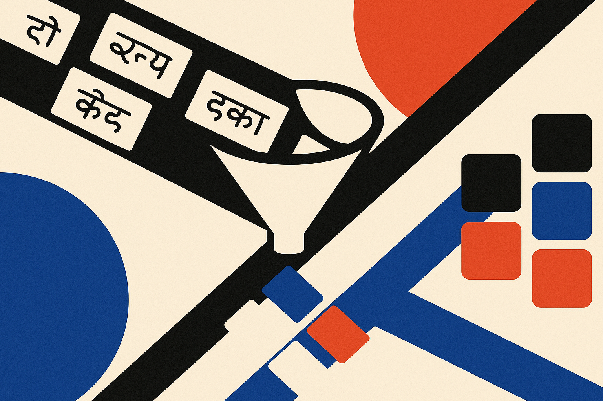

Marathi has more than 83 million speakers. That puts it among the top twenty languages in the world by number of speakers. Still, for NLP infrastructure, it has often been treated like a niche case.

That mismatch is the story behind L3Cube-MahaPOS, a new Marathi part-of-speech tagging dataset and benchmark. POS tagging sounds old-school, because it is. But it still sits underneath a lot of practical NLP work: machine translation, information extraction, search, parsing, grammar tools, and downstream language understanding systems.

The important part here is not that someone ran BERT again. It is that the L3Cube team built a manually annotated, standardized resource for a language where “just use English assumptions” breaks quickly.

## Marathi is not a small English problem

The L3Cube-MahaPOS paper reports 32,354 manually annotated Marathi news sentences, labeled by Marathi-proficient annotators using a 16-tag scheme aligned with Universal Dependencies. That matters because Marathi has several properties that punish lazy NLP pipelines.

It has rich morphology. Word order is relatively free. There is no capitalization signal like English has for proper nouns. And code-mixing with Hindi and English is common. A tokenizer or tagger that quietly assumes English structure will fail in boring, hard-to-debug ways.

The team also emphasizes preprocessing: Unicode normalization, Devanagari-aware tokenization, and noise filtering. This is the part that rarely gets conference-demo glamour, but it often decides whether a model is useful outside a notebook. If the same Marathi word can appear in visually similar but internally different Unicode forms, your model is not only learning language. It is learning encoding accidents.

This is where under-resourced language work becomes different from “train bigger.” The dataset, annotation guidelines, and preprocessing rules are infrastructure. Once those exist, the next model has something stable to improve against.

## The benchmark is useful because it is not magical

L3Cube benchmarked six model families: HMM, CRF, BiLSTM, BiLSTM with CharCNN, MuRIL, and the Marathi-specific MahaBERT-v2. The best system reached 88.67% token-level accuracy and 81.67% macro-F1 across 15 evaluated tag classes.

Those are respectable numbers. They are not “solved” numbers.

The gap between token accuracy and macro-F1 is worth paying attention to. Accuracy can look fine when common tags dominate. Macro-F1 is less forgiving because it asks how the model handles rarer classes too. For real tools, those long-tail errors matter. A grammar assistant, extractor, or translation system can be derailed by repeated mistakes on less frequent but semantically important categories.

It is also useful that the paper includes older baselines, not just transformer variants. HMMs and CRFs may not win, but they anchor the benchmark. They tell future researchers whether improvements come from better language modeling, better morphology handling, better character modeling, or just more parameters.

MahaBERT-v2 doing well is not surprising. A Marathi-specific transformer should have an advantage. But the bigger lesson is that language-specific modeling still has a place, especially when the language has morphology and script behavior that broad multilingual models may flatten.

## The quiet value is standardization

The most practical release here is not a leaderboard score. It is the combination of data, guidelines, trained checkpoints, and a repeatable preprocessing pipeline.

That package makes the benchmark harder to hand-wave. A Marathi NLP team can now compare systems against a shared test setup instead of inventing a private split, tuning to it, and calling the result progress. It also gives applied teams a starting point for domain adaptation. News text is not social media, customer support, legal text, or education content. But a clean news corpus with manual POS tags is a better base than nothing.

The catch is coverage. L3Cube-MahaPOS is drawn from news text, so it will not fully represent conversational Marathi, rural dialects, informal spellings, or heavier code-mixed usage. The paper names code-mixing as a challenge, but a news corpus will only expose part of that problem. Builders should expect performance to drop when moving into WhatsApp-style text, voice transcripts, or messy user-generated content.

If I were building with this today, I would use L3Cube-MahaPOS as the evaluation backbone, then create a small domain-specific audit set from my actual product data. Run MahaBERT-v2 and a simpler CRF or BiLSTM baseline, compare not only accuracy but error types, then manually inspect the tags that break downstream tasks. The miss most readers will make is treating 88.67% as a product-readiness number. It is a benchmark number. The product question is whether the remaining 11% fails quietly, or breaks the thing users came for.
