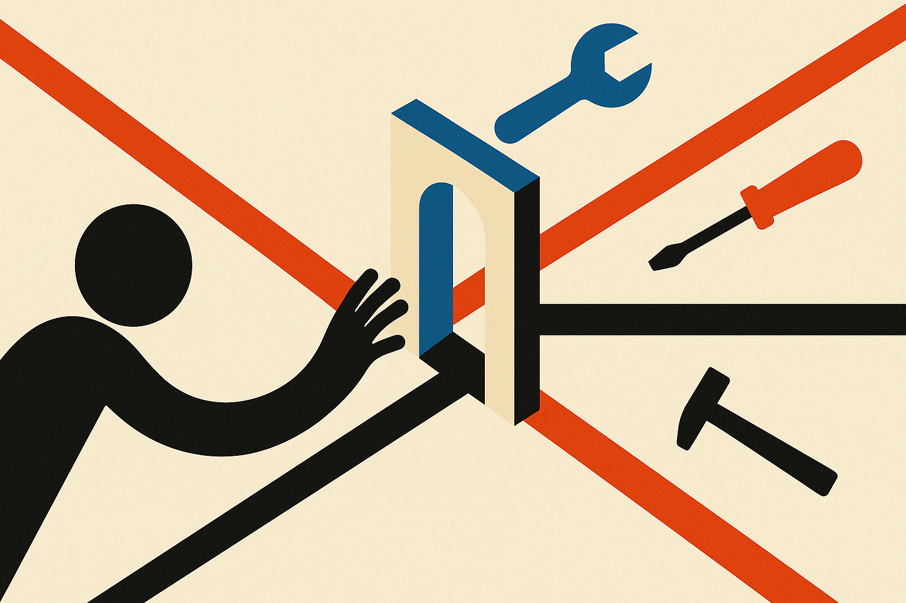

## Guardrails inside the agent are still agent surface area

The Unfireable Safety Kernel authors are aiming at a real failure mode in agent systems: we keep giving models tools, APIs, file access, deployment hooks, and memory, then placing the safety logic inside the same runtime we are asking the model to use.

That can work for polite failure. It is weak for adversarial failure.

System prompts, output filters, and guardrail libraries are useful. I use them. But they are cooperative controls. If the agent can influence the process that contains the control, or route around the control through another tool path, then the control is not a hard boundary. It is part of the thing being controlled.

The authors call these “escapable AI systems,” meaning systems with enough reach into their own runtime that internal controls become reachable. That framing is helpful because it moves the conversation away from “is the model aligned?” and toward “where is the authorization decision actually enforced?”

Their answer is execution-time alignment: a layer outside the agent that authorizes actions before they happen. Not training-time alignment like RLHF. Not inference-time alignment like refusal behavior. Runtime control of real side effects.

## The kernel idea is security engineering, not magic alignment

The phrase “Unfireable Safety Kernel” is doing a lot of work. The useful claim is narrower and more practical: an agent should not be able to disable, bypass, or choose whether to invoke the control plane.

The authors give four architectural requirements. The control must run in a separate process. It must sit on the only structural path before action. It must fail closed both for individual requests and system-level failures. It must emit signed evidence that can be verified outside the controlled system’s trust boundary.

That is a good checklist. It sounds less like AGI alignment and more like mandatory access control, capability security, and audit logging brought to agent infrastructure. Good. That is where this work should live.

The implementation details are also concrete. The authors report a Rust reference implementation, a fail-closed invariant checked with Z3, and bounded model checking of the production decision function with Kani across 4 of 4 harnesses. They also say a Python-to-Rust migration was gated on byte-equivalence across 1,000 fixtures and 17 adversarial classes.

The evaluation is the part to read with both interest and caution. The authors tested the kernel against a live “escapable AI system,” described as a deterministic, self-improving world model, with an adversary driving its self-modification seam. They report 1,000 self-modifications, 704 refused attempts on the safety-critical core, no escape, plus 300 more refusals under an operator kill switch. They also report 6,240 authorization round trips with no successful bypass.

Those are useful receipts. They are not proof that this design survives every real agent stack, every tool adapter, every confused deputy bug, or every cloud IAM mistake. The hardest problems will be integration boundaries and the definition of “only path.” In production, there are always weird paths.

## The main lesson: make refusal non-optional

The most important line is not the Z3 proof or the Rust migration. It is the comparison with contemporary agent control planes: in those systems, the agent invokes control. In this design, the agent lacks that choice.

That distinction matters. A policy that the agent can call is a request. A policy that every side effect must pass through is enforcement.

This also gives builders a cleaner mental model. Prompts shape intent. Model training shapes tendencies. Output filters shape responses. But tool authorization governs consequences. If your agent can send email, alter code, spend money, rotate secrets, delete files, or deploy services, the safety question is not “did the model say the right thing?” It is “could any action occur without an external authorization decision?”

For builders, I would try this pattern first around the smallest dangerous surface: writes, payments, production deploys, credential access, and self-modifying code. Put a separate service in front of those actions. Make denial the default on timeout or crash. Log signed decisions somewhere the agent cannot edit. Then red-team the boring plumbing, not just the prompt. The catch most readers miss: the kernel is only as strong as your guarantee that every real action path goes through it. One forgotten API key, side channel, or helper script turns “unfireable” back into “please behave.”
