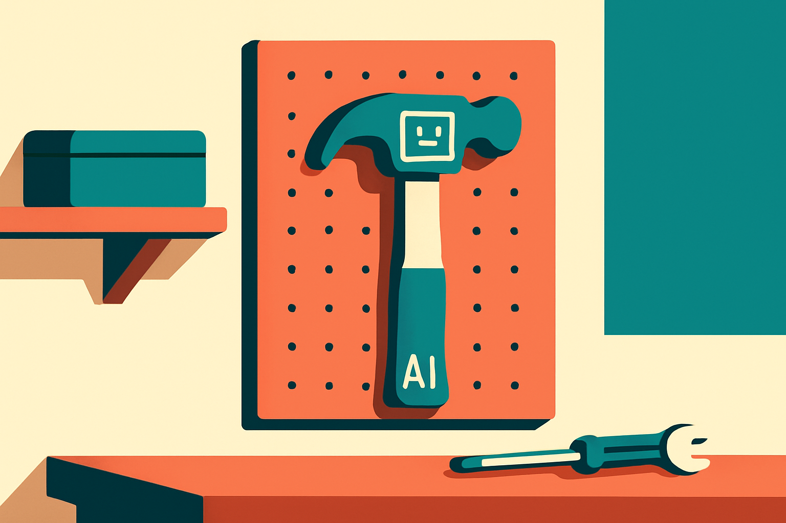

Google DeepMind announced computer use in Gemini 3.5 Flash. Not Pro. Flash. The cheap, fast tier.

That detail is doing a lot of work, and most of the early reaction on Hacker News skipped right past it to argue about whether agents that click buttons are useful yet. Fair question. But the model choice is the actual news here, and it reframes what computer use is for.

## What computer use actually means

Computer use is the capability where a model looks at a screenshot of a UI, decides what to do, and emits an action: click here, type this, scroll there. Then it sees the result and goes again. Anthropic shipped a version of this with Claude in late 2024. OpenAI followed. Now Google has it in Gemini, and they put it in Flash.

The loop is simple to describe and brutal to run in production. Every step is a round trip: screenshot in, reasoning, action out, wait for the screen to change, screenshot again. A task that a human does in twelve clicks becomes twelve or more model calls. If each call is slow and expensive, the whole agent is slow and expensive, and slow plus expensive is how most agent demos die between the keynote and the invoice.

This is why the tier matters. The bottleneck for computer use was never just whether the model could reason about a button. It was whether you could afford to call it twenty times to fill out one form.

## Why Flash, not Pro

Put a frontier model on a computer-use task and you get good decisions per step at a price that makes the per-task cost ugly. Twenty calls to a top-tier model, each one chewing through a full screenshot, adds up fast. The reasoning is great. The economics are not.

Flash flips that. Lower cost per call, much faster response, so the loop actually closes in something close to real time. You trade some per-step judgment for the ability to run the whole sequence cheaply and often. For computer use specifically, that trade looks smart, because most of the steps in a real workflow are not hard. Click the dropdown. Pick the date. Hit submit. You do not need a PhD-level model to find the submit button. You need a model that finds it correctly nine times out of ten and costs almost nothing per look.

Google DeepMind is making a bet that I think is directionally right: computer use is a high-volume, low-glamour workload, and high-volume low-glamour workloads belong on the speed tier. The flagship model is for the hard reasoning. The cheap fast model is for the grind.

The catch, and nobody has shown clean numbers on this yet, is reliability per step. If Flash clicks the wrong thing 5 percent of the time, that error compounds across a twenty-step task into something closer to a coin flip on whether the whole thing finishes. DeepMind's announcement leads with capability and speed. It does not lead with end-to-end task completion rates on messy real-world sites, and that is the number I want.

## The reliability math is the whole game

Here is the part that turns excitement into something you can plan around. Agent reliability is multiplicative. A task with N steps where each step succeeds with probability p completes with probability p to the power N. The intuition fails most people because the per-step number sounds fine and the per-task number is a disaster.

Say each step works 95 percent of the time. That feels solid. Run a ten-step task and you are at about 60 percent end to end. Run twenty steps and you are near 36 percent. The model can be impressive at every individual click and still fail the actual job most of the time.

So the real question for Flash is not "can it use a computer." Of course it can, they all can now. The question is what its per-step success rate is on the kind of cluttered, popup-ridden, slow-loading sites that real work happens on, and whether you can structure tasks to keep N small. A fast cheap model that you can call often also means you can afford retries, verification steps, and checkpoints. That is the hidden upside of the speed tier. Reliability you cannot buy with a smarter model, you can sometimes buy back with cheap repetition.

The Hacker News thread had the usual split. One camp says computer use is a hack and the right answer is APIs, not pixel-pushing. The other says most of the world's software has no API you can reach and never will, so pixels are the only door. Both are right. APIs are better when they exist. They do not exist for the long tail of internal tools, legacy portals, and government sites where a lot of tedious work actually lives. Computer use is the universal adapter for software that was only ever built for humans.

## Where this lands for the next year

Putting computer use on Flash signals that Google sees this as infrastructure, not a flagship party trick. Infrastructure gets cheap and fast before it gets ubiquitous. The pattern looks a lot like how transcription or basic OCR went from premium feature to assumed default once the cost dropped far enough that you stopped thinking about it.

I would not bet on fully autonomous agents running your business by year end. I would bet on a lot of narrow, supervised, ten-step automations getting quietly economical. The shift from "too expensive to bother" to "cheap enough to try on a Tuesday" is exactly the kind of change that does not make headlines and then shows up in everyone's workflow six months later.

If you are building on this, start small and measure the thing DeepMind did not advertise. Pick one tedious task with clear success and failure states, something like pulling a report from a vendor portal that has no API. Wire up Gemini 3.5 Flash computer use, run it a hundred times, and log the actual end-to-end completion rate, not the per-step vibe. Then break the task into the smallest possible chunks, add a verification screenshot check after each risky action, and use the cheap call price to retry on failure instead of reaching for a smarter model. The catch most people miss: the win from Flash is not that it reasons better, it is that it is cheap enough to be redundant. Redundancy is how you turn a 60 percent agent into a 95 percent one. Build for that and the speed tier earns its keep.
