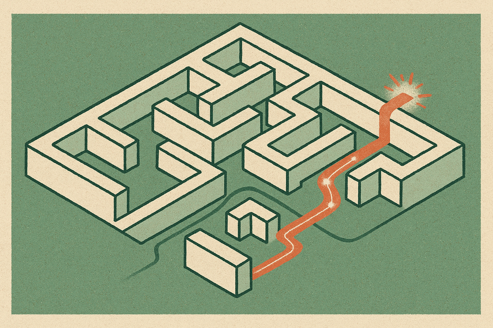

LLM agents have a measurement problem.

Final answers are easy to grade when the task has a clean answer. Agent trajectories are not. A browser agent clicks, searches, opens tools, writes files, calls APIs, and sometimes takes actions that cannot be undone. If it fails at step 47, the final score tells you very little about where the run went off track.

That is why process reward models have been attractive. Score each step, not just the outcome. But for agents, that gets expensive fast. Human labeling is hard because the intermediate state can be ambiguous. Monte Carlo rollouts are hard because long-horizon environments are noisy and costly. Dedicated reward model training adds another pipeline, another dataset, another place to drift.

The paper "Neglected Free Lunch from Post-training" makes a useful claim: if you already did RL post-training, you may already have a step-level signal sitting in the model.

## The critic hiding in the policy gap

The core idea is called progress advantage. The researchers derive it under a general stochastic Markov decision process: the log-probability ratio between the RL-trained policy and its reference policy recovers the optimal advantage function.

Put plainly: compare what the post-trained model is more likely to do against what the base reference model would have done in the same state. If RL pushed probability up for an action, that gap can act like a signal that the action made progress. If it pushed probability down, maybe not.

That is a very different setup from training a separate process reward model. No extra step labels. No task-specific reward model. No new annotation pass. The scoring signal comes from a byproduct of the standard RL post-training pipeline.

I like this because it turns a training artifact into an evaluation tool. The reference policy is not just a before-picture. It becomes a measuring stick.

## Where this could actually help

The researchers tested progress advantage across three applications: test-time scaling, uncertainty quantification, and failure attribution. They report results on five benchmarks and four model families. Across those settings, progress advantage beat confidence-based baselines and also surpassed dedicated trained reward models, despite not using task-specific reward model training.

The test-time scaling angle is the most immediately useful. If an agent samples multiple possible next steps or multiple trajectories, a step-level progress signal gives you a way to rank partial work before paying for full rollouts. That matters when tool calls are slow, expensive, or stateful.

Uncertainty is also interesting. Model confidence is famously slippery. A model can be very sure while doing the wrong thing, especially in agent tasks where it does not know which hidden state matters. Progress advantage gives a different lens: not "how likely was this token," but "how much did RL training prefer this action over the reference behavior?"

Failure attribution may be the sleeper use case. If you can score each step after a failed run, you can find the first bad turn instead of reading the whole transcript by hand. For teams running agents in support, coding, data ops, or browser workflows, that is not academic. It is debugging time.

## The catch: free does not mean plug-and-play

There are caveats.

First, you need access to both policies, or at least their log probabilities. Many builders working through hosted black-box APIs will not have that. If the provider does not expose the reference model or comparable logprobs, the method is hard to reproduce directly.

Second, the signal inherits the taste of the RL process. If post-training rewarded shallow hacks, benchmark gaming, or stylistic compliance, the progress advantage will reflect that. It is not an independent judge. It is a shadow of the RL objective.

Third, the paper’s claim is broad, but the real-world agent mess is broader. Production workflows have changing tools, permission boundaries, user preferences, partial observability, and hidden business rules. A method that beats trained reward models on five benchmarks is promising. It is not a blanket replacement for evals.

Still, this is the kind of result I pay attention to. Not because it says agents are solved. Because it reduces one painful part of the stack. Step-level scoring has been treated like a separate supervision problem. This reframes it as something you may get from the delta between before-RL and after-RL behavior.

For builders, the practical move is simple: if you control your model stack, start logging action-level probabilities from both the reference and post-trained policies during agent runs. Use the ratio as a candidate trace score, then compare it against your human bug reports and final task outcomes. The catch most readers will miss: this is not a replacement for product evals. It is a triage signal. Use it to choose which branches to expand, which failures to inspect, and which agent steps deserve suspicion first.
