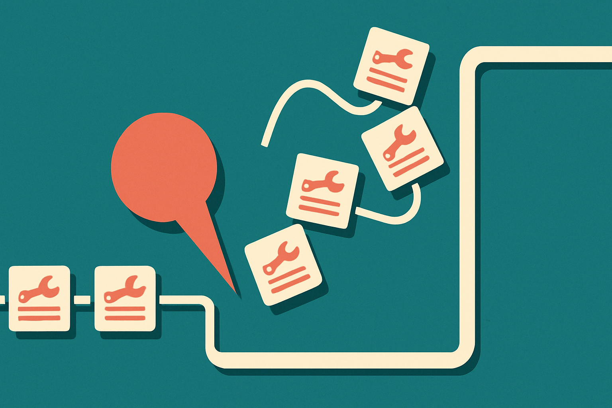

Agent training has a boring failure mode that matters more than the demo reels suggest: the model does not forget how to use the tool. It forgets how to say the magic words around the tool.

That is the useful finding in the arXiv paper, listed under both cs.CL and cs.LG, “Why Multi-Step Tool-Use Reinforcement Learning Collapses and How Supervisory Signals Fix It.” The authors studied multi-step tool-use reinforcement learning and found cases of catastrophic collapse, where performance drops sharply and the tool invocation structure breaks.

The key detail: the underlying tool-use ability can remain intact. The failure can come from probability spikes on specific control tokens. In plain English, the model starts overproducing or misplacing the little structural tokens that tell the runtime where a tool call begins, ends, or slots into a sequence.

That is not a philosophical problem. It is an interface problem with training dynamics attached.

## The agent breaks at the protocol layer

A lot of agent talk treats tool use as reasoning plus API access. But deployed tool use is also protocol discipline. The model has to produce a valid structure, call the right thing, pass the right arguments, read the result, then continue without corrupting the next step.

RL can reward eventual success, but multi-step tool use gives the optimizer many ways to get weird before it gets good. If a small formatting behavior happens to correlate with reward early in training, it can get amplified. The authors report “unexpected probability spikes” in control tokens. Once that happens, the agent’s execution format falls apart, even if the model could still solve the task in another wrapper.

This maps to what builders see in production. The model is “smart” in the transcript, then it emits invalid JSON. Or it selects the right tool with malformed parameters. Or it gets through step three and then forgets the calling convention. The capability is there. The contract is broken.

## Supervision helps, but it teaches the map too well

The authors tested several supervisory signals, including off-policy supervision, hints, supervision from erroneous examples, and different schedules for mixing those signals with RL. Their strongest practical result is that interleaving supervised fine-tuning with RL improves training stability.

That makes sense. SFT keeps the model anchored to valid trajectories while RL pushes on task success. One signal says “win.” The other says “do not tear up the rails while trying to win.”

But the paper also reports a catch: interleaved SFT plus RL degraded under format and content out-of-distribution evaluation. That is the part I would underline. Supervision can stabilize the behavior you show it, but it can also make the agent too attached to that behavior’s surface form. If your training traces all look like one tool schema, one prompt wrapper, one task family, you may be buying stability by narrowing the agent’s comfort zone.

This is the trade I keep seeing in agent work. More scaffolding reduces chaos. Too much scaffolding becomes a costume the model cannot remove.

## The lesson is not “RL is broken”

The better lesson is that agent RL needs instrumentation below the reward curve. If you only watch task success, collapse looks mysterious. If you watch token distributions around tool syntax, invalid call rates, argument repair frequency, and per-step survival through the tool chain, collapse becomes easier to catch.

The authors also looked at learning rates and generalization, which matters because these failures are not just dataset issues. They are training dynamics issues. A model can be pushed into a brittle local behavior by the optimizer, not merely by bad examples.

I like this paper because it makes agent failure less magical. Multi-step tool use is not one skill. It is a stack: task reasoning, protocol formatting, state tracking, tool selection, argument construction, observation use, and recovery. RL pressure can improve parts of the stack while damaging another part.

Practitioner's take: if you are training or fine-tuning tool-using agents, do not just add RL and stare at final reward. Track structural validity as a first-class metric. Mix in supervised traces during training, especially for long tool chains, but test against changed formats, renamed tools, shuffled schemas, and tasks outside the training pattern. The catch most teams miss is that a stable agent in your harness may be a brittle agent wearing your harness as a crutch.
