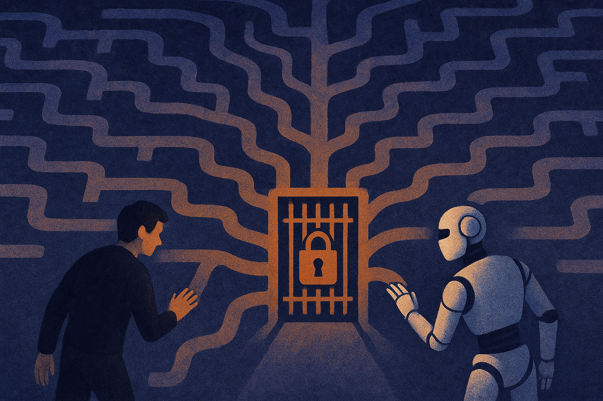

A Hacker News item with the headline “AI in mathematics is forcing big questions” is thin evidence by itself. No paper. No benchmark. No named system in the prompt.

But the question is real.

Math is becoming one of the cleanest stress tests for AI because it punishes vibes. A chatbot can sound fluent about a product plan and still be wrong in ways that take weeks to discover. In math, a claim either follows or it does not. The catch is that the path can be long, subtle, and hard to inspect.

That makes AI math less a story about “machines replacing mathematicians” and more a story about the plumbing of trust.

## The answer is not the work

We already have examples of AI systems doing nontrivial mathematical work. DeepMind’s AlphaGeometry, published in 2024, solved 25 of 30 olympiad geometry problems under contest-style conditions, using a neuro-symbolic setup and synthetic training data. That was a meaningful result because geometry problems have structure, and the system could combine pattern generation with symbolic checking.

But most working mathematics is not olympiad geometry. It is definition-heavy, social, cumulative, and often exploratory. Mathematicians do not just want an answer. They want to know which lemmas matter, where the proof is fragile, what the new object suggests, and whether the result connects to existing work.

This is where current AI tools are awkward. They can suggest approaches, rewrite arguments, find analogies, or draft formalizations. They can also hallucinate citations, skip constraints, and produce proof-shaped prose that collapses when checked.

So the useful question is not: can AI do math?

The useful question is: which parts of mathematical work can be generated cheaply, and which parts can be verified cheaply?

## Formal proof changes the game

The big practical shift is the connection between language models and proof assistants like Lean. Informal math is written for humans. Formal math is written so a machine can check every step. That difference matters.

If a model proposes a proof in plain English, the reader still carries the burden. If a model proposes Lean code that compiles against mathlib, the burden moves. Not all of it, because formalization can encode the wrong statement or hide unhelpful assumptions. But a large chunk of local correctness becomes testable.

That creates a different product shape than the usual chatbot. The valuable system is not a confident explainer. It is a loop: propose, formalize, check, repair, search, summarize. The model’s job is not to be right on the first try. Its job is to keep generating plausible next moves that a verifier can reject quickly.

This is why math is a preview of serious AI tooling in other fields. Code already works this way. Write, run tests, inspect, patch. Math is pushing toward the same pattern, but with a higher bar for correctness and a much longer context of prior knowledge.

## The social question is the hard one

If AI produces a proof that checks, who gets credit? The person who posed the conjecture? The person who designed the search loop? The lab that trained the model? The maintainers of the formal library that made the proof possible?

There is no clean answer yet.

There is also a publication problem. Journals and reviewers are built around human-readable arguments. Formal verification helps, but it does not automatically explain why a theorem matters. A 10,000-line checked proof may be correct and still intellectually unsatisfying. Mathematics is not only correctness. It is compression, taste, and reuse.

That is the part hype misses. AI can increase the supply of candidate proofs and computations. It does not automatically increase the supply of judgment.

For builders, the near-term opportunity is not “AI mathematician in a box.” Build narrow loops around verification. Pick a domain with existing formal libraries, capture failed attempts, show dependency trails, and make the machine’s work inspectable by default. The catch most teams miss: the UI should not optimize for confident answers. It should optimize for rejected paths, checked steps, and the shortest route from a guess to something a serious human can trust.
