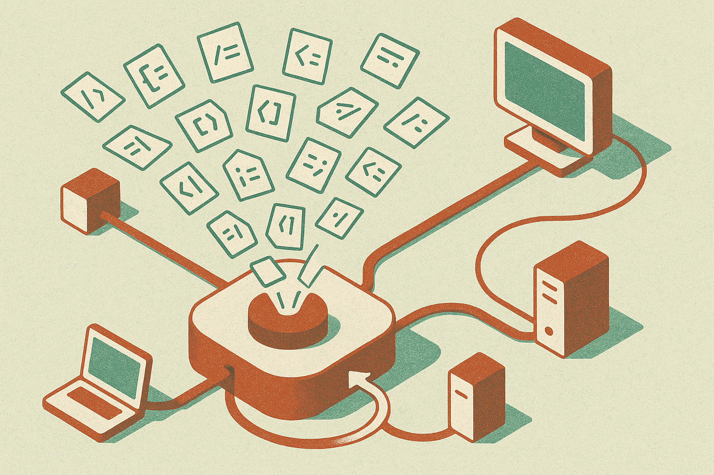

The interesting part of Weave’s new router is not that it swaps models behind Claude Code, Codex, or Cursor. People have been hand-picking cheaper models for months.

The interesting part is where the routing decision sits.

Weave built an Anthropic/OpenAI-compatible endpoint for coding agents. The agent sends a request. The router inspects that inference call, picks a model, translates what needs translating, then sends the work onward. In Weave’s example, a planning step might go to Opus 4.8, context-gathering subagents might go to DeepSeek V4 Flash, and implementation might go to GLM 5.2.

That is the right abstraction. Not “which model do we use?” but “which model should handle this specific move?”

## The expensive model should not be the default reflex

Weave says the trigger was Opus 4.7. Tokenizer changes made their AI coding bill jump, even though they did not need top-tier reasoning for every call. That tracks with what builders feel once agents move from novelty to daily workflow. The cost problem is not one heroic prompt. It is hundreds of small calls: inspect this file, summarize this dependency, apply this patch, rerun the plan.

Frontier models are still valuable. The mistake is using them as the universal runtime.

Coding agents naturally create mixed workloads. Some calls need judgment across a messy codebase. Some need careful planning. Some are basically retrieval, rewriting, or mechanical edits. Treating those as the same category is wasteful.

Weave reports 40% token savings over the last month, with no noticeable hit to quality or velocity. Good signal, but still an internal claim. “No noticeable difference” is not the same as a measured benchmark across repos, languages, task types, and developer skill levels. I would want to see failed patches, reverted commits, time-to-merge, and human intervention rates before treating 40% as portable.

Still, even if the real number is half that, the pattern matters.

## Routing is an eval problem wearing an infra jacket

The hard part is not proxying requests. The hard part is knowing when the cheap model is good enough.

Weave says its router is trained with reinforcement learning on tens of thousands of agent traces. The reward is tied to whether the selected model completes the task. That is a sensible direction because routing quality depends on the shape of the work, not a static leaderboard.

But this also creates new failure modes.

A bad router can silently downgrade the one call that mattered. A model translation layer can distort tool schemas, system prompts, or context formatting. A cheap model can produce a plausible edit that passes a narrow check but damages architecture. If the developer only sees “the agent failed,” debugging gets murky. Was it the coding agent, the model, the router, the prompt translation, or the repo state?

This is why I like the endpoint approach but would not run it blind. A router needs trace visibility. It should show which model handled each step, why it picked that model, what it cost, and what happened after. The savings are only useful if the team can audit the misses.

Also, Elastic License 2.0 means source-available, not plain open source. That may be fine for many teams, especially if they self-host, but it matters for infra that sits in the middle of every coding request.

## The agent stack is becoming a scheduler

This is where coding agents are headed. The model is no longer one big brain behind the curtain. It is a pool of workers with different prices, latencies, context behaviors, and failure profiles.

The agent plans. The router schedules. The eval loop teaches the scheduler. The developer supervises the output.

That sounds less magical than “one model writes the app.” It is also much closer to how production systems get efficient. Databases use query planners. Compute platforms use schedulers. Now AI coding tools are getting a similar layer because model choice has become a runtime decision.

For builders, I would try this first on low-risk agent work: repo exploration, test generation, documentation edits, small refactors. Log every routing decision. Compare against a frontier-only baseline for cost, elapsed time, and human corrections. The catch most teams will miss: routing is only as good as your task labels and traces. If you cannot tell which agent steps succeeded, you cannot safely teach a system which model deserved the job.
