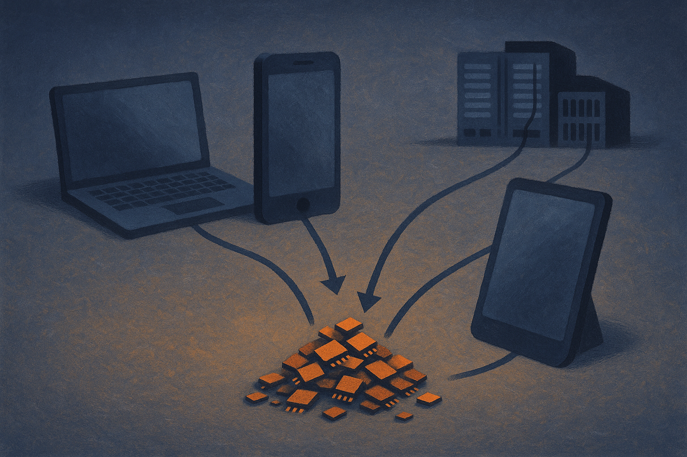

Matthew Berman’s claim is simple: Apple has raised the base MacBook Pro price by $300 and the base iPad price by $150, and the culprit is the AI boom pushing up memory prices.

That is plausible. It is also not the whole case yet.

The useful part is not “Apple got more expensive,” because Apple products get more expensive for plenty of reasons: component costs, product segmentation, storage defaults, currency, tariffs, margins, supply contracts. The useful part is the reminder that AI demand is physical. It needs memory. A lot of it. Not just GPUs, not just data centers, not just frontier labs buying accelerator clusters.

Memory is the quiet tax on the AI stack.

## Memory is where AI leaves the cloud

Most AI coverage still treats compute as the scarce thing. GPUs are visible. H100s became a meme. Data center buildouts get headlines. But memory sits underneath almost every practical AI decision.

Training needs it. Inference needs it. Local models need it. Phones and laptops need more of it if vendors want on-device features that are not toy demos. Even if the model weights live partly in the cloud, the device still needs enough headroom to run retrieval, indexing, embeddings, summarization, transcription, image processing, and whatever agentic wrapper the product team ships next quarter.

That is why Apple is such a good signal. Apple sells integrated devices, not parts. If memory gets more expensive, customers do not see a clean “DRAM surcharge” line item. They see a higher base price, fewer cheap configurations, or a more painful upgrade ladder.

Berman’s warning to wait before buying an Apple laptop may be good consumer advice if the reported price changes are real and near-term pricing is unsettled. But for builders, the larger point is not timing a purchase. It is understanding that local AI is becoming a bill of materials problem.

## The causal chain is believable, but still thin

I would not overstate the Apple-specific claim from this alone. Berman points to a memory price chart and says AI demand is gobbling up supply. That direction makes sense, but the source material does not prove Apple raised these specific prices because of AI-driven memory inflation.

A stronger claim would need Apple configuration history, component price data, supply contract context, and some separation between DRAM, NAND, and other cost inputs. An iPad price bump and a MacBook Pro price bump may share a cause, or they may not. Apple also has a long history of using base models and storage tiers to shape margins.

Still, the market logic is hard to ignore. AI demand competes with consumer electronics for some of the same supply chain capacity. When the data center side is willing to pay for high-volume memory, everyone downstream feels it. Maybe not immediately. Maybe not evenly. But eventually.

This matters because the “AI PC” pitch often assumes hardware gets better and cheaper on the usual curve. More RAM, more neural processing, more storage, same price. That may not hold if AI turns memory into a strategic input instead of a commodity afterthought.

## The buyer question changed

For the last decade, most normal laptop advice was easy: buy enough RAM because you cannot upgrade later, but do not overthink it. Now the advice is less clean.

If you expect to run local models, code assistants, private document search, local transcription, or multimodal workflows, the base configuration may age badly. Not because the CPU is too slow. Because memory pressure makes the machine feel cramped. The gap between “works today” and “works well for AI workflows in two years” is likely to be memory first.

That does not mean everyone should panic-buy the highest spec. It means the old upgrade math needs an AI column.

If you are buying fleet machines for a team, test the actual workflows before standardizing on base models. Run the local assistant, browser, IDE, design tools, meeting transcription, and background indexing at the same time. Watch memory pressure, not benchmark scores. If you are building an AI product, assume your users may have less headroom than your dev machine, especially on consumer laptops and tablets.

Practitioner’s Take: Treat memory as a product constraint, not a spec-sheet detail. Before you ship an on-device AI feature, test it on the cheapest current device your users are likely to own, with real background apps running. If it only feels good on a maxed-out laptop, you built a demo for reviewers, not a workflow. The catch most teams miss: cloud fallback can save quality, but it does not erase local memory pressure from the user experience.
