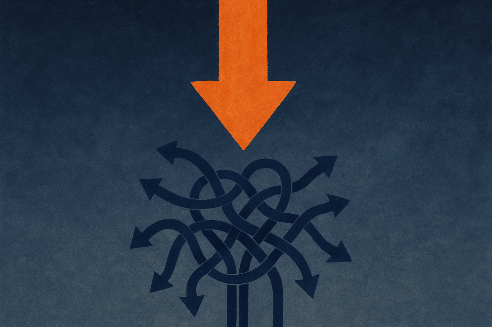
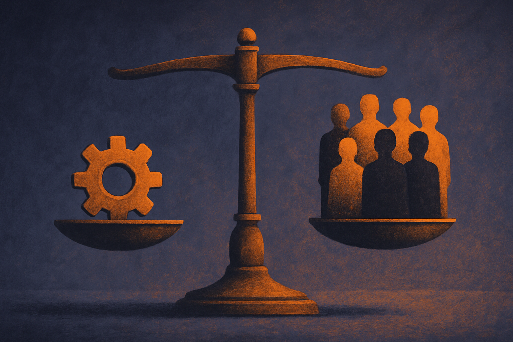

A headline went around this week: "Ford hired AI and sacked humans. It backfired badly." It's the kind of story that gets shared hard because it confirms what a lot of people already feel. The robots came for the jobs, the robots couldn't do the jobs, the humans came back. Schadenfreude with a moral.

I want to be careful here, because the source is a single Hacker News post with a punchy title and not much underneath it. I can't verify the specifics of what Ford cut, when, or how badly it backfired. So I'm not going to pretend I know the inside story. What I can do is treat this as a case study in a pattern that's very real, regardless of whether Ford is the perfect example. The pattern is: a company swaps people for AI, the swap underperforms, and the company quietly walks it back.

That pattern is worth understanding because it's going to repeat across a lot of companies this year, and most of the lessons are predictable.

## The headline is doing a lot of work

First, the honest part. "Backfired badly" is a vibe, not a metric. Stories like this travel because they're emotionally satisfying, not because they're well sourced. When you see a layoff-to-rehire narrative, ask what actually got measured. Did quality drop in a way customers noticed? Did costs go up after the savings? Did they rehire the same roles or different ones?

Most of the time the real story is messier than the headline. Companies rarely admit "the AI failed." They restructure, they rename roles, they bring back a smaller team with a new title. From the outside that looks like a clean reversal. From the inside it's usually a correction, not a confession.

So treat the Ford framing as a prompt, not a proof. The interesting question isn't "did Ford screw up." It's "what makes these swaps fail, and how would you avoid it."

## Where AI-for-headcount swaps actually break

When automation-for-people moves go wrong, they tend to fail in the same few places.

The first is the long tail. AI handles the common 80% of cases well and falls apart on the weird 20%. The problem is that the weird 20% is often where the value and the risk live. A human support agent who handled 100 tickets a day was also catching the three that would have become lawsuits, refunds, or churned accounts. Cut that human, and you don't notice the loss until the exceptions pile up.

The second is tacit knowledge. The people you replace often hold context that was never written down: which supplier always ships late, which customer needs a phone call instead of an email, what the actual approval process is versus the documented one. AI can't absorb what isn't recorded. When that knowledge walks out the door, the system that depended on it degrades in ways nobody predicted.

The third is the supervision gap. AI doesn't remove work, it moves the work. Someone has to check outputs, handle escalations, fix the errors, and own the failures. If you cut the headcount before you've built the supervision layer, you've just created a hole where accountability used to be. The savings on paper become losses in practice.

None of this means AI can't do the job. It means the job was never just the visible task. It was the task plus the exceptions plus the judgment plus the institutional memory.

## Why the rehire is the predictable ending

Here's the part operators should sit with. The rehire isn't a sign that AI failed. It's a sign that the deployment was sequenced wrong.

The companies that get burned tend to do it in one order: cut people first to book the savings, then deploy AI to cover the gap, then discover the gap is bigger than the model can fill. By then you've lost the people and the knowledge, and rehiring costs more than you saved.

The companies that don't get burned do it in the opposite order. They deploy AI alongside the existing team, measure where it actually performs, identify which work genuinely no longer needs a human, and only then adjust headcount. Slower, less dramatic, far fewer reversals. The savings show up later but they're real.

The reason the first order is so common is that the savings are the thing the board wants and the capability is the thing nobody can prove in advance. So the pressure is always to book the cut early and figure out the coverage later. That's the trap. You're paying for a capability you haven't validated, with a cost you've already locked in.

## What this means for the next two years

We're going to see a lot more of these stories, and most of them will be told badly. Pro-AI accounts will bury the failures, anti-AI accounts will inflate them. The truth is going to sit in the boring middle: AI is genuinely capable of doing real chunks of real jobs, and companies are genuinely bad at figuring out which chunks before they cut.

The signal to watch isn't layoffs. It's the rehire rate and the role redefinitions that follow. If a company cuts 500 roles and quietly posts 200 new ones with adjacent titles six months later, that's the actual data point. That's where you learn what AI couldn't cover.

And the companies that look boring right now, the ones running AI in parallel with their teams and not announcing dramatic cuts, are probably the ones doing it right. No headline. No backfire. Just a slow shift in what the work looks like.

A builder reading the Ford story should resist the urge to treat it as either vindication or warning, because the framing is too thin to be either. The actionable move is to copy the order that works: deploy in parallel, instrument everything, and find the failure modes before you touch headcount. Run the AI on live work next to the humans for a full cycle, log every escalation and every exception it punts on, and let that data tell you which roles are actually replaceable. The catch most readers miss is that the long tail and the tacit knowledge are exactly the parts that don't show up in a demo, so the savings you can see early are the ones most likely to reverse. Cut last, not first.
