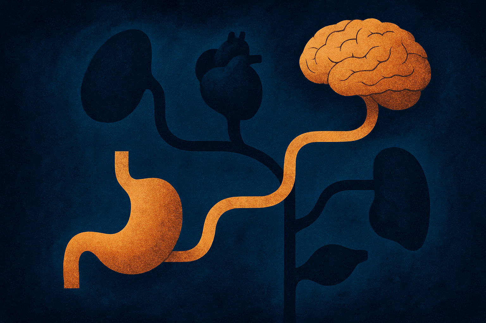
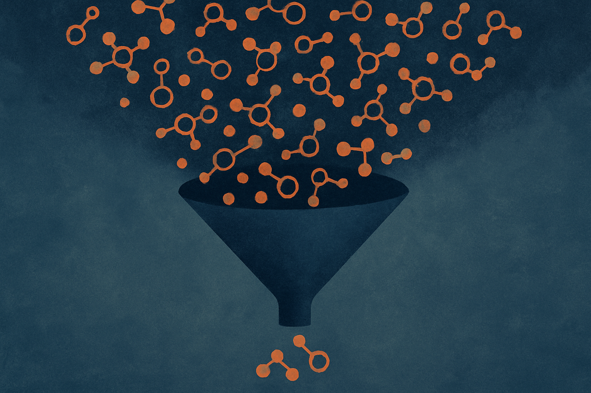

I got one source for this today: a Hacker News thread pointing at how Ozempic works on the gut-brain axis. That's it. No paper attached, no lab statement, no dataset. So I'm not going to pretend I can synthesize five expert takes into a tidy verdict. Instead I want to use this as a case study in something I think about a lot: where AI genuinely moves the needle in understanding drugs like semaglutide, and where people are projecting capabilities that don't exist yet.

Because GLP-1 drugs are the perfect storm for AI hype. Huge market, mysterious mechanism, mountains of biological data, and a public that desperately wants a clean story. Let me separate what's real.

## What we actually know about the gut-brain part

Semaglutide (the molecule in Ozempic and Wegovy) is a GLP-1 receptor agonist. GLP-1 is a hormone your gut releases after you eat. It does a few things: nudges insulin release, slows how fast your stomach empties, and acts on receptors in the brain that govern appetite and satiety. The "gut-brain axis" framing is about that last part. The drug doesn't just work on your pancreas. It talks to your hypothalamus and brainstem, and that signaling is a big reason people eat less.

That much is established pharmacology. The interesting and genuinely unsettled questions are the ones the Hacker News crowd tends to circle: how much of the appetite effect is direct receptor binding in the brain versus vagus nerve signaling from the gut, why the drugs seem to dampen reward-seeking beyond food (alcohol, nicotine, even compulsive behaviors in some reports), and what the long-term consequences of chronically altering that signaling loop are.

Notice that none of those open questions get answered by an AI model. They get answered by wet-lab experiments, knockout mice, and human trials that take years. This is the first thing to keep straight.

## Where AI is doing real work in this space

Now the honest optimist part. AI is not decoding the gut-brain axis on its own, but it's a serious accelerant in several specific places, and these are worth knowing if you build in bio.

Protein structure and binding. The whole reason next-generation GLP-1 drugs are arriving fast is that companies can now model receptor-ligand interactions computationally before they ever synthesize a compound. AlphaFold and its successors gave researchers structural predictions for receptors that used to take months of crystallography. That doesn't invent a drug, but it shrinks the search space for what to test.

Multi-receptor design. The drugs getting attention now (tirzepatide hits GLP-1 and GIP, and triple agonists add glucagon) are combinatorial problems. Tuning a molecule to hit three receptors with the right relative strength is exactly the kind of optimization where machine learning over assay data earns its keep. Eli Lilly and others have been open that computational screening is part of the pipeline.

Mining the literature and the EHR. The "Ozempic also reduces alcohol cravings" signal partly came from researchers running models over electronic health records and prescription data, spotting that patients on these drugs had lower rates of certain other diagnoses. That's a real and underrated use: AI as a hypothesis generator across messy population-scale data. It tells you where to look. It does not tell you what's true.

## Where the hype outruns the biology

Here's the part I'd push back on if I were in that thread.

"AI will simulate the whole gut-brain axis." No. We cannot simulate a single human cell with full fidelity, let alone the cross-talk between an enteric nervous system, the vagus nerve, circulating hormones, and a brain. Models that claim to "predict mechanism" are usually doing pattern-matching over existing annotations, not running biology forward from first principles. When someone shows you a slick diagram of a drug's mechanism generated by an LLM, that's a synthesis of human-written papers, not a discovery.

"The model found the mechanism." Be very suspicious of this phrasing. Correlation surfacing in EHR data is a lead, not a finding. The alcohol-craving link is plausible and partly supported by small trials now, but the path from "the model noticed something" to "we understand the receptor pathway responsible" runs entirely through experiments AI didn't do.

"We can personalize GLP-1 dosing with AI." Maybe someday, but the data to do this well mostly doesn't exist yet. You'd need longitudinal, multi-modal data on enough people to learn who responds and who gets side effects, and most of that is locked in silos or simply never collected. A model is only as good as the data underneath, and the data here is thinner than the marketing implies.

There's a pattern across all three: AI is excellent at compressing and searching what humans already know or have already measured. It's weak to useless at generating new biological ground truth. The gut-brain axis is mostly an unmeasured-ground-truth problem.

## How to read claims like this without getting fooled

When a story crosses your feed saying AI "revealed" how a drug works, run three quick checks. First, is there a wet-lab or clinical result behind it, or just a computational output? Second, is the AI generating a hypothesis (fine, useful) or asserting a mechanism (suspicious)? Third, what data did the model see, and could that data even contain the answer? If the answer requires measuring something nobody measured, no model conjures it.

I'm an optimist about AI in drug discovery. The structure-prediction and screening wins are real and they're compressing timelines in ways that matter for patients. But the gut-brain axis specifically is a humbling reminder that biology still gates on physical experiments, and the most honest thing a model can tell you right now is where to point the microscope.

A builder's move here: if you're working anywhere near bio or health data, treat AI as a triage layer over evidence you already have, not an oracle that produces new facts. The highest-value thing you can build today is the hypothesis-ranking and literature-synthesis tooling that helps a researcher decide which of a hundred experiments to run first. That's a real product with real ROI. The catch most people miss is that the moment your tool starts presenting ranked hypotheses as conclusions, you've stopped being useful and started being dangerous, especially in health, where a confident wrong answer costs more than no answer. Build the funnel that narrows the search. Let the wet lab close it.
