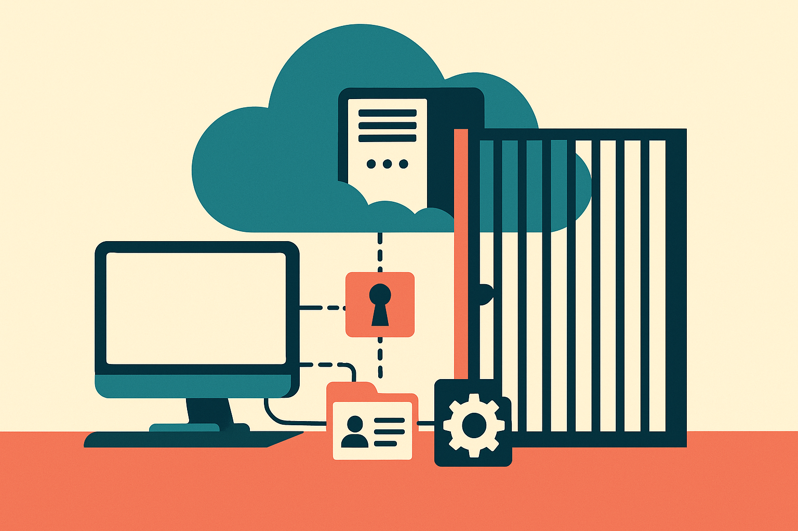

Alex Finn is right about the direction, even if I would discount the panic.

His argument is simple: learn local AI now, while hardware is still obtainable and open models are good enough to matter. He frames it against a dramatic backdrop: restricted access to future frontier models, rising hardware prices, Chinese labs pushing hard, and the emergence of “hand selected winners.” Some of those claims need more support than Finn gives them, especially the idea that the US government is broadly banning access to top frontier models. I would not treat that as established from this material alone.

But the operator lesson still holds. Local AI is becoming a real capability, not a hobbyist flex.

## The useful part is control

Finn shows off a serious home lab: three Mac Studios with 512 GB memory, two Mac Minis, a DGX Spark, and a new RTX desktop. He says he has spent around $40,000. That is not the normal path. It is also not the point.

The point is that local inference gives you a different set of tradeoffs than a $20 monthly chatbot. You can run against private files without shipping everything to a cloud provider. You can keep working when an API changes, rate limits you, deprecates a model, or tightens policy. You can tune your own stack around latency, retrieval, structured outputs, and repeat workflows instead of waiting for a product team to expose the exact button you need.

That does not mean local models beat frontier models. Most people should still use frontier models every day. I do. The gap at the top remains real, especially for hard reasoning, coding at scale, multimodal work, and long-context synthesis.

Local AI is not a replacement for the best remote model. It is insurance, a workshop, and sometimes a cheaper production path.

## The scary hardware story is partly true

Finn’s hardware anxiety is more believable than his access panic.

He says Apple devices have seen 20% to 25% price increases, Mac Minis are no longer available below $1,500, and adding 128 GB of RAM to his build would have cost another $4,000 on top of a $9,000 machine. I am not validating each price claim here, but the broader pressure is obvious: memory, GPUs, power, and supply chains now sit at the center of AI capability.

The lesson is not “buy a $40,000 lab before it is too late.” That is bunker thinking.

The better move is to map workloads to hardware. A spare laptop can run small models for writing, extraction, classification, and local RAG experiments. A high-memory Mac can be useful for larger quantized models. A single consumer GPU can carry plenty of agent and coding experiments if you design the workflow well. You do not need to own frontier-scale compute to learn the important mechanics.

The trap is buying hardware before knowing the job.

## Local AI is a skill stack

The most valuable thing Finn is pointing at is education. Local AI forces you to understand model size, context windows, quantization, memory bandwidth, tool calling, retrieval, evals, and latency. Those are not niche details. They are the plumbing behind serious AI work.

A builder who has only used hosted chatbots tends to think in prompts. A builder who has run local models starts thinking in systems: what runs where, what data stays private, what model is good enough, what can fail safely, what should be cached, what should be escalated to a stronger model.

That skill transfers even if you never run production locally.

Practitioner's take: do not start by shopping for the biggest box you can afford. Pick one recurring workflow, maybe email triage, document Q&A, meeting notes, codebase search, or invoice extraction. Run it once with a hosted frontier model, then once with a small local model. Compare quality, speed, privacy, and cost. The catch most readers miss: local AI only becomes useful when it is attached to your files, tools, and repeat jobs. A local chatbot with no workflow is just a slower novelty.
