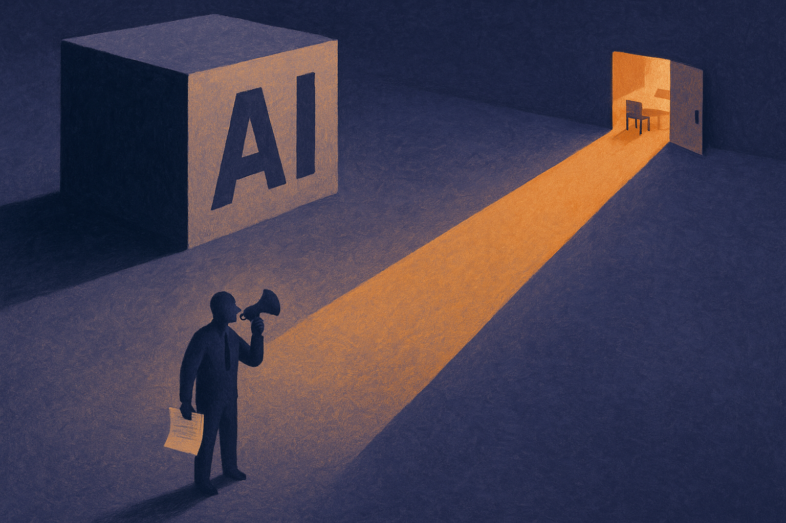

Sarah Wynn-Williams, author of *Careless People*, has claimed Meta surveilled her for 12 months to enforce silence. That is the claim circulating through Hacker News today, and it lands in a very specific moment.

AI companies are asking for trust on bigger and bigger surfaces: memory, agents, workplace data, health-adjacent workflows, browser control, customer support, coding environments, procurement, and internal decision support. At the same time, the people best placed to see what is going wrong are often employees, contractors, researchers, policy staff, and early partners.

If those people believe criticism can trigger legal pressure, private investigation, or career damage, then “responsible AI” becomes a brochure word.

## The governance problem is not only the model

Most AI governance talk still centers on model behavior. Hallucinations. Bias. Jailbreaks. Copyright. Eval scores. Dangerous capabilities. All real topics.

But governance also includes the company’s behavior around the model. How it treats internal dissent. How it handles former employees. Whether compliance teams can say no. Whether researchers can publish uncomfortable findings. Whether security is protecting users, or protecting executives from embarrassment.

That distinction matters because AI products are unusually dependent on trust. A cloud database can be judged on uptime, latency, and breach history. An AI assistant asks for messy context: emails, files, goals, calendars, private drafts, source code, customer notes. Users do not just trust the software. They trust the institution behind it.

Meta’s history makes this especially sensitive. Wynn-Williams’ book, *Careless People*, is about Facebook’s leadership culture and global policy choices. Meta has disputed claims around the book. That dispute should be separated from the larger point: when a platform company and a former insider are fighting over what can be said, the public should care about the process, not just the personalities.

## Silence is a product risk

Founders sometimes treat internal criticism as a morale problem. Big companies often treat it as a legal problem. AI companies should treat it as a product risk.

The reason is simple. Your best early warning system is usually human. A policy lead notices a deployment pattern that will blow up in a foreign market. A red teamer sees that a safety fix is mostly cosmetic. A customer engineer hears that enterprise users are pasting regulated data into a tool with unclear retention settings. A researcher sees benchmark gaming. A support worker sees the same failure mode across hundreds of tickets.

If speaking up feels unsafe, the signal does not disappear. It just moves outside the company, gets distorted, or arrives late.

This is where the AI industry should be more demanding than ordinary tech. These systems are being embedded into decision loops. Not all are high stakes, but enough are. The internal culture around dissent is part of the safety case.

OpenAI’s 2024 employee letter about non-disparagement agreements made a similar point, even though the facts were different. Staff wanted the right to raise concerns without losing equity or facing contractual pressure. Anthropic, Google DeepMind, Meta, OpenAI, xAI, Mistral, Cohere, and the rest all face the same basic tension: the more consequential the product, the more valuable dissent becomes, and the more tempting it is to control it.

## Builders should design for ugly feedback

There is a practical lesson here for smaller teams too. Do not wait until you are big enough to have a crisis comms department.

Write down how employees can report safety, privacy, and misuse concerns. Give them a path that does not require going through the manager who owns the launch. Keep access logs for sensitive data and internal monitoring tools. Separate security investigations from executive reputation management. Make it clear what former employees can say about public-interest risks. If you use NDAs, carve out lawful reporting and safety concerns in plain language.

This is not charity. It is operational hygiene.

The catch most readers miss: whistleblower policy is not separate from AI quality. It is one of the ways you find out your system is failing before customers, regulators, or journalists do. If you are building with AI today, test your model, yes. But also test your organization. Ask who can stop a bad launch, who can publish bad news, and what happens to the person who says the thing leadership does not want to hear.
