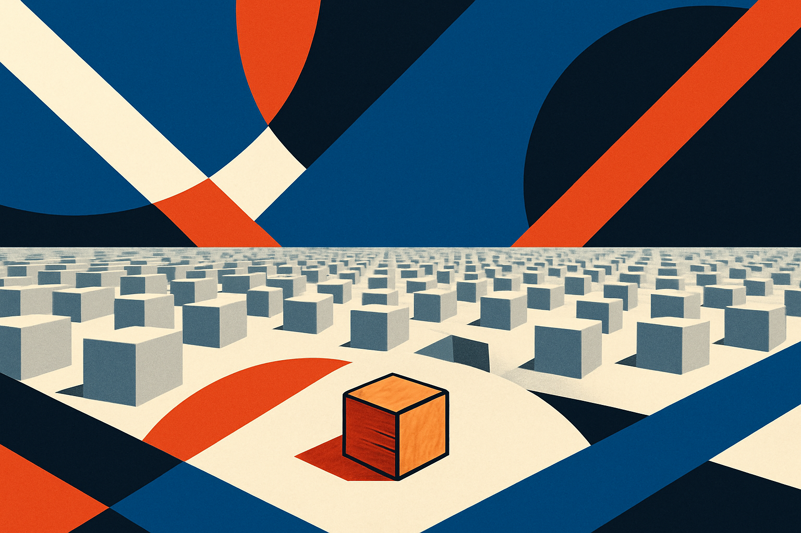
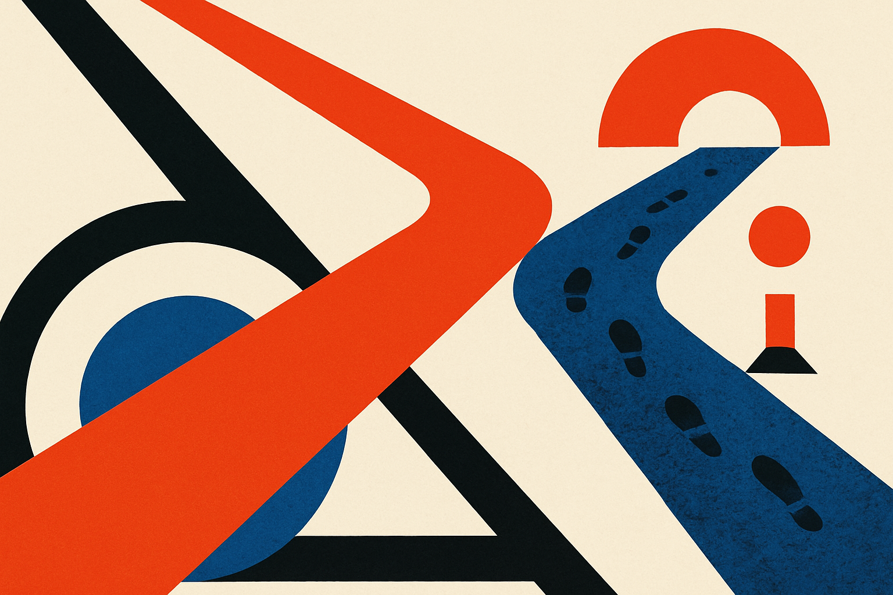
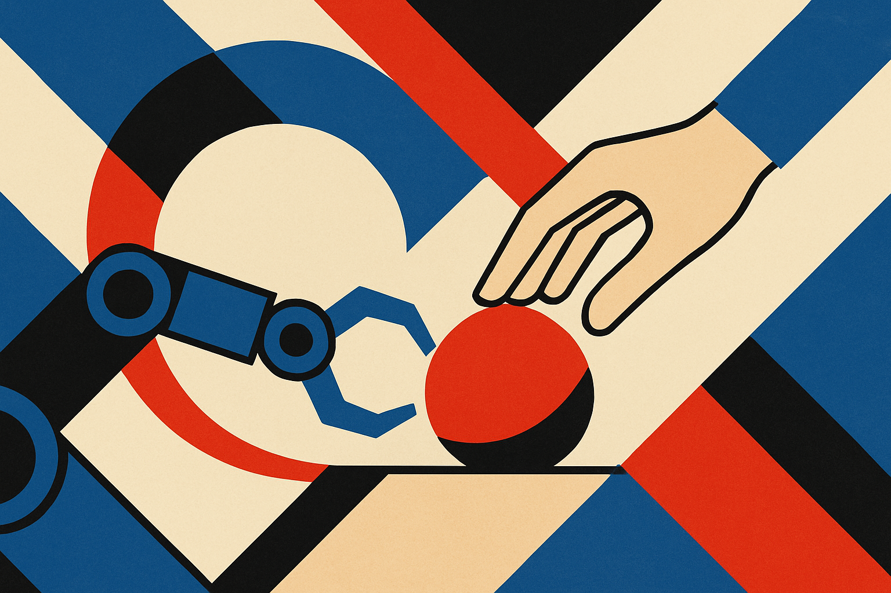

A clip making the rounds on Hacker News this week pairs a tired phrase ("AI slop") with an old answer. It's the Robin Williams scene from Dead Poets Society, the one where his character tells a room full of teenagers that we don't read and write poetry because it's cute. We do it because we are members of the human race, and the human race is full of passion. The point being floated: the best response to a flood of machine-generated noise isn't a better spam filter. It's remembering why anyone made the thing in the first place.

I think that's right, and I also think it's incomplete. So let me try to take it seriously rather than just nod at it.

## The slop problem is real and it's a volume problem

Let's be precise about what people mean by slop, because the word is doing a lot of work. Slop is not "AI-assisted writing." Slop is content produced with no reader in mind, optimized for a feed or a ranking system or an ad impression, generated at a volume no human audience asked for. The tell is that nobody on either end cares. The writer didn't want to write it. The reader didn't want to read it. A model sat in the middle and converted electricity into filler.

The reason it feels new is the cost curve. Producing a thousand mediocre articles used to require a content farm with actual humans typing. Now it requires an API key and a loop. The marginal cost of plausible-sounding text fell to roughly zero, and anything that falls to zero gets overproduced. This is not a moral failing of the models. It's what happens to any commodity when supply explodes.

So the diagnosis is correct. We are drowning. The Williams clip resonates because it names the thing the volume threatens: not accuracy, not even quality exactly, but intent. The sense that a human meant this for you.

## Why "make it human" is the wrong instruction

Here's where I part ways with the easy version of the takeaway. A lot of people watch that clip and conclude the answer is to write more passionately, to inject more soul, to be authentically human as a content strategy. That's a trap, and it's a trap because it turns the cure into more of the disease.

The moment "be human" becomes a tactic, you get a new genre of slop: the performatively personal. The LinkedIn post that opens with a fake vulnerable confession. The newsletter that manufactures a folksy anecdote because the playbook says stories convert. You can generate that with a model too. In fact models are excellent at it, because emotional cadence is a pattern like any other. Passion as a deliverable is just slop wearing a nicer coat.

Williams's character wasn't telling those kids to perform passion. He was telling them poetry is what passion produces when it has somewhere to go. The output is downstream of a real reason to make the thing. You can't reverse-engineer it by adding more adjectives.

## The signal that survives is specificity

If passion can be faked, what can't be? My answer, and the thing I keep coming back to as a builder: specificity that costs something to produce.

A model can write you a confident paragraph about a tool it has never used. It cannot tell you that the rate limit kicked in at request 47, that the docs lied about the default timeout, that the thing broke in a way the changelog didn't mention. Lived specificity is expensive because it requires having actually done the thing, and that expense is exactly what makes it a credible signal in a sea of cheap text.

This is the part the Williams framing gestures at but doesn't quite name. The reason the human-race-is-full-of-passion line lands is not the passion. It's that the line is attached to a specific person, in a specific scene, played by someone who is now gone, which is why a clip from 2009 about a poem keeps surfacing in 2026. The specificity is what carries the feeling. Strip the specifics and you get a greeting card.

For anyone publishing right now, this reframes the whole game. The competition is no longer other writers. It's the infinite supply of generically competent text. You don't beat infinity on polish, because the machines polish for free. You beat it on the stuff that only exists because you were there.

## What this means for the tools we build

There's a builder angle here that the culture-war framing usually skips. If the problem is overproduction of low-intent content, then a lot of "AI content tools" are aimed at exactly the wrong outcome. A tool that helps you generate forty blog posts a day is a slop machine with a friendly UI, and the market is going to figure that out faster than the vendors hope.

The tools that earn their place do the opposite. They reduce the cost of the expensive parts: transcribing the call where the real insight happened, surfacing the specific detail you forgot, checking whether your claim actually holds up, turning your messy lived experience into something legible without sanding off what made it specific. Augmentation that keeps the human as the source of truth, not the human as a rubber stamp on machine output.

That distinction (machine as amplifier of one real thing versus machine as duplicator of nothing) is going to separate the products that last from the ones that get filtered out along with the slop they make.

The Williams clip is right that the answer is human. It's just that "human" in 2026 isn't a vibe you add at the end. It's the part of the work that couldn't have been generated, because it only happened to you.

If you publish anything, run one test before you hit send: could a model have written this without ever having lived it? If yes, you're adding to the pile. The fix isn't more soul or more passion, which a model can fake fine. The fix is to put in the one detail you earned the hard way, the thing that's true because you were there. That's the cost the machines can't pay, and right now it's the only signal that reliably gets through. The catch most people miss: this means writing less, not more, because lived specificity doesn't scale, and that's precisely the point.
