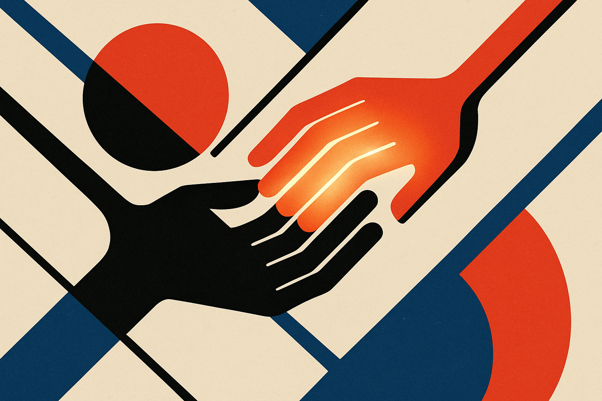
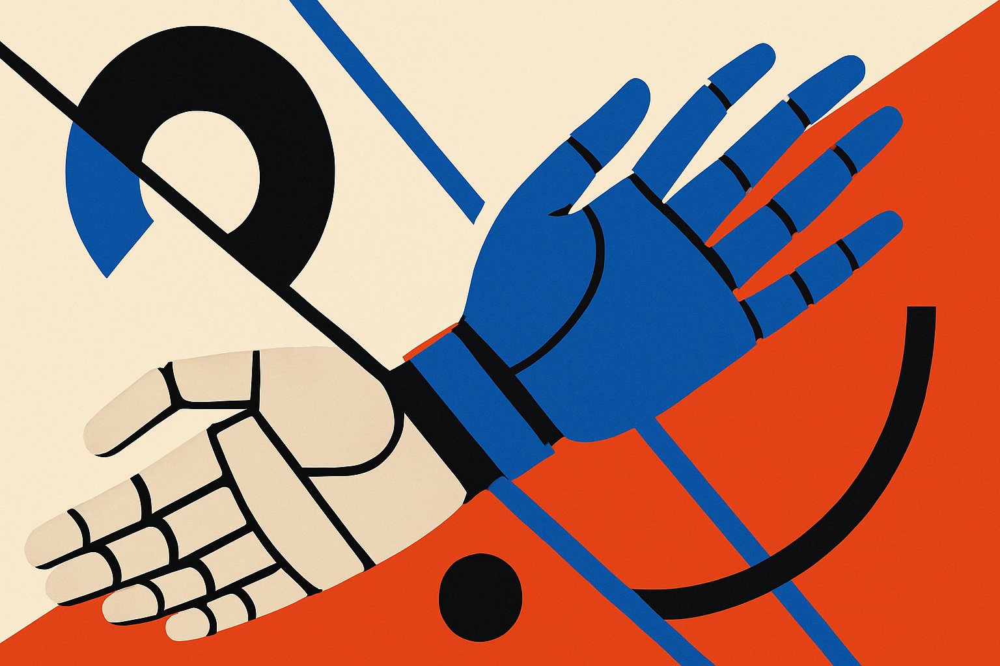

Here is a problem that sounds trivial until you try it: a robot hand that can hold a mug, and a robot hand that can press a button. Two skills, both working. Now make one hand do both at the same time. Hold the mug steady while a finger reaches out and presses something.

The naive answer is to chain the policies. Run skill one, then run skill two. It falls apart fast. The second policy moves fingers the first policy needed for gripping. The mug drops. This is what a new paper from the DexCompose authors calls destructive interference, and it is the wall that has kept multi-task dexterous manipulation stuck on single skills.

DexCompose proposes a fix that is less about a bigger model and more about a cleaner contract between policies. Assign ownership. Decide which fingers belong to which task, then let each policy act only inside its own lane.

## Why stacking hand skills is harder than it looks

A human hand has roughly the same problem and solves it without thinking. You hold a phone with three fingers and tap with your thumb. The holding fingers stay put while the thumb does something completely different. That coordination is invisible to you and brutally hard to learn for a policy trained on one objective.

The reason is overlap. Both the gripping policy and the pressing policy want to control the same fingers and the same contact points. A policy trained to hold a mug has opinions about every joint, including the index finger you now want to use for pressing. When you run a second policy on top, its commands for that index finger collide with the first policy's commands. Neither was trained to defer to the other.

The DexCompose authors frame this precisely: adding a new task on top of an existing skill imposes conflicting demands on overlapping fingers and contact modes. The interference is structural, not a tuning problem. You cannot blend the two action outputs and hope for the best, because the average of "grip tight" and "extend to press" is often "lose the object."

## The core idea: figure out which fingers actually matter

What makes DexCompose interesting is the step before any new training. Given a pretrained policy that, say, holds an object after completing its task, the method asks a blunt question: which fingers does this skill genuinely need to keep working?

It answers empirically. The authors collect successful post-task states, the configurations where skill one has done its job and is holding steady. Then they run what they call release tests over candidate finger masks. In plain terms: let go of some fingers and see if the object stays put. If you can release the pinky and the mug doesn't move, the pinky is not load-bearing for that skill. If you release the thumb and everything collapses, the thumb is essential.

This produces a map of ownership. A subset of fingers is necessary for preserving the first skill. The remaining fingers, the ones the release tests show are expendable, become available real estate for the second task.

This is the part I find genuinely smart. Instead of guessing which degrees of freedom to protect, or hand-labeling them, the system probes the policy's actual dependence on each finger. It is closer to how an engineer would debug a system than how a typical end-to-end RL pipeline operates. You isolate the load-bearing parts before you touch anything.

## Two residuals, two jobs

Once ownership is mapped, DexCompose trains two small modules that sit on top of the frozen pretrained policies. Both are residuals, meaning they nudge an existing policy rather than replace it.

The first is a bounded residual stabilizer. Its only job is task preservation: keep the first skill's outcome intact. Bounded matters here. The corrections it can apply are limited in magnitude, so it can fight small disturbances without going off and rewriting the original behavior. Think of it as a quiet hand that holds the mug steady while the rest of the hand gets busy.

The second is a context-aware residual. This one adapts the frozen downstream policy, the press-the-button skill, but only within the action subspace assigned to the new task. It does not get to touch the fingers the release tests marked as essential to skill one. It operates in its own lane, defined by the ownership map.

The asymmetry between the two modules is the point. One is conservative and defensive, scoped to hold. One is active and adaptive, scoped to do the new thing. They are not symmetric peers blending outputs. They have different mandates and different action subspaces, which is exactly what prevents the collision that breaks naive chaining.

## What the numbers say, and what they don't

DexCompose was evaluated on 16 composite tasks: four object-retention skills crossed with four downstream interactions. Average composite success rate came in at 77.4%.

I want to be honest about how to read that. 77.4% is not a number you ship a warehouse robot on. Roughly one in four attempts fails the composite goal. But the right comparison is not perfection, it is the alternative. The whole premise of the paper is that conventional policy chaining causes destructive interference, which implies the baseline is much worse, often outright failure on the composite. Against that, a method that succeeds three times out of four on tasks that previously broke is a real step.

The other honest caveat: these are simulation-flavored benchmark results across a curated task set, and the paper presents this as a promising direction rather than a solved problem. The phrase the authors use, that structural action ownership with dual residuals offers a promising direction, is the right level of confidence. They are claiming the framing is right, not that the percentages are production-grade.

What I'd want to see next is how the ownership map holds up when the two skills are more entangled. The release-test idea works cleanly when some fingers are clearly expendable. It gets harder when both tasks genuinely need the same finger at the same time, which is the case humans handle by time-sharing a digit. Pure spatial ownership may not cover that.

## Practitioner's take

If you are building anything that composes learned policies, robot hands or not, the reusable lesson here is the ownership step, not the residuals. Before you stack two behaviors, run the equivalent of a release test: ablate parts of the action or state space and measure which parts the first behavior actually depends on. Most teams skip this and try to blend or fine-tune the whole thing, then fight the interference forever. Mapping dependence first turns a vague conflict into an explicit, scoped boundary, and a bounded corrective module is far easier to trust than a freshly retrained joint policy.

The catch most readers will miss: this approach assumes the two skills can be cleanly separated into lanes. When they truly contend for the same resource at the same moment, finger or otherwise, spatial ownership stops being enough and you need time-sharing, which DexCompose does not yet address. Use it where your tasks are mostly disjoint in what they touch. Don't expect it to solve genuinely coupled coordination, the thing your own hand does so well you forgot it was hard.
