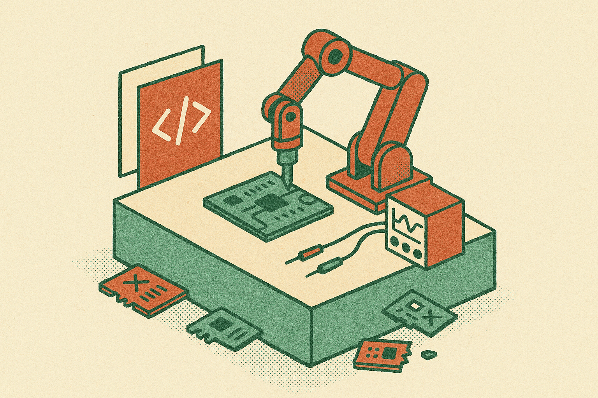

HORIZON is a useful signal because it does not ask an AI model to “design a chip” in the abstract.

It gives the agent a repo.

That sounds small. It is not. A repository has files, history, tests, constraints, diffs, rollbacks, and failure traces. Those are the native materials of engineering work. The HORIZON researchers frame hardware design as repository-level code evolution, then let an agent operate inside an isolated git worktree until it satisfies an acceptance predicate.

That is much more interesting than another demo where a model emits Verilog and someone squints at the output.

## The harness is the product

The core move in HORIZON is the Markdown harness. The system compiles that harness into a project pack containing domain knowledge, an executable evaluator, an acceptance predicate, and git/runtime policy. Then the agent runs hands-free against the pack.

The model is not floating around with vague instructions. It is boxed into a workflow with state, replay, and measurable pass/fail behavior. Git is not just storage here. It is the agent’s memory substrate, trace log, and safety rail.

This is the pattern I keep coming back to with useful agents. The win is rarely “the model got smarter.” The win is that someone turned a messy job into an environment where attempts are cheap, failures are inspectable, and success has a crisp definition.

Hardware design has a lot of that structure already. HDL files. Simulators. lint tools. synthesis flows. verification suites. Constraints. The trick is packaging enough of that into a closed loop that an agent can do meaningful work without a human steering every edit.

## 100% benchmark completion is a milestone, not a victory lap

HORIZON reports 100% benchmark completion across ChipBench, RTLLM, Verilog-Eval, and nine CVDP categories. That is a serious result. It says the agent loop can complete a wide set of controlled hardware-design tasks without hands-on intervention.

But the researchers also state the obvious limit: this does not mean agentic AI has solved hardware design.

Good. Because it has not.

Benchmarks are controlled proxies. Real chip design includes ugly integration surfaces, ambiguous requirements, physical constraints, timing closure, power budgets, IP reuse, verification debt, toolchain quirks, organizational process, and the long tail of “this passed locally but broke downstream.” A Verilog benchmark can tell you whether an agent can satisfy a contained evaluator. It cannot tell you whether it can own a block in a production SoC program.

The more honest read is this: HORIZON shows that autonomous agents can make progress when the task is repo-shaped, evaluable, and reversible. That is still a big deal. It moves the conversation from prompt quality to engineering substrate.

## Agents need rails more than vibes

The most transferable idea here is not specific to chips. It is the repo-level loop.

Take a domain artifact. Put it in version control. Add executable evaluation. Define acceptance. Constrain runtime behavior. Preserve traces. Let the agent mutate the repo, test, inspect failures, and try again.

That is how software agents are slowly becoming useful in production-ish settings. HORIZON pushes the same pattern into hardware artifacts instead of EDA software systems. The shift matters because hardware has higher stakes and less tolerance for hand-wavy correctness.

I would not read this as “junior hardware engineers are obsolete.” I would read it as “well-scoped repo tasks are becoming automatable.” That includes benchmark fixes, small RTL modules, testbench generation, lint cleanup, and constrained transformations where the acceptance predicate is strong.

The catch is that the acceptance predicate becomes the real spec. If the evaluator is shallow, the agent will optimize toward shallow success. If the harness misses a downstream constraint, the agent will happily produce something that passes and still fails the job.

Practitioner's take: start by finding one hardware or systems task that already has a repo, a repeatable test command, and a clear pass condition. Wrap that into a harness before worrying about agent architecture. Let the agent work in a disposable branch, require full trace capture, and review the diff like you would review an eager intern’s patch. The missed part is not model choice. It is whether your evaluator actually represents the work you care about.
