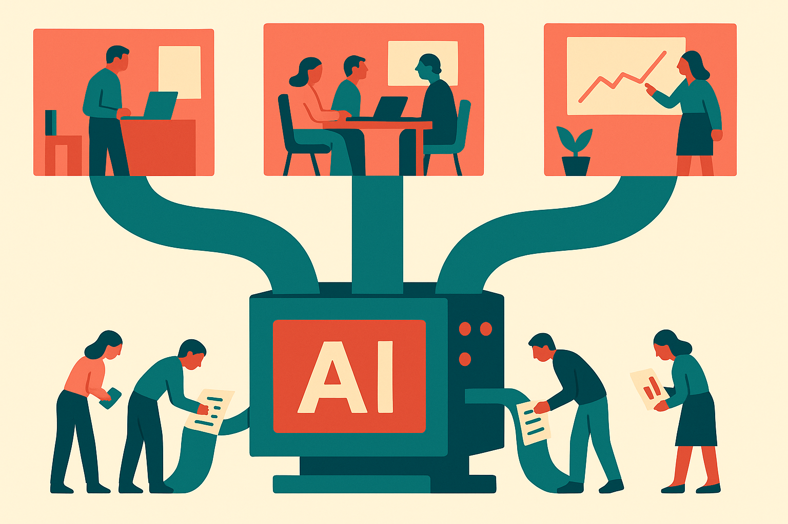

OpenAI reported that HP Inc. is scaling its Frontier strategic partnership to deploy AI across three areas: customer experiences, software development, and enterprise operations.

That is a short announcement, but the shape matters.

This is not the “every employee gets a chatbot” story. It is also not the “one magical agent replaces a department” story. HP is pointing at the three places where large companies are most likely to get real AI value, and also where they are most likely to hit governance, workflow, and trust problems quickly.

## The pattern is broader than HP

The interesting part is the bundle.

Customer experiences means AI close to the market. Support, sales assistance, product guidance, account workflows. This is where mistakes are visible and expensive, but the payoff is easy to understand. Faster answers. Better routing. More personalized help. Fewer dead-end interactions.

Software development is the easier internal wedge. Developers already work in text-heavy, tool-heavy environments. They can inspect outputs. They can reject bad suggestions. They can turn partial automation into productivity without pretending the model is always right.

Enterprise operations is the messy middle. Finance, HR, procurement, legal, IT, facilities, compliance. Lots of documents. Lots of approvals. Lots of old systems. Lots of exceptions. If AI works here, it is usually because someone redesigned the process around the model, not because they pasted a chat box on top of a workflow from 2014.

That three-lane rollout is becoming the enterprise default: front office, engineering, back office. HP’s announcement fits that template.

## The missing details are the deal

OpenAI did not, in the material provided, give the details I would want before calling this a major deployment success.

No timeline. No employee count. No customer volume. No model configuration. No mention of whether HP is using OpenAI tools directly, custom applications, internal platforms, or some mix. No specific metrics around ticket resolution, developer throughput, cost reduction, quality, or customer satisfaction.

That does not make the partnership empty. It just means the announcement is an input, not evidence of impact.

The same caution applies to the word “Frontier.” It signals a strategic relationship with OpenAI and likely access to OpenAI’s current enterprise stack and support motion. But the word itself does not tell us whether HP is using frontier models for every task, routing lighter tasks to cheaper systems, fine-tuning, retrieval, agents, or human-in-the-loop review.

For builders, the operating question is not “Did HP buy AI?” It is “Which workflows can survive contact with production?”

Customer-facing AI needs escalation paths and audit trails. Developer AI needs integration into repos, issue trackers, security scanners, and review culture. Operations AI needs permissions, records, and clear rules for when a human signs off.

## Strategic partnerships are becoming deployment scaffolding

The large AI labs are selling more than API access now. They are selling confidence, reference architecture, model access, implementation help, and executive air cover.

That matters inside big companies. A chief information officer can approve small AI experiments easily. Scaling across customer experience, engineering, and operations is different. It requires procurement alignment, security review, legal review, internal change management, and a plan for measuring the work after launch.

OpenAI gets a marquee enterprise partner. HP gets a stronger story around AI adoption, both internally and for its own products and services. The real test will be whether this turns into shipped workflows with measurable gains, or another slide in the enterprise AI partnership deck.

The practical move is to copy the structure, not the press release. Pick one workflow in each lane: one customer-facing process, one developer workflow, one internal operation. Instrument the baseline first. Add AI where it reduces handoffs, waiting, or repetitive judgment. Keep a human checkpoint where the cost of failure is high. The catch most teams miss: the model is usually not the bottleneck. The bottleneck is the process around the model.
